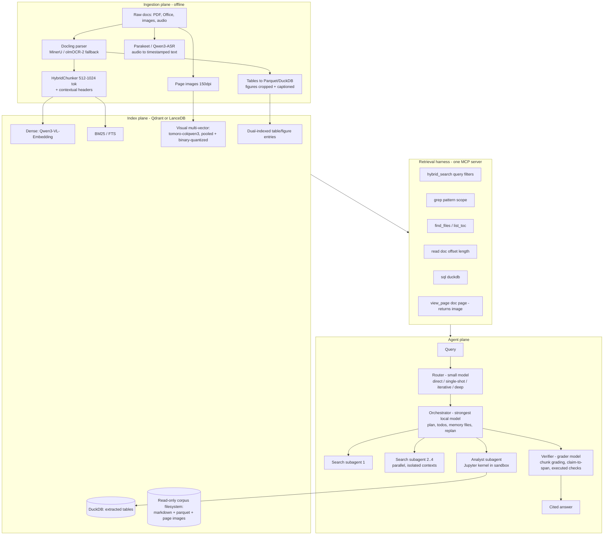

# Local Agentic Multimodal RAG — System Design

**Date:** July 15, 2026
**Status:** Design complete, pre-implementation
**Constraint:** Runs fully local (no cloud APIs). Design covers Apple Silicon (32–128GB unified memory) and Linux/NVIDIA (1–2× 24GB+) tiers.

This design is grounded in a July 2026 research sweep across primary sources (papers, model cards, leaderboards, production writeups) and practitioner reports (r/LocalLLaMA, HN, engineering blogs). Every load-bearing claim links to its source. Vendor-self-reported numbers are flagged.

---

## 1. What the system must do

1. **Reason over multimodal documents** — PDFs (born-digital and scanned), tables, charts, figures, screenshots, images, audio; answer questions with grounded citations.
2. **Plan its own retrieval pipeline per query** — decide whether to answer directly, do one retrieval pass, run an iterative agent loop, or fan out a deep-research investigation.
3. **Execute code** — analyze retrieved tables/data in a sandbox; all quantitative claims computed, never read off a chunk.
4. **Step back and gather more context** — detect insufficient evidence, reformulate, switch retrieval granularity, widen the search, or spawn more subagents.
5. **Fan out search subagents** — an orchestrator on the strongest local model delegating to parallel searchers on cheaper models (the Claude Code / Anthropic research-system pattern, mapped onto local models).

---

## 2. Design principles (each backed by 2026 evidence)

| # | Principle | Evidence |
|---|-----------|----------|
| P1 | **Retrieval quality is the bottleneck, not the agent loop.** Invest in the index before the orchestration. | Hornet's measurement of real agent search behavior: oracle evidence → 93% accuracy vs 14% with weak retrieval ([hornet.dev](https://hornet.dev/blog/this-is-what-agentic-retrieval-looks-like), May 2026) |
| P2 | **Route queries; don't run the agent loop on everything.** Iterative retrieval costs ~3.5× tokens and loses to well-tuned classic RAG on broad/simple queries. | ACL 2026 Industry Track "Is Agentic RAG worth it?" — agentic wins narrow multi-hop domains, loses broad noisy ones (FEVER 64.6 vs 87.9), 2.7–3.9× input tokens ([arXiv 2601.07711](https://arxiv.org/abs/2601.07711)); RAGRouter-Bench ([arXiv 2604.03455](https://arxiv.org/abs/2604.03455)) |
| P3 | **Search is a tool the agent drives, not a one-shot top-k.** Give the model multiple granularities: search → grep → read → SQL. | A-RAG ([arXiv 2602.03442](https://arxiv.org/abs/2602.03442)); "Beyond Semantic Similarity: Direct Corpus Interaction" ([arXiv 2605.05242](https://arxiv.org/abs/2605.05242)); "Is Grep All You Need?" ([arXiv 2605.15184](https://arxiv.org/abs/2605.15184)); LlamaIndex legal-kb retrieval harness (Jul 2026) |
| P4 | **But keep good embeddings inside the loop.** Dense retrieval raises accuracy AND cuts agent iterations vs BM25/grep-only on large fuzzy corpora. | BrowseComp-Plus: 55.9% with BM25 vs 70.1% with Qwen3-Embedding-8B, with fewer search calls ([arXiv 2508.06600](https://arxiv.org/abs/2508.06600)) |
| P5 | **Hybrid multimodal retrieval, fused with RRF.** Visual late-interaction + parsed-text channels beat either alone (~6.5% over image-only); text rerankers still beat visual rerankers. | ViDoRe v3 pipeline leaderboard ([HF blog](https://huggingface.co/blog/antoineedy/vidore-v3-pipeline-framework-and-leaderboard), Feb 2026) |
| P6 | **Retrieve visually, generate from text where possible.** Parsed text gives higher downstream answer utility; keep page images for verification and figure reading. | IRPapers Show HN (Feb 2026): text context 0.82 vs 0.71 downstream utility; "Lost in OCR Translation" ([arXiv 2505.05666](https://arxiv.org/abs/2505.05666)) — except scanned docs, where OCR noise poisons the text leg |
| P7 | **Self-correction must be grounded in external signal.** Unguided self-reflection fails (~64.5% blind-spot rate); retrieval grading, claim→span citation checks, and *executed* numeric verification work. | Self-Correction Bench ([OpenReview](https://openreview.net/forum?id=7K1kXowjK1)); CRAG pattern; FVA-RAG counter-evidence retrieval ([arXiv 2512.07015](https://arxiv.org/abs/2512.07015)) |
| P8 | **Context engineering is a first-class subsystem.** Compaction + memory files gave +39% on 100-turn agentic evals with 84% token reduction; KV-cache-stable prompts are worth 5–10× prefill latency locally. | Anthropic context management ([claude.com](https://claude.com/blog/context-management)); Manus KV-cache lessons ([manus.im](https://manus.im/blog/Context-Engineering-for-AI-Agents-Lessons-from-Building-Manus)) |
| P9 | **Tool-calling failures are harness plumbing, not model weakness.** Chat templates, JSON parsing, and context bloat cause most local agent failures — treat serving config as part of the product. | r/LocalLLaMA May 2026 field reports (bad JSON, wrong chat templates, `--jinja` for Gemma 4, vLLM KV-cache bugs) |
| P10 | **Ship text RAG + evals first; add modalities where failing queries justify them.** | Practitioner consensus across HN/BigData Boutique (May 2026); multimodal is "not a drop-in upgrade" |

---

## 3. Architecture overview

Five planes, loosely coupled:

1. **Serving plane** — local model servers behind one OpenAI-compatible proxy (llama-swap), so every agent component just sees endpoints.
2. **Ingestion plane** — offline pipeline: parse, chunk, caption, embed, index. Idempotent, resumable.
3. **Index plane** — one store (Qdrant or LanceDB) holding three retrieval channels + DuckDB for extracted tables + a plain read-only filesystem view of the parsed corpus.
4. **Retrieval harness** — a single MCP server exposing the corpus at multiple granularities. This is the interface boundary: any agent framework (or Claude Code itself) can drive it.
5. **Agent plane** — router → orchestrator → subagents (search, analyst) → verifier.

The MCP boundary is the key decoupling decision: the harness outlives any framework choice, and MCP is now the settled standard (10K+ public servers; next spec finalizes July 28, 2026 — [MCP blog](https://blog.modelcontextprotocol.io/posts/2026-07-28-release-candidate/)).

---

## 4. Model selection

The July 2026 landscape has a genuine unlock: **the Qwen3.5/3.6 generation (Feb–Apr 2026) is natively multimodal at every size under Apache 2.0** ([Qwen3.5 collection](https://huggingface.co/collections/Qwen/qwen35)), and the **Qwen3-VL-Embedding + Qwen3-VL-Reranker** pair (Jan 2026, Apache 2.0) completes an all-open multimodal retrieval stack from one vendor lineage. The orchestrator *is* a document VLM — no separate vision tower needed.

Context on the alternatives: Meta has exited open weights (no Llama 5 exists — claims of one are fabricated; [The Decoder](https://the-decoder.com/metas-muse-spark-is-its-first-frontier-model-and-its-first-without-open-weights/)). DeepSeek-V4-Flash (MIT, 284B-A13B) is the strongest per-dollar open agentic model but needs ~128GB+ and llama.cpp support was still maturing in early July 2026. GLM-5.2 is the #1 open model ([Artificial Analysis](https://artificialanalysis.ai/articles/glm-5-2-is-the-new-leading-open-weights-model-on-the-artificial-analysis-intelligence-index)) but impractical below 256GB.

### 4.1 Role → model matrix

| Role | Mac 32–64GB | Mac 96–128GB | NVIDIA 1–2× 24GB |
|---|---|---|---|
| **Orchestrator** (plan, synthesize, read pages) | Qwen3.6-35B-A3B, Q4 ≈21GB (SWE-bench V 73.4%, [Qwen blog](https://qwen.ai/blog?id=qwen3.6-35b-a3b)) | **Qwen3.5-122B-A10B**, 4-bit MLX ≈72GB, ~42 tok/s on M3 Max (BFCL-V4 72.2, [HF](https://huggingface.co/mlx-community/Qwen3.5-122B-A10B-4bit)); alt: gpt-oss-120b (≈64GB, 76–88 tok/s) | **Qwen3.6-27B**, Q4 on one 24GB card (SWE-bench V 77.2%, [HF](https://huggingface.co/Qwen/Qwen3.6-27B)) |
| **Search subagents** | Same server as orchestrator (shared weights, separate contexts) | Qwen3.6-35B-A3B or same server as orchestrator | Same server, continuous batching |
| **Router + graders** | Qwen3.5-4B (multimodal, 262K ctx) | Qwen3.5-4B or 9B | Qwen3.5-9B |
| **Perception sidecar** (fast page reads during ingestion) | MiniCPM-V 4.6 (1.3B, ≈4GB, DocVQA 94.7, [GitHub](https://github.com/openbmb/MiniCPM-V)) | MiniCPM-V 4.6 | MiniCPM-V 4.6 or InternVL3.5-8B-Flash |
| **Visual retriever** (late-interaction) | tomoro-colqwen3-embed-4b or ColModernVBERT 250M (CPU, [arXiv 2510.01149](https://arxiv.org/abs/2510.01149)) | tomoro-colqwen3-embed-8b (ViDoRe v3 #2 at 61.59, Apache 2.0, [HF](https://huggingface.co/TomoroAI/tomoro-colqwen3-embed-8b)) | tomoro-colqwen3-embed-4b-AWQ or 8B |
| **Dense embedder** (text + images + video, single-vector) | Qwen3-VL-Embedding-2B (MMEB-V2 leader family, MRL dims, Apache 2.0, [HF](https://huggingface.co/Qwen/Qwen3-VL-Embedding-8B)) | Qwen3-VL-Embedding-2B | Qwen3-VL-Embedding-8B |
| **Reranker — text** | Qwen3-Reranker-0.6B | Qwen3-Reranker-4B | Qwen3-Reranker-4B |
| **Reranker — visual** (page-image candidates) | Qwen3-VL-Reranker-2B | Qwen3-VL-Reranker-2B | Qwen3-VL-Reranker-8B |
| **OCR** (ingestion fallback for scans) | PaddleOCR-VL-1.6 (0.9B; OmniDocBench 96.33 — vendor-reported) | + olmOCR-2-7B for handwriting/messy scans | olmOCR-2 via vLLM |
| **ASR** | Parakeet TDT 0.6B v3 (6.3% WER, ~3,333× realtime, CC-BY-4.0) or Qwen3-ASR-1.7B (52 languages, Apache 2.0); faster-whisper large-v3-turbo as coverage fallback | same | same |

Notes:
- **Subagents share the orchestrator's model server.** Locally, spawning a *different* model per subagent wastes memory; spawning parallel *contexts* against one server with continuous batching (vLLM/SGLang) or slot-parallel llama.cpp gets the fan-out benefit at no extra weight cost. Role differentiation comes from prompts, not weights.
- **License check before shipping:** Nemotron ColEmbed V2 is the ViDoRe v3 accuracy champion (63.42) but CC-BY-NC — excluded. jina-reranker-v3 is CC-BY-NC — excluded. Everything selected above is Apache 2.0 / MIT / CC-BY except where flagged.
- Even the best visual retriever scores <65% NDCG@10 on ViDoRe v3 — visual retrieval is not solved; multi-hop and open-ended queries are the weak spots. The agent loop (P3) exists precisely to compensate.

### 4.2 Serving stack

**Mac (primary):**
- **llama-swap** ([GitHub](https://github.com/mostlygeek/llama-swap)) as the single OpenAI-compatible front door; `groups` pin the embedder + rerankers resident while the big LLM hot-swaps. It also speaks Anthropic-style API — relevant for the Agent SDK option below.
- **MLX** for the performance-critical paths: mlx-lm server for the orchestrator (MLX is ~30–40% faster than llama.cpp on recent Apple Silicon and now backs both Ollama and LM Studio), **mlx-vlm** (v0.6.4, Jul 2026) for VLM serving with prefix + vision-feature caching.
- llama.cpp `llama-server` (GGUF) for anything MLX doesn't cover; grammars/JSON-schema for structured outputs.

**NVIDIA:**
- **vLLM** (v0.25 line) as primary: VLM serving, xgrammar structured output, tool-call parsing, automatic prefix caching. Switch to **SGLang** if profiling shows the agent loop is prefix-heavy (RadixAttention gives ~20–30% on shared-prefix agentic workloads).
- llama-swap in front for VRAM juggling of non-resident models.

**Serving-config hygiene (P9, from field reports):** pin chat templates explicitly per model (`--jinja` class bugs), test tool-call JSON round-trips as part of CI, verify prefix caching is actually hitting (log KV-cache hit rate), and pin server versions — a late-March 2026 llama.cpp regression window produced silent token corruption.

---

## 5. Ingestion pipeline

Offline, idempotent, queue-backed (plain asyncio + SQLite job table at laptop scale; Hatchet on Postgres if it grows).

### 5.1 Per-document flow

1. **Render page images** (150 DPI PNG) for every page — kept forever; they power visual retrieval, VLM re-inspection at query time, and citation screenshots.
2. **Parse** with **Docling** (v2.113+, structured `DoclingDocument`, tables, reading order, bounding boxes; [GitHub](https://github.com/docling-project/docling)). Fast path for born-digital PDFs: pymupdf4llm. Escalation path: MinerU v3.4+ (CJK, complex layout, MPS-supported) → olmOCR-2 / PaddleOCR-VL-1.6 for scans and handwriting.
   - **Scanned-document rule (P6 corollary):** if OCR confidence is low, mark the doc `visual-primary` — its text channel is excluded from fusion so OCR noise can't poison retrieval ("OCR Hinders RAG", [OHRBench](https://arxiv.org/abs/2412.02592)).
3. **Chunk** with Docling HybridChunker, 512–1024 tokens, layout-aware (recursive-512 was the top-ranked simple strategy in Feb 2026 benchmarks; layout-aware is the structural upgrade). Prepend **contextual headers** (doc title → section path → one-line LLM-generated context). Contextual retrieval cuts top-20 retrieval failures by up to 67% when combined with reranking, and with a local 4B model it's a free offline batch job.
4. **Tables** → extracted to Parquet, registered in **DuckDB**; each table also gets its own index entry.
5. **Figures/charts** → cropped via layout bounding boxes; each region gets a **dual index entry**: (a) direct visual embedding, (b) VLM-generated caption + markdown serialization embedded as text ([kapa.ai pattern](https://www.kapa.ai/blog/how-we-index-images-for-rag)). Captions are generated by MiniCPM-V 4.6 with a conservative prompt — caption drift (hallucinated details entering the index) is a documented production failure mode.
6. **Audio** → Parakeet/Qwen3-ASR → timestamped segments, chunked on speaker turns; WhisperX for diarization when needed.
7. **Embed + index** (Section 6) and write the doc into the **corpus manifest** (`corpus_map.md`: doc id, title, type, date, page count, one-line summary) — the agent's pre-loaded map of what exists.

### 5.2 Deferred deep parsing (optimization, Phase 4)

The AgenticOCR / "Index Light, Reason Deep" pattern ([arXiv 2602.24134](https://arxiv.org/abs/2602.24134), [arXiv 2602.14162](https://arxiv.org/pdf/2602.14162)): index every page visually + cheap text pass; run expensive parsing (olmOCR-2, table extraction) only on pages actually retrieved, at query time, caching results. Cuts ingestion cost dramatically for large corpora where most pages are never retrieved.

---

## 6. Index design

### 6.1 Three retrieval channels

| Channel | Content | Model | Store |
|---|---|---|---|
| **Sparse** | parsed text chunks | BM25 / FTS (Tantivy-backed LanceDB FTS, or Qdrant sparse vectors) | same store |
| **Dense** | text chunks + figure captions + audio segments (+ natural images, video keyframes) | Qwen3-VL-Embedding (MRL-truncate to 1024d) | same store |
| **Visual multi-vector** | page images + figure/table crops | tomoro-colqwen3 (320d/token late-interaction) | same store, multivector field |

**Fusion:** RRF with k=60 (the untuned production default in every 2026 guide), metadata **pre-filters** (doc type, date range, source) applied in the ANN engine, not post-hoc. Retrieve ~30–50 fused candidates → rerank to 5–15: Qwen3-Reranker (text) for text-resolvable queries, Qwen3-VL-Reranker-2B when candidates are page images. Reranking is "the highest-value 5 lines of code" (practitioner consensus) and the specific thing the ACL agentic-RAG study found missing from agentic pipelines.

### 6.2 Multi-vector storage recipe

Raw ColPali-style indexing is the #1 practitioner complaint (~200KB/page → 100GB for 500K pages). The 2026 mitigation stack, all applied at index time:

1. **Start from tomoro-colqwen3** — already 320d/token (≈13× smaller than full-dim baselines; ~0.82TB/1M pages claimed by Tomoro).
2. **Token pooling ~3×** (hierarchical mean-pooling; "token merging is strictly superior to token pruning" — [arXiv 2603.22434](https://arxiv.org/abs/2603.22434)).
3. **Binary quantization** on pooled vectors (Vespa demonstrated binary MaxSim at 32× smaller, 4× faster).
4. **Two-stage search:** pooled/binary vectors in the HNSW index for candidate generation → exact MaxSim rescore of top ~100 with full-precision multivectors (stored un-indexed, Qdrant `m=0` pattern; [Qdrant tutorial](https://qdrant.tech/documentation/tutorials-search-engineering/using-multivector-representations/)).

Net: a 100K-page corpus lands in the low single-digit GB — laptop-viable.

### 6.3 Store choice

- **Mac / embedded-first: LanceDB** — in-process (no server alongside the model servers), native FTS + dense + multivector MaxSim in one library, disk-based indexes suit unified memory ([docs](https://docs.lancedb.com/search/multivector-search)).
- **NVIDIA / service-first: Qdrant** — native `MAX_SIM` multivector, sparse + dense + weighted-RRF hybrid in one Query API call, binary quantization, best filtered-ANN performance, official MCP server.
- Both are viable on both platforms; the abstraction layer in code should be thin enough to swap. pgvector and Chroma are excluded: no first-class MaxSim.
- **DuckDB** sits beside the vector store for extracted tables (the analyst's SQL target). The parsed corpus also lives as a plain **read-only filesystem** (markdown + parquet + page PNGs) — this is what makes grep/read/code-execution tools trivial.

---

## 7. The retrieval harness (one MCP server)

Multi-granularity corpus access, per P3/P4. Six tools, deliberately few, results paginated:

| Tool | Signature | Purpose |
|---|---|---|
| `hybrid_search` | (query, filters?, channel?) → ranked chunks with doc/page/score | The high-recall entry point (all three channels + RRF + rerank) |
| `grep` | (pattern, scope?) → matching lines with doc/page refs | Exact strings, IDs, part numbers, quotes — where embeddings fail |
| `find_files` | (glob/filter) → doc list from manifest | Corpus inventory; "what exists" |
| `read` | (doc_id, offset, length) → parsed text window | Read exact wording before citing; coarse→fine discipline |
| `sql` | (duckdb query) → result table | Aggregations over extracted tables; scanning happens in the engine, not the context window |
| `view_page` | (doc_id, page) → page image | VLM re-inspection of figures/charts/layout; the multimodal escape hatch |

Design rules:
- **Enforced discipline in prompts** (from LlamaIndex legal-kb): inventory → semantic narrow → read/grep to confirm exact wording → only then cite. Citations carry `doc_id:page` + quoted span (+ bounding box when from the visual channel).
- **Numbers rule:** any quantitative claim must come from `sql` or sandbox execution over the extracted table, never from reading digits out of a chunk (VLMs misread axes and invent precise numbers — documented failure mode).
- Tool results return **references + snippets, not full documents** — token discipline per Anthropic's code-execution-with-MCP findings (98.7% context reduction by filtering in-engine).
- The server is framework-agnostic: the custom agent uses it, and so can Claude Code / any MCP host pointed at the same corpus — free debugging UI.

---

## 8. Agent plane

### 8.1 Router (P2)

A single structured-output call on Qwen3.5-4B classifying into four routes:

1. **direct** — answerable without the corpus (greetings, general knowledge the user clearly wants unretrieved) → answer, note that no retrieval occurred.
2. **single-shot** — simple factual lookup → one `hybrid_search`, rerank, generate with citations. This should handle ~60–70% of real queries at classic-RAG cost.
3. **iterative** — multi-hop / ambiguous / needs table math → one search agent with the full harness, budget ~10–15 tool calls.
4. **deep** — breadth-first synthesis ("compare all vendor contracts", "summarize the evidence across these 40 papers") → orchestrator + parallel subagents.

Misroute recovery: single-shot escalates to iterative if the verifier rejects; iterative escalates to deep if the plan discovers breadth. Escalation is cheap; starting everything at deep is 15× tokens (Anthropic's measured multi-agent overhead).

### 8.2 Orchestrator (the "Opus role", on the strongest local model)

Follows the deep-agents harness shape that three independent implementations converged on (LangChain deepagents, Claude Agent SDK, Microsoft Agent Framework): **plan tool + memory files + subagent spawning + compaction**.

- **Plan first, replan always:** writes `plan.md` (todos) before spawning; re-decides after every subagent report (plan–execute–reflect with replanning; frozen plans lost).
- **Effort scaling rules in the prompt, verbatim policy** (Anthropic's single biggest fix for over/under-spawning): simple lookup = answer directly or 1 subagent with 3–5 tool calls; comparison = 2 subagents; broad synthesis = 3–4 subagents with explicit non-overlapping charters.
- **Parallel cap = 2–4 subagents** — the local serving throughput is the real constraint; continuous batching makes 2–4 concurrent contexts nearly free, more just queues.
- **Memory files:** `notes/` and `plan.md` updated after every subagent return; synthesis happens from notes, not from raw transcripts (context isolation is the compression mechanism that makes fan-out work).
- **Step-back behavior (requirement #4) is explicit policy:** on insufficient evidence — reformulate the query; switch granularity (semantic ↔ grep ↔ read ↔ view_page); relax filters; consult `corpus_map.md` for unexplored sources; spawn a differently-chartered subagent. **Never answer from a failed retrieval; say what's missing instead.**

### 8.3 Search subagents

- Isolated context per subagent; ReAct loop over the six harness tools; same model server as the orchestrator, different system prompt.
- Return **≤2K-token distillates**: findings + `doc_id:page` citations + confidence + what was tried and failed (so the orchestrator doesn't re-search dead ends).
- **Stop policy — budgets + marginal utility, not vibes** (Stop-RAG showed LLM-prompted stopping underperforms; [arXiv 2510.14337](https://arxiv.org/abs/2510.14337)): hard cap on tool calls and tokens, plus a check — "did the last retrieval surface new entities/claims?" Two consecutive no-new-information rounds → stop. Over-searching measurably degrades answers by importing distractors ([SAAS](https://arxiv.org/abs/2605.29796)).

### 8.4 Analyst subagent (code execution, requirement #3)

- **Persistent Jupyter kernel inside a sandbox** — state (loaded DataFrames) survives across steps, matching how analysis actually proceeds.
- Sandbox: **Apple `container` 1.0** on macOS 26 (per-container lightweight VM, [GitHub](https://github.com/apple/containerization)); OrbStack/Docker container as fallback; **Docker + gVisor** on Linux. Pyodide-in-Deno (**mcp-run-python**) as the cheap fast path for small pure-Python snippets.
- Hardening: no network, corpus mounted read-only, writable `artifacts/` volume only, CPU/memory/time limits, non-root.
- Charts and result files return as **paths + short textual summaries**, never base64 in context.
- The analyst is where verification-by-execution happens: recompute the sum, re-derive the growth rate, cross-check the chart's claimed value against the extracted table.

### 8.5 Verifier (P7)

Runs before the answer ships; grader = Qwen3.5-4B with structured binary/ternary outputs (local models are unreliable at 1–10 scoring):

1. **Chunk relevance grading** (CRAG pattern) — pre-generation, parallel over retrieved chunks; irrelevant-heavy retrievals trigger the step-back policy instead of generation.
2. **Claim→span citation check** — post-generation NLI: every claim maps to a quoted span in a retrieved doc; unsupported claims trigger targeted re-retrieval or get cut. (Anthropic's research system runs citation as a dedicated final pass.)
3. **Executed numeric checks** — any number in the answer that came from a table is recomputed via `sql` by the analyst.
4. **Bounded:** ≤2 correction loops, then answer with explicit uncertainty. No unguided "reflect on your answer" passes — they demonstrably don't work.

### 8.6 Context engineering rules (P8)

- **Byte-stable prompt prefixes per role** (orchestrator / searcher / analyst / grader): no timestamps, no reordered JSON keys, fixed tool schemas — never mutate the tool list mid-session. Each role's prefix then KV-caches independently (vLLM automatic prefix caching / llama.cpp prompt cache / mlx prefix caching).
- **Append-only context; compaction at ~70%** of the model's *usable* window — local models degrade well before advertised context; budget conservatively. Compaction prompt tuned on real traces (recall first, then precision).
- **Just-in-time loading:** keep identifiers (doc ids, paths, queries) in context, load content on demand; `corpus_map.md` is the small pre-loaded exception.

---

## 9. Framework choice

**Recommendation: two-track, sharing the MCP harness.**

1. **Track A (start here): Claude Agent SDK driving local models.** Ollama v0.14+ natively implements the Anthropic Messages API (`ANTHROPIC_BASE_URL=http://localhost:11434` — [Ollama blog](https://ollama.com/blog/claude)); LiteLLM proxies vLLM/MLX the same way, and llama-swap speaks Anthropic-style API too. This buys the entire proven harness — subagents with context isolation, hooks as policy gates, MCP client, sessions, compaction — for free, and it's exactly the orchestrator/subagent pattern this design calls for. Qwen3.6 was explicitly tuned to run inside Claude Code-style harnesses. Caveats: harness prompts are tuned for Claude; needs a strong tool-caller with 32K+ context (Qwen3.6-class clears this bar).
2. **Track B (fallback / end-state): lean custom loop** — PydanticAI (v2, typed tool contracts, any OpenAI-compatible endpoint) or LangGraph+deepagents if explicit graph control is wanted — against the *same* MCP server. Motivation: full control of KV-cache-stable prompts per role, and framework fatigue is real (practitioners consistently report replacing heavy frameworks with 200–400-line custom orchestration).

Because the retrieval harness, sandbox, and serving plane are all framework-agnostic, switching tracks is a rewrite of only the thin agent layer.

---

## 10. Evaluation & observability

Retrieval quality is the bottleneck (P1), so the eval harness is built in **Phase 1, before any agent exists**.

- **Private benchmark, BrowseComp-Plus-style** ([arXiv 2508.06600](https://arxiv.org/abs/2508.06600)): 50–150 questions over *your* corpus with labeled supporting docs and hard negatives; mix single-hop / multi-hop / table-math / figure-reading / cross-doc synthesis query types (ViDoRe v3's taxonomy is the template). Score per layer:
  1. Retrieval hit rate per hop (each channel alone, then fused — proves each channel earns its cost)
  2. Answer accuracy (local LLM judge, **binary rubric**, calibrated against ~30 hand-labeled examples)
  3. Citation support rate (claim→span NLI)
  4. Cost: tokens, tool calls, wall clock per route
- **Tracing:** Arize Phoenix for the dev loop (single process, OTel/OpenInference); self-hosted Langfuse v4 when persistent traces + prompt management are wanted. Instrument via OTel GenAI conventions so the backend stays swappable.
- **Regression gating:** DeepEval (pytest-style) in CI — every prompt/model/index change runs the benchmark.
- Public references for sanity checks: MMLongBench-Doc (long multimodal docs), FRAMES (multi-hop), OmniDocBench (parsing), ViDoRe v3 (visual retrieval).

---

## 11. Known failure modes → mitigations

| Failure mode (documented in production, 2026) | Mitigation in this design |
|---|---|
| Caption drift — hallucinated captions poison the index | Conservative captioning prompts + dual indexing (visual embedding is the co-equal channel) |
| Chart hallucination — VLM misreads axes, invents numbers | Numbers rule: quantitative claims only via `sql`/sandbox over extracted tables; verifier recomputes |
| Modality leakage — visually-similar-but-irrelevant pages | RRF fusion with text channels + reranking; visual channel never ships alone |
| OCR noise poisoning hybrid retrieval on scans | `visual-primary` flag excludes low-confidence OCR from fusion |
| Table linearization garbage (merged cells, multi-column) | Docling/MinerU structured extraction to Parquet; HTML-table preservation; ingestion QA sampling |
| Tool-call JSON/template plumbing failures | Pinned chat templates, structured-output enforcement (xgrammar/GBNF/Outlines), round-trip tests in CI |
| Over-search importing distractors | Budgets + marginal-utility stop; effort-scaling rules |
| Compounding errors in long agent chains | Verifier gates, ≤2 correction loops, answer-with-uncertainty terminal state |
| Context bloat / KV-cache misses on long sessions | Stable prefixes, append-only, compaction at 70%, distillate-only subagent returns |
| Stale/temporally-wrong retrieval ("Q2 2025, not last year") | Date metadata pre-filters; manifest carries doc dates; router prompt surfaces temporal intent |

---

## 12. Phased build plan

**Phase 0 — Serving bring-up (days).** llama-swap + MLX/llama.cpp (or vLLM) config; pull models; verify tool-calling JSON round-trips, structured output, and prefix-cache hit rates per model. Deliverable: `models.yaml`, smoke tests.

**Phase 1 — Classic RAG + evals (week 1–2).** Docling ingestion → chunks + contextual headers → dense + BM25 in LanceDB/Qdrant → RRF → rerank → single-shot answer with citations. Build the private benchmark and Phoenix tracing **now**. Deliverable: a boring, measured, classic RAG that is the baseline every later phase must beat. (P10: this alone will handle most simple queries well.)

**Phase 2 — Multimodal channels (week 3–4).** Page-image multi-vector index (pooling + binary quant + two-stage rescore); table→Parquet/DuckDB + figure dual indexing; `view_page`; audio ingestion. Re-run benchmark: fused vs text-only, per query type — keep the visual channel only where it earns its storage.

**Phase 3 — Agentic loop (week 5–7).** MCP retrieval harness (all six tools); router; Track A orchestrator + search subagents + verifier; step-back policies; effort scaling. Benchmark iterative-vs-single-shot per route — validate the router's cost/quality tradeoff empirically.

**Phase 4 — Analyst + hardening (week 8+).** Sandbox + persistent kernel + numbers rule enforcement; deferred deep parsing; Langfuse; DeepEval CI gate; compaction tuning on real traces; optional Track B migration.

---

## 13. Key sources

Architecture & patterns: [Anthropic multi-agent research system](https://www.anthropic.com/engineering/multi-agent-research-system) · [Anthropic context engineering](https://www.anthropic.com/engineering/effective-context-engineering-for-ai-agents) · [Code execution with MCP](https://www.anthropic.com/engineering/code-execution-with-mcp) · [Manus context engineering](https://manus.im/blog/Context-Engineering-for-AI-Agents-Lessons-from-Building-Manus) · [SoK: Agentic RAG](https://arxiv.org/abs/2603.07379) · [Is Agentic RAG worth it? (ACL 2026)](https://arxiv.org/abs/2601.07711) · [A-RAG](https://arxiv.org/abs/2602.03442) · [Direct Corpus Interaction](https://arxiv.org/abs/2605.05242) · [Stop-RAG](https://arxiv.org/abs/2510.14337) · [Hornet agentic retrieval measurements](https://hornet.dev/blog/this-is-what-agentic-retrieval-looks-like) · [Bayer PRINCE (martinfowler.com)](https://martinfowler.com/articles/reliable-llm-bayer.html)

Retrieval & models: [ViDoRe v3](https://huggingface.co/blog/QuentinJG/introducing-vidore-v3) · [ViDoRe v3 pipeline leaderboard](https://huggingface.co/blog/antoineedy/vidore-v3-pipeline-framework-and-leaderboard) · [tomoro-colqwen3](https://tomoro.ai/insights/beyond-text-unlocking-true-multimodal-end-to-end-rag-with-tomoro-colqwen3) · [Qwen3-VL-Embedding](https://huggingface.co/Qwen/Qwen3-VL-Embedding-8B) · [Qwen3.5](https://huggingface.co/collections/Qwen/qwen35) · [Qwen3.6-35B-A3B](https://qwen.ai/blog?id=qwen3.6-35b-a3b) · [BrowseComp-Plus](https://arxiv.org/abs/2508.06600) · [MUVERA](https://arxiv.org/abs/2405.19504) · [Vespa binary MaxSim](https://blog.vespa.ai/scaling-colpali-to-billions/) · [Lost in OCR Translation](https://arxiv.org/abs/2505.05666)

Infra: [Docling](https://github.com/docling-project/docling) · [MinerU](https://github.com/opendatalab/MinerU) · [olmOCR-2](https://allenai.org/blog/olmocr-2) · [Qdrant multivector](https://qdrant.tech/documentation/tutorials-search-engineering/using-multivector-representations/) · [LanceDB multivector](https://docs.lancedb.com/search/multivector-search) · [llama-swap](https://github.com/mostlygeek/llama-swap) · [mlx-vlm](https://github.com/Blaizzy/mlx-vlm) · [Apple containerization](https://github.com/apple/containerization) · [mcp-run-python](https://github.com/pydantic/mcp-run-python) · [Ollama Anthropic API](https://ollama.com/blog/claude) · [Claude Agent SDK](https://code.claude.com/docs/en/agent-sdk/overview)

**Flagged as vendor-reported or unverified:** PaddleOCR-VL-1.6's 96.33 OmniDocBench score; tomoro storage claims; Kimi K2.7-Code benchmarks; exact release dates of several serving-stack versions. ViDoRe leaderboard standings are a Feb–Apr 2026 snapshot.
