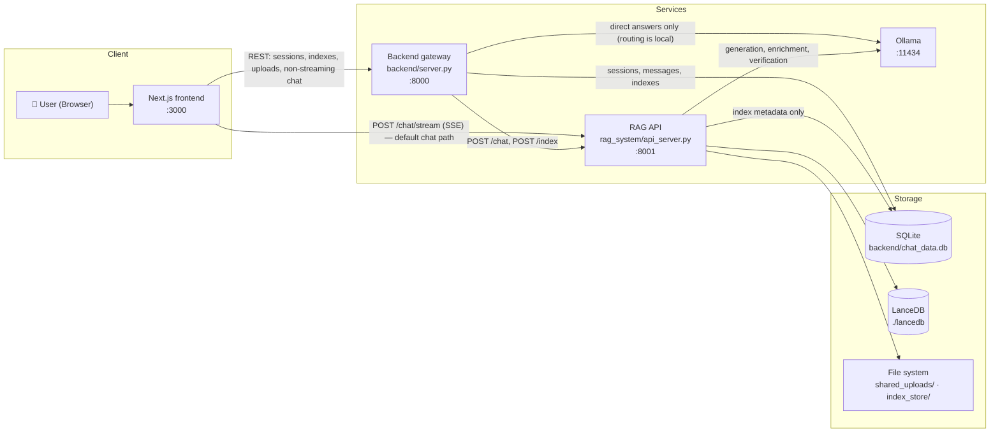
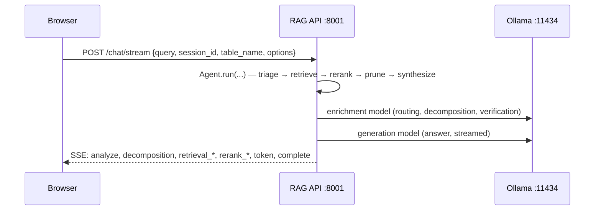
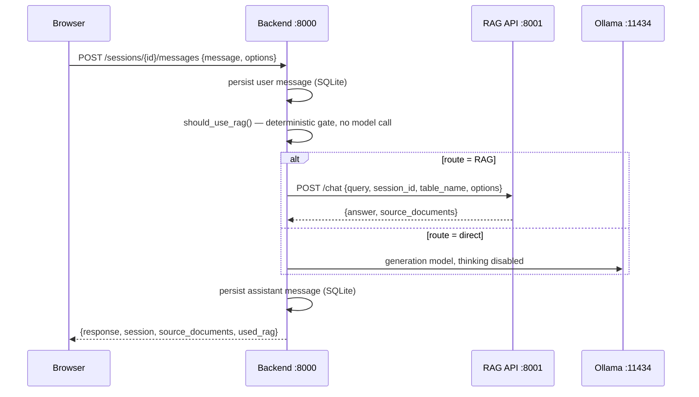
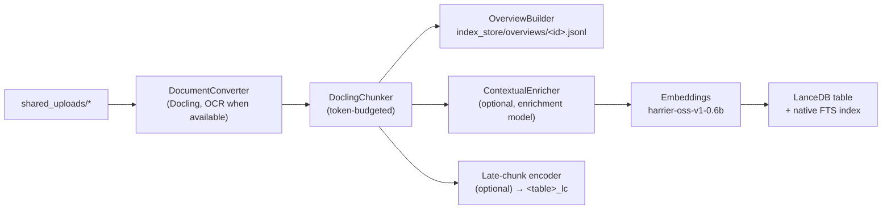
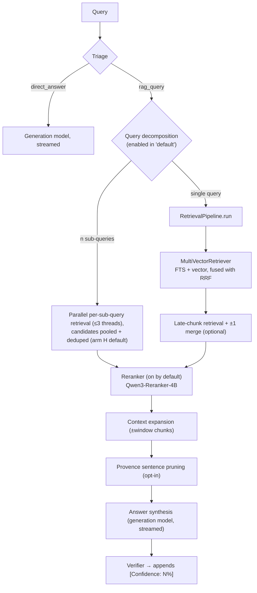

# 🏗️ System Architecture Overview

_Last updated: 2026-08-08_

This document explains how data and control flow through **localGPT** — from a user's browser to model inference and back. It is the ground-truth reference for engineers and integrators; every port, path and endpoint below was read out of the current source.

---

## 1. Process Topology

The system is four separate OS processes. Nothing in `rag_system` runs inside the backend gateway — the gateway talks to the RAG API over HTTP.

```mermaid
flowchart LR
    subgraph Client
        U["👤 User (Browser)"]
        FE["Next.js frontend<br/>:3000"]
        U --> FE
    end

    subgraph Services
        BE["Backend gateway<br/>backend/server.py<br/>:8000"]
        RAG["RAG API<br/>rag_system/api_server.py<br/>:8001"]
        OL["Ollama<br/>:11434"]
    end

    subgraph Storage
        SQL[("SQLite<br/>backend/chat_data.db")]
        LDB[("LanceDB<br/>./lancedb")]
        FS["File system<br/>shared_uploads/ · index_store/"]
    end

    FE -->|"REST: sessions, indexes, uploads, non-streaming chat"| BE
    FE -->|"POST /chat/stream (SSE) — default chat path"| RAG
    BE -->|"POST /chat, POST /index"| RAG
    BE -->|"direct answers only (routing is local)"| OL
    RAG -->|"generation, enrichment, verification"| OL

    BE -->|"sessions, messages, indexes"| SQL
    RAG -->|"index metadata only"| SQL
    RAG --> LDB
    RAG --> FS
```

| Process | Entry point | Port | Server type |
|---------|-------------|------|-------------|
| Frontend | `npm run dev` (or `npm run build && npm run start`) | 3000 | Next.js 15 / React 19 |
| Backend gateway | `python backend/server.py` | 8000 | `socketserver.ThreadingTCPServer` (concurrent) |
| RAG API | `python -m rag_system.api_server` or `python -m rag_system.main api --port 8001` | 8001 | `socketserver.TCPServer` (**requests are serialized**) |
| Ollama | `ollama serve` | 11434 | external |

`python run_system.py` starts all four and aggregates their logs.

The backend port is the module constant `PORT = 8000` in `backend/server.py` and the RAG API port defaults to `8001` in `start_server()`; neither is read from an environment variable. What *is* configurable is where each side looks for the others — see [§6](#6-configuration-entry-points).

### The browser talks to two origins

The chat UI defaults to streaming (`enableStream` is `true` in `src/components/ui/session-chat.tsx`), and streaming goes **directly** from the browser to `:8001/chat/stream`, bypassing the gateway. Session CRUD, uploads, index management and the non-streaming chat fallback go to `:8000`. Any deployment must therefore expose **both** ports to the browser, and the frontend build must know both URLs (`NEXT_PUBLIC_API_URL`, `NEXT_PUBLIC_RAG_API_URL`). Both servers send `Access-Control-Allow-Origin: *`.

---

## 2. Request Paths

### 2.1 Streaming chat (the default UI path)

```mermaid
sequenceDiagram
    participant B as Browser
    participant R as RAG API :8001
    participant O as Ollama :11434
    B->>R: POST /chat/stream {query, session_id, table_name, options}
    R->>R: Agent.run(...) — triage → retrieve → rerank → prune → synthesize
    R->>O: enrichment model (routing, decomposition, verification)
    R->>O: generation model (answer, streamed)
    R-->>B: SSE: analyze, decomposition, retrieval_*, rerank_*, token, complete
```

`Agent.run()` executes the whole pipeline and the handler forwards each phase as an SSE event. See [§2.4](#24-in-process-pipeline-inside-the-rag-api).

### 2.2 Non-streaming chat

```mermaid
sequenceDiagram
    participant B as Browser
    participant G as Backend :8000
    participant R as RAG API :8001
    participant O as Ollama :11434
    B->>G: POST /sessions/{id}/messages {message, options}
    G->>G: persist user message (SQLite)
    G->>G: should_use_rag() — deterministic gate, no model call
    alt route = RAG
        G->>R: POST /chat {query, session_id, table_name, options}
        R-->>G: {answer, source_documents}
    else route = direct
        G->>O: generation model, thinking disabled
    end
    G->>G: persist assistant message (SQLite)
    G-->>B: {response, session, source_documents, used_rag}
```

**The gateway gate.** `should_use_rag(message, idx_ids, force_rag)` in `backend/server.py` is a pure function: `force_rag` → RAG; no linked indexes → direct; a whole-message smalltalk/assistant-meta allowlist regex (`hello`, `thanks!`, `who are you`, capped at six words) → direct; everything else → RAG. No LLM call, no file reads, no network. Measured at ~0.002 ms per message against ~750 ms for the enrichment-model router it replaced (Phase 2.3).

It is deliberately biased toward RAG. The agent-side triage in [§2.4](#24-in-process-pipeline-inside-the-rag-api) still runs on every RAG request and can still return a direct answer, so the gate never has to decide correctly on its own — it only has to avoid sending "hi" through a retrieval pipeline. `used_rag` in the response reports which way the gate went.

### 2.3 Indexing

Uploads land in `shared_uploads/` (backend). Indexing is then triggered either per session (`POST :8000/sessions/{id}/index`) or per named index (`POST :8000/indexes/{id}/build`); both forward to `POST :8001/index`, which runs `IndexingPipeline.run(file_paths)` in the RAG API process.

```mermaid
flowchart LR
    UP["shared_uploads/*"] --> DC["DocumentConverter<br/>(Docling, OCR when available)"]
    DC --> CH["DoclingChunker<br/>(token-budgeted)"]
    CH --> OV["OverviewBuilder<br/>index_store/overviews/&lt;id&gt;.jsonl"]
    CH --> EN["ContextualEnricher<br/>(optional, enrichment model)"]
    EN --> EM["Embeddings<br/>harrier-oss-v1-0.6b"]
    EM --> LT["LanceDB table<br/>+ native FTS index"]
    CH --> LC["Late-chunk encoder<br/>(optional) → &lt;table&gt;_lc"]
```

Contextual enrichment returns copies of the chunks, so the late-chunk leg encodes the **original** chunk text while the main table stores the enriched text (with the original preserved in `metadata.original_text`).

### 2.4 In-process pipeline inside the RAG API

```mermaid
flowchart TD
    Q["Query"] --> T{"Triage"}
    T -->|direct_answer| DA["Generation model, streamed"]
    T -->|rag_query| DEC{"Query decomposition<br/>(enabled in 'default')"}
    DEC -->|n sub-queries| PAR["Parallel per-sub-query retrieval (≤3 threads),<br/>candidates pooled + deduped (arm H default)"]
    DEC -->|single query| RP["RetrievalPipeline.run"]
    PAR --> RR
    RP --> RET["MultiVectorRetriever<br/>FTS + vector, fused with RRF"]
    RET --> LCM["Late-chunk retrieval + ±1 merge (optional)"]
    LCM --> RR["Reranker (on by default)<br/>Qwen3-Reranker-4B"]
    RR --> CE["Context expansion (±window chunks)"]
    CE --> PR["Provence sentence pruning (opt-in)"]
    PR --> SY["Answer synthesis (generation model, streamed)"]
    SY --> VF["Verifier → appends [Confidence: N%]"]
```

With the shipped default (arm H, 2026-08-15) the decomposed path retrieves per sub-query, pools and de-duplicates the candidates, then runs ONE rerank and ONE synthesis over the union context. Sending `compose_sub_answers: true` keeps the older path: answer each sub-query, then compose the final answer from the sub-answers.

Triage order in `Agent._triage_query_async`: the overview router runs first (an LLM call on the enrichment model, grounded in the document overviews loaded for the session); if there is conversation history the query short-circuits to `rag_query`; otherwise a fallback LLM triage picks `rag_query` / `direct_answer`. `force_rag=true` on the RAG API skips triage entirely.

There is no GraphRAG path. `GraphExtractor`, `GraphRetriever`, `GraphQueryTranslator`, the `graph_query` triage outcome and the `retrieval.graph` / `graph_strategy` config blocks were **deleted on 2026-08-09** (roadmap item 2.5): the path was unreachable, GraphRAG loses on single-hop retrieval, its multi-hop gains are contested, and it costs 41–57× at indexing and up to ~377× in query tokens ([`research/academic-evidence-2026.md`](research/academic-evidence-2026.md) §6).

---

## 3. Where State Lives

| Store | Location | Written by | Contents |
|-------|----------|-----------|----------|
| SQLite | `backend/chat_data.db` (`DB_PATH`) | backend (all tables), RAG API (index metadata only) | `sessions`, `messages`, `session_documents`, `indexes`, `index_documents`, `session_indexes` |
| LanceDB | `./lancedb` (`storage.lancedb_uri`, `LANCEDB_PATH`) | RAG API | `text_pages_v4` (default table), `text_pages_<index_id>` (per named index), `<table>_lc` (late-chunk vectors) |
| Overviews | `index_store/overviews/<session_or_index_id>.jsonl`, plus `index_store/overviews/overviews.jsonl` as a global fallback | RAG API (indexing) | one-paragraph document summaries used by the agent's triage router (the gateway gate no longer reads them) |
| Uploads | `shared_uploads/` | backend | original uploaded files, prefixed with a UUID |

**Chat messages are written by `backend/server.py` only** (`handle_session_chat`). The RAG API holds a `ChatDatabase` handle but never touches the `messages` or `sessions` tables.

---

## 4. Threading and Shared State

* The **backend** is threaded (`ThreadingTCPServer`, `daemon_threads = True`). `backend/database.py` opens a fresh SQLite connection per call, so concurrent handlers are safe.
* The **RAG API is single-threaded**. One `/chat`, `/chat/stream` or `/index` request is served at a time; everything else queues. This is deliberate: the process holds one `RAG_AGENT` singleton whose pipeline config is mutated by per-request options.
* Because that config is shared, per-request retrieval options are applied to it — but scoped to the request: the agent snapshots the pipeline config before applying overrides and restores it afterwards, so options no longer leak into later requests. The per-request generation `model` goes through a context manager (`_generation_model_override`) that restores the previous value and rejects model ids that do not match the active `LLM_BACKEND`.
* `factory.get_pipeline_config()` returns a `copy.deepcopy` of the profile, so the module-level `PIPELINE_CONFIGS` in `rag_system/main.py` is never mutated.

---

## 5. Known Architectural Limitations

These are real, current behaviours — not planned work. See [`improvement_plan.md`](improvement_plan.md) for the fixes on the roadmap.

1. **Streamed turns are persisted by a client callback, not by the stream itself.** `POST :8001/chat/stream` writes nothing to SQLite; when the stream completes, the browser posts the finished turn to `POST :8000/sessions/{id}/messages/save`, which stores both messages and derives the session title. A client that consumes the stream directly and skips that call gets no history.
2. **The RAG API serializes requests.** Concurrency is one in-flight RAG request per process.
3. **`enable_docling_chunk` defaults to `true` over HTTP.** `rag_system/api_server.py` maps the flag to `chunker_mode` (`"docling"` when true, `"legacy"` when false), so the Docling chunker runs unless the client sends `false` to select the legacy chunker. (`create_index_script.py` sets `"legacy"` explicitly.)
4. **Service ports are not configurable by environment variable** — only the URLs used to reach them are.

---

## 6. Configuration Entry Points

| Concern | Where |
|---------|-------|
| Model defaults, pipeline profiles | `rag_system/main.py` (`OLLAMA_CONFIG`, `WATSONX_CONFIG`, `EXTERNAL_MODELS`, `PIPELINE_CONFIGS`) |
| Agent / pipeline construction | `rag_system/factory.py` (`get_agent`, `get_indexing_pipeline`, `get_pipeline_config`) |
| Active profile for the RAG API | `RAG_CONFIG_MODE` (default `default`; an unknown value silently falls back to `default`) |
| Service URLs and model overrides | environment variables — see [`.env.example`](../.env.example) and [`system_overview.md`](system_overview.md#7-configuration) |

---

## 7. Component Documents

| Component | Documentation |
|-----------|---------------|
| Whole system, models, configuration | [`system_overview.md`](system_overview.md) |
| Why each component is built this way (evidence + eval numbers; "deliberately not implemented") | [`design_rationale.md`](design_rationale.md) |
| HTTP APIs (backend + RAG API) | [`api_reference.md`](api_reference.md) |
| Indexing pipeline | [`indexing_pipeline.md`](indexing_pipeline.md) |
| Retrieval pipeline | [`retrieval_pipeline.md`](retrieval_pipeline.md) |
| Verifier | [`verifier.md`](verifier.md) |
| Triage / routing | [`triage_system.md`](triage_system.md) |
| Roadmap | [`improvement_plan.md`](improvement_plan.md) |

> **Change management**: when the topology changes (new process, new store, a new browser-facing origin), update this overview first, then the component docs.
