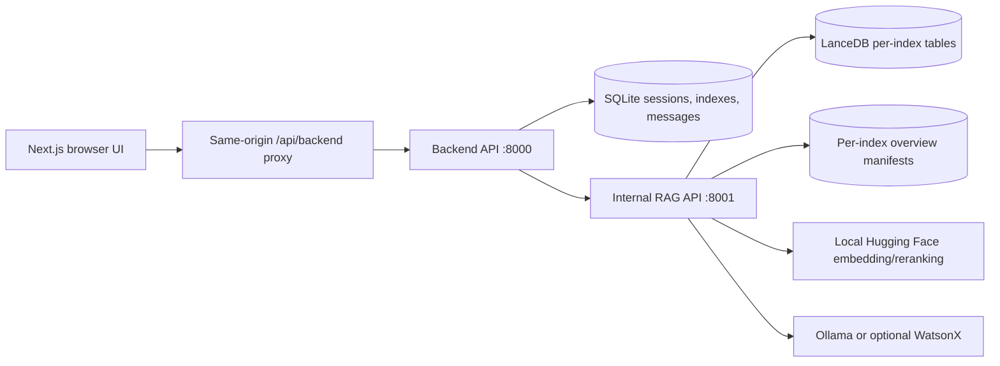

# Architecture overview

This is the implemented service topology. Detailed contracts live in [system overview](system_overview.md), [API reference](api_reference.md), [indexing](indexing_pipeline.md), and [retrieval](retrieval_pipeline.md).

```mermaid
flowchart LR
    Browser["Next.js browser UI"] --> Proxy["Same-origin /api/backend proxy"]
    Proxy --> Backend["Backend API :8000"]
    Backend --> SQLite[("SQLite sessions, indexes, messages")]
    Backend --> RAG["Internal RAG API :8001"]
    RAG --> Lance[("LanceDB per-index tables")]
    RAG --> Overviews[("Per-index overview manifests")]
    RAG --> HF["Local Hugging Face embedding/reranking"]
    RAG --> Provider["Ollama or optional WatsonX"]
```

The backend is the public API and sole chat-persistence owner. It validates uploads, owns index/session metadata, derives the set of LanceDB tables linked to a session, and proxies both ordinary and SSE agent calls. The browser does not call the RAG service directly.

The RAG service owns conversion, chunking, enrichment, embedding, LanceDB writes, routing, retrieval, reranking, synthesis, and optional verification. Rebuilds replace an index's artifacts. Retrieval is scoped to all and only the tables linked to the requesting session.

Local defaults bind ports 8000 and 8001 to loopback. Docker publishes ports 3000, 8000, 8001, and optional 11434 on host loopback while services communicate over the Compose network. A shared upload volume lets the backend pass validated paths to the RAG service; shared LanceDB, overview, and SQLite volumes provide persistence.

Ollama keeps generation local. WatsonX is an explicit cloud option and receives prompts and retrieved context. Hugging Face weights may be downloaded; repository-defined Python code is disabled unless `LOCALGPT_TRUST_REMOTE_CODE=true`.

Page-image embeddings and VLM synthesis are not active. The current document pipeline preserves tables as text/Markdown and uses OCR fallback for image-only PDFs.
