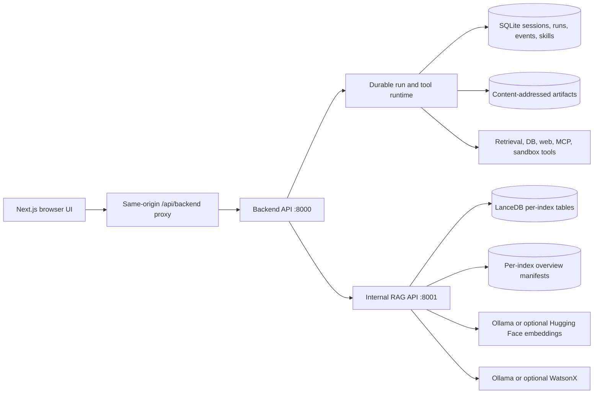

# Architecture overview

This is the implemented service topology. Detailed contracts live in [system overview](system_overview.md), [API reference](api_reference.md), [indexing](indexing_pipeline.md), and [retrieval](retrieval_pipeline.md).

```mermaid
flowchart LR
    Browser["Next.js browser UI"] --> Proxy["Same-origin /api/backend proxy"]
    Proxy --> Backend["Backend API :8000"]
    Backend --> Runtime["Durable run and tool runtime"]
    Runtime --> SQLite[("SQLite sessions, runs, events, skills")]
    Runtime --> Artifacts[("Content-addressed artifacts")]
    Runtime --> Tools["Retrieval, DB, web, MCP, sandbox tools"]
    Backend --> RAG["Internal RAG API :8001"]
    RAG --> Lance[("LanceDB per-index tables")]
    RAG --> Overviews[("Per-index overview manifests")]
    RAG --> Embedding["Ollama or optional Hugging Face embeddings"]
    RAG --> Provider["Ollama or optional WatsonX"]
```

The FastAPI backend is the public API, durable orchestrator, artifact boundary, and sole chat-persistence owner. A run has a guarded state machine, append-only replay events, cancellation intent, tool audit rows, and checkpoints. The browser does not call the RAG service directly.

Tools are registered explicitly from typed JSON schemas. The runtime intersects request permissions with the server allowlist, validates inputs before dispatch, enforces approval for side effects, limits execution time/output/iterations, and records lifecycle events. MCP and database connectors are server-configured so a prompt cannot invent an endpoint or connection string. Public URL tools resolve and reject private, loopback, link-local, reserved, and non-HTTP destinations. Python runs only in a network-disabled Docker container; there is no host-shell fallback.

The RAG service owns conversion, chunking, enrichment, embedding, LanceDB writes, routing, retrieval, reranking, synthesis, and optional verification. Rebuilds replace an index's artifacts. Retrieval is scoped to all and only the tables linked to the requesting session.

Local defaults bind ports 8000 and 8001 to loopback. Docker publishes ports 3000, 8000, 8001, and optional 11434 on host loopback while services communicate over the Compose network. A shared upload volume lets the backend pass validated paths to the RAG service; shared LanceDB, overview, and SQLite volumes provide persistence.

Ollama keeps generation local. WatsonX is an explicit cloud option and receives prompts and retrieved context. Hugging Face weights may be downloaded; repository-defined Python code is disabled unless `LOCALGPT_TRUST_REMOTE_CODE=true`.

Artifacts use SHA-256 content addressing and separate metadata/provenance. The default blob store is local; an S3-compatible adapter is available. Page-image embeddings and VLM synthesis are not active. The current document pipeline preserves tables as text/Markdown and uses OCR fallback for image-only PDFs.
