# 🏗️ System Architecture Overview

_Last updated: 2025-07-06_

This document explains how data and control flow through the Advanced **RAG System** — from a user's browser all the way to model inference and back.  It is intended as the **ground-truth reference** for engineers and integrators.

---

## 1. Bird's-Eye Diagram

```mermaid
flowchart LR
    subgraph Client
        U["👤  User (Browser)"]
        FE["Next.js Front-end\nReact Components"]
        U --> FE
    end

    subgraph Network
        FE -->|HTTP/JSON| BE["Python HTTP Server\nbackend/server.py"]
    end

    subgraph Core["rag_system core package"]
        BE --> LOOP["Agent Loop\n(rag_system/agent/loop.py)"]
        BE --> IDX["Indexing Pipeline\n(pipelines/indexing_pipeline.py)"]

        LOOP --> RP["Retrieval Pipeline\n(pipelines/retrieval_pipeline.py)"]
        LOOP --> VER["Verifier (Grounding Check)"]
        RP --> RET["Retrievers\nBM25 | Dense | Hybrid"]
        RP --> RER["AI Reranker"]
        RP --> SYNT["Answer Synthesiser"]
    end

    subgraph Storage
        LDB[("LanceDB Vector Tables")]
        SQL[("SQLite – chat & metadata")]
    end

    subgraph Models
        OLLAMA["Ollama Server\n(qwen3, etc.)"]
        HF["HuggingFace Hosted\nEmbedding/Reranker Models"]
    end

    %% data edges
    IDX -->|chunks & embeddings| LDB
    RET -->|vector search| LDB
    LOOP -->|LLM calls| OLLAMA
    RP -->|LLM calls| OLLAMA
    VER -->|LLM calls| OLLAMA
    RP -->|rerank| HF

    BE -->|CRUD| SQL
```

---

### Data-flow Narrative
1. **User** interacts with the Next.js UI; messages are posted via `src/lib/api.ts`.
2. **backend/server.py** receives JSON over HTTP, applies CORS, and proxies the request into `rag_system`.
3. **Agent Loop** decides (via _Triage_) whether to perform Retrieval-Augmented Generation (RAG) or direct LLM answering.
4. If RAG is chosen:
   1. **Retrieval Pipeline** fetches candidates from **LanceDB** using BM25 + dense vectors.
   2. **AI Reranker** (HF model) sorts snippets.
   3. **Answer Synthesiser** calls **Ollama** to write the final answer.
5. Answers can be **Verified** for grounding (optional flag).
6. Index-building is an offline path triggered from the UI — PDF/📄 files are chunked, embedded and stored in LanceDB.

---

## 2. Component Documents
The table below links to deep-dives for each major component.

| **Component** | **Documentation** |
|---------------|-------------------|
| Agent Loop | [`system_overview.md`](system_overview.md) |
| Indexing Pipeline | [`indexing_pipeline.md`](indexing_pipeline.md) |
| Retrieval Pipeline | [`retrieval_pipeline.md`](retrieval_pipeline.md) |
| Verifier | [`verifier.md`](verifier.md) |
| Triage System | [`triage_system.md`](triage_system.md) |

---

> **Change-management**: whenever architecture changes (new micro-service, different DB, etc.) update this overview diagram first, then individual component docs. 