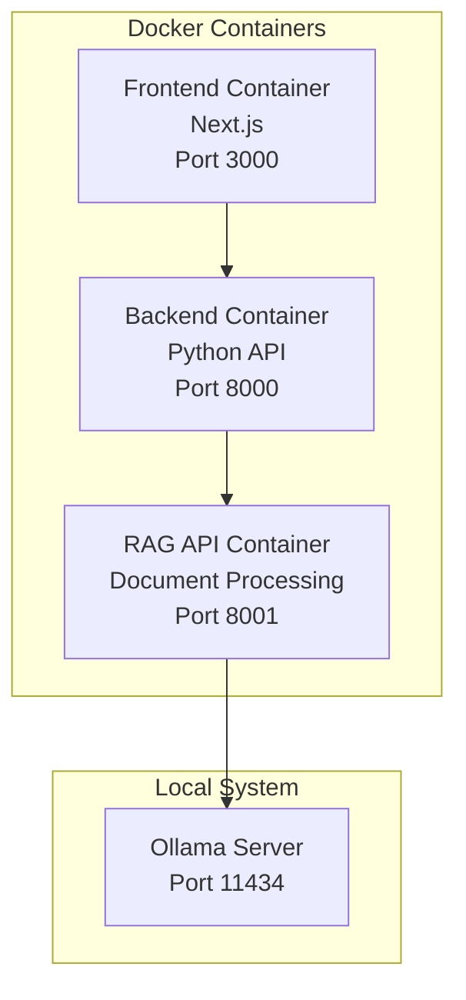
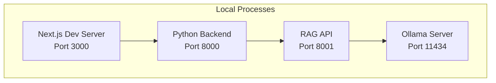

# 🚀 RAG System Deployment Guide

_Last updated: 2025-01-07_

This guide provides comprehensive instructions for deploying the RAG system using both Docker and direct development approaches.

---

## 🎯 Deployment Options

### Option 1: Docker Deployment (Production) 🐳
- **Best for**: Production environments, containerized deployments, scaling
- **Pros**: Isolated, reproducible, easy to manage
- **Cons**: Slightly more complex setup, resource overhead

### Option 2: Direct Development (Development) 💻
- **Best for**: Development, debugging, customization
- **Pros**: Direct access to code, faster iteration, easier debugging
- **Cons**: More dependencies to manage

---

## 1. Prerequisites

### 1.1 System Requirements

#### **Minimum Requirements**
- **CPU**: 4 cores, 2.5GHz+
- **RAM**: 8GB (16GB recommended)
- **Storage**: 50GB free space
- **OS**: Linux, macOS, or Windows with WSL2

#### **Recommended Requirements**
- **CPU**: 8+ cores, 3.0GHz+
- **RAM**: 32GB+ (for large models)
- **Storage**: 200GB+ SSD
- **GPU**: NVIDIA GPU with 8GB+ VRAM (optional, for acceleration)

### 1.2 Common Dependencies

**Both deployment methods require:**
```bash
# Ollama (required for both approaches)
curl -fsSL https://ollama.ai/install.sh | sh

# Git for cloning
git 2.30+
```

### 1.3 Docker-Specific Dependencies

**For Docker deployment:**
```bash
# Docker & Docker Compose
Docker Engine 24.0+
Docker Compose 2.20+
```

### 1.4 Direct Development Dependencies

**For direct development:**
```bash
# Python & Node.js
Python 3.8+
Node.js 16+
npm 8+
```

---

## 2. 🐳 Docker Deployment

### 2.1 Installation

#### **Step 1: Install Docker**

**Ubuntu/Debian:**
```bash
# Install Docker
curl -fsSL https://get.docker.com -o get-docker.sh
sudo sh get-docker.sh
sudo usermod -aG docker $USER
newgrp docker

# Install Docker Compose V2
sudo apt-get update
sudo apt-get install docker-compose-plugin
```

**macOS:**
```bash
# Install Docker Desktop
brew install --cask docker
# Or download from: https://www.docker.com/products/docker-desktop
```

**Windows:**
```bash
# Install Docker Desktop with WSL2 backend
# Download from: https://www.docker.com/products/docker-desktop
```

#### **Step 2: Clone Repository**
```bash
git clone https://github.com/your-org/rag-system.git
cd rag-system
```

#### **Step 3: Install Ollama**
```bash
# Install Ollama (runs locally even with Docker)
curl -fsSL https://ollama.ai/install.sh | sh

# Start Ollama
ollama serve

# In another terminal, install models
ollama pull qwen3:0.6b
ollama pull qwen3:8b
```

#### **Step 4: Launch Docker System**
```bash
# Start all containers using the convenience script
./start-docker.sh

# Or manually:
docker compose --env-file docker.env up --build -d
```

#### **Step 5: Verify Deployment**
```bash
# Check container status
docker compose ps

# Test all endpoints
curl http://localhost:3000      # Frontend
curl http://localhost:8000/health  # Backend
curl http://localhost:8001/models  # RAG API
curl http://localhost:11434/api/tags  # Ollama
```

### 2.2 Docker Management

#### **Container Operations**
```bash
# Start system
./start-docker.sh

# Stop system
./start-docker.sh stop

# View logs
./start-docker.sh logs

# Check status
./start-docker.sh status

# Manual Docker Compose commands
docker compose ps                    # Check status
docker compose logs -f              # Follow logs
docker compose down                 # Stop all containers
docker compose up --build -d        # Rebuild and restart
```

#### **Individual Container Management**
```bash
# Restart specific service
docker compose restart rag-api

# View specific service logs
docker compose logs -f backend

# Execute commands in container
docker compose exec rag-api python -c "print('Hello')"
```

---

## 3. 💻 Direct Development

### 3.1 Installation

#### **Step 1: Install Dependencies**

**Python Dependencies:**
```bash
# Clone repository
git clone https://github.com/your-org/rag-system.git
cd rag-system

# Create virtual environment (recommended)
python -m venv venv
source venv/bin/activate  # On Windows: venv\Scripts\activate

# Install Python packages
pip install -r requirements.txt
```

**Node.js Dependencies:**
```bash
# Install Node.js dependencies
npm install
```

#### **Step 2: Install and Configure Ollama**
```bash
# Install Ollama
curl -fsSL https://ollama.ai/install.sh | sh

# Start Ollama
ollama serve

# In another terminal, install models
ollama pull qwen3:0.6b
ollama pull qwen3:8b
```

#### **Step 3: Launch System**

**Option A: Integrated Launcher (Recommended)**
```bash
# Start all components with one command
python run_system.py
```

**Option B: Manual Component Startup**
```bash
# Terminal 1: RAG API
python -m rag_system.api_server

# Terminal 2: Backend
cd backend && python server.py

# Terminal 3: Frontend
npm run dev

# Access at http://localhost:3000
```

#### **Step 4: Verify Installation**
```bash
# Check system health
python system_health_check.py

# Test endpoints
curl http://localhost:3000      # Frontend
curl http://localhost:8000/health  # Backend
curl http://localhost:8001/models  # RAG API
```

### 3.2 Direct Development Management

#### **System Operations**
```bash
# Start system
python run_system.py

# Check system health
python system_health_check.py

# Stop system
# Press Ctrl+C in terminal running run_system.py
```

#### **Individual Component Management**
```bash
# Start components individually
python -m rag_system.api_server    # RAG API on port 8001
cd backend && python server.py     # Backend on port 8000
npm run dev                         # Frontend on port 3000

# Development tools
npm run build                       # Build frontend for production
pip install -r requirements.txt --upgrade  # Update Python packages
```

---

## 4. Architecture Comparison

### 4.1 Docker Architecture



### 4.2 Direct Development Architecture



---

## 5. Configuration

### 5.1 Environment Variables

#### **Docker Configuration (`docker.env`)**
```bash
# Ollama Configuration
OLLAMA_HOST=http://host.docker.internal:11434

# Service Configuration
NODE_ENV=production
RAG_API_URL=http://rag-api:8001
NEXT_PUBLIC_API_URL=http://localhost:8000
```

#### **Direct Development Configuration**
```bash
# Environment variables are set automatically by run_system.py
# Override in environment if needed:
export OLLAMA_HOST=http://localhost:11434
export RAG_API_URL=http://localhost:8001
```

### 5.2 Model Configuration

#### **Default Models**
```python
# Embedding Models
EMBEDDING_MODELS = [
    "Qwen/Qwen3-Embedding-0.6B",  # Fast, 1024 dimensions
    "Qwen/Qwen3-Embedding-4B",    # High quality, 2048 dimensions
]

# Generation Models  
GENERATION_MODELS = [
    "qwen3:0.6b",  # Fast responses
    "qwen3:8b",    # High quality
]
```

### 5.3 Performance Tuning

#### **Memory Settings**
```bash
# For Docker: Increase memory allocation
# Docker Desktop → Settings → Resources → Memory → 16GB+

# For Direct Development: Monitor with
htop  # or top on macOS
```

#### **Model Settings**
```python
# Batch sizes (adjust based on available RAM)
EMBEDDING_BATCH_SIZE = 50   # Reduce if OOM
ENRICHMENT_BATCH_SIZE = 25  # Reduce if OOM

# Chunk settings
CHUNK_SIZE = 512           # Text chunk size
CHUNK_OVERLAP = 64         # Overlap between chunks
```

---

## 6. Operational Procedures

### 6.1 System Monitoring

#### **Health Checks**
```bash
# Comprehensive system check
curl -f http://localhost:3000 && echo "✅ Frontend OK"
curl -f http://localhost:8000/health && echo "✅ Backend OK"
curl -f http://localhost:8001/models && echo "✅ RAG API OK"
curl -f http://localhost:11434/api/tags && echo "✅ Ollama OK"
```

#### **Performance Monitoring**
```bash
# Docker monitoring
docker stats

# Direct development monitoring
htop           # Overall system
nvidia-smi     # GPU usage (if available)
```

### 6.2 Log Management

#### **Docker Logs**
```bash
# All services
docker compose logs -f

# Specific service
docker compose logs -f rag-api

# Save logs to file
docker compose logs > system.log 2>&1
```

#### **Direct Development Logs**
```bash
# Logs are printed to terminal
# Redirect to file if needed:
python run_system.py > system.log 2>&1
```

### 6.3 Backup and Restore

#### **Data Backup**
```bash
# Create backup directory
mkdir -p backups/$(date +%Y%m%d)

# Backup databases and indexes
cp -r backend/chat_data.db backups/$(date +%Y%m%d)/
cp -r lancedb backups/$(date +%Y%m%d)/
cp -r index_store backups/$(date +%Y%m%d)/

# For Docker: also backup volumes
docker compose down
docker run --rm -v rag_system_old_ollama_data:/data -v $(pwd)/backups:/backup alpine tar czf /backup/ollama_models_$(date +%Y%m%d).tar.gz -C /data .
```

#### **Data Restore**
```bash
# Stop system
./start-docker.sh stop  # Docker
# Or Ctrl+C for direct development

# Restore files
cp -r backups/YYYYMMDD/* ./

# Restart system
./start-docker.sh  # Docker
python run_system.py  # Direct development
```

---

## 7. Troubleshooting

### 7.1 Common Issues

#### **Port Conflicts**
```bash
# Check what's using ports
lsof -i :3000 -i :8000 -i :8001 -i :11434

# For Docker: Stop conflicting containers
./start-docker.sh stop

# For Direct: Kill processes
pkill -f "npm run dev"
pkill -f "server.py"
pkill -f "api_server"
```

#### **Docker Issues**
```bash
# Docker daemon not running
docker version  # Check if daemon responds

# Restart Docker Desktop (macOS/Windows)
# Or restart docker service (Linux)
sudo systemctl restart docker

# Clear Docker cache
docker system prune -f
```

#### **Ollama Issues**
```bash
# Check Ollama status
curl http://localhost:11434/api/tags

# Restart Ollama
pkill ollama
ollama serve

# Reinstall models
ollama pull qwen3:0.6b
ollama pull qwen3:8b
```

### 7.2 Performance Issues

#### **Memory Problems**
```bash
# Check memory usage
free -h           # Linux
vm_stat           # macOS
docker stats      # Docker containers

# Solutions:
# 1. Increase system RAM
# 2. Reduce batch sizes in configuration
# 3. Use smaller models (qwen3:0.6b instead of qwen3:8b)
```

#### **Slow Response Times**
```bash
# Check model loading
curl http://localhost:11434/api/tags

# Monitor component response times
time curl http://localhost:8001/models

# Solutions:
# 1. Use SSD storage
# 2. Increase CPU cores
# 3. Use GPU acceleration (if available)
```

---

## 8. Production Considerations

### 8.1 Security

#### **Network Security**
```bash
# Use reverse proxy (nginx/traefik) for production
# Enable HTTPS/TLS
# Restrict port access with firewall
```

#### **Data Security**
```bash
# Enable authentication in production
# Encrypt sensitive data
# Regular security updates
```

### 8.2 Scaling

#### **Horizontal Scaling**
```bash
# Use Docker Swarm or Kubernetes
# Load balance frontend and backend
# Scale RAG API instances based on load
```

#### **Resource Optimization**
```bash
# Use dedicated GPU nodes for AI workloads
# Implement model caching
# Optimize batch processing
```

---

## 9. Success Criteria

### 9.1 Deployment Verification

Your deployment is successful when:

- ✅ All health checks pass
- ✅ Frontend loads at http://localhost:3000
- ✅ You can create document indexes
- ✅ You can chat with uploaded documents
- ✅ No error messages in logs

### 9.2 Performance Benchmarks

**Acceptable Performance:**
- Index creation: < 2 minutes per 100MB document
- Query response: < 30 seconds for complex questions
- Memory usage: < 8GB total system memory

**Optimal Performance:**
- Index creation: < 1 minute per 100MB document  
- Query response: < 10 seconds for complex questions
- Memory usage: < 16GB total system memory

---

**Happy Deploying! 🚀** 