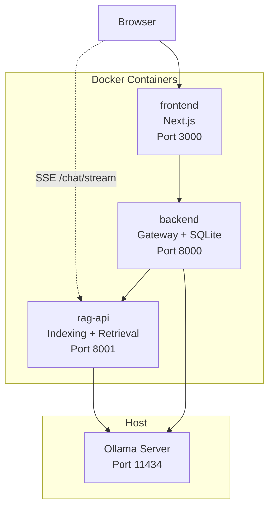
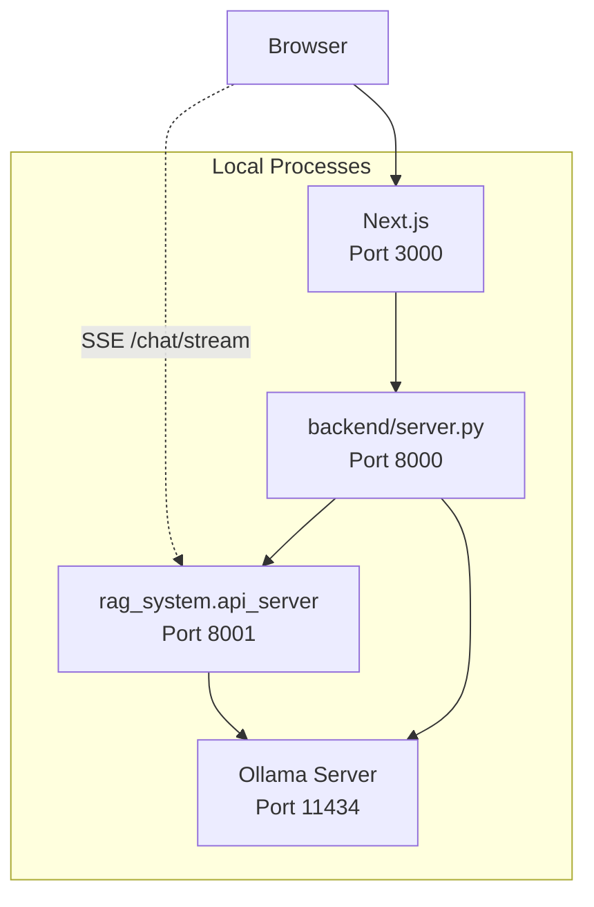

# 🚀 LocalGPT Deployment Guide

_Last updated: 2026-08-08_

This guide covers deploying LocalGPT with Docker or as directly-run processes.

---

## 🎯 Deployment Options

### Option 1: Docker Deployment 🐳
- **Best for**: reproducible environments, keeping dependencies isolated
- **Pros**: one command, pinned base images, health-gated startup order
- **Cons**: slower first build, GPU passthrough is extra work

### Option 2: Direct Processes 💻
- **Best for**: development, debugging, GPU/MPS access
- **Pros**: direct access to code, faster iteration, native acceleration
- **Cons**: more dependencies to manage on the host

---

## 1. Prerequisites

### 1.1 System Requirements

#### **Minimum Requirements**
- **CPU**: 4 cores, 2.5GHz+
- **RAM**: 8GB (16GB recommended)
- **Storage**: 50GB free space
- **OS**: Linux, macOS, or Windows with WSL2

#### **Recommended Requirements**
- **CPU**: 8+ cores, 3.0GHz+
- **RAM**: 32GB+
- **Storage**: 200GB+ SSD
- **GPU**: NVIDIA GPU with 8GB+ VRAM (optional; Apple Silicon uses MPS)

### 1.2 Common Dependencies

```bash
# Ollama (required for both approaches)
curl -fsSL https://ollama.ai/install.sh | sh

# Git for cloning
git 2.30+
```

### 1.3 Docker-Specific Dependencies

```bash
Docker Engine 24.0+
Docker Compose plugin 2.20+
```

### 1.4 Direct Deployment Dependencies

```bash
Python 3.10+   # 3.11 recommended; the images use python:3.11-slim
Node.js 20+
npm 10+
```

---

## 2. 🐳 Docker Deployment

### 2.1 Installation

#### **Step 1: Install Docker**

**Ubuntu/Debian:**
```bash
curl -fsSL https://get.docker.com -o get-docker.sh
sudo sh get-docker.sh
sudo usermod -aG docker $USER
newgrp docker

sudo apt-get update
sudo apt-get install docker-compose-plugin
```

**macOS:**
```bash
brew install --cask docker
# Or download from: https://www.docker.com/products/docker-desktop
```

**Windows:**
```bash
# Install Docker Desktop with the WSL2 backend
# Download from: https://www.docker.com/products/docker-desktop
```

#### **Step 2: Clone Repository**
```bash
git clone https://github.com/PromtEngineer/localGPT.git
cd localGPT
```

#### **Step 3: Install Ollama**
```bash
# Runs on the host by default, even with Docker
curl -fsSL https://ollama.ai/install.sh | sh

ollama serve

# In another terminal
ollama pull qwen3.5:9b
ollama pull qwen3.5:4b
```

#### **Step 4: Launch**
```bash
# Convenience script (local Ollama)
./start-docker.sh

# Containerized Ollama instead
./start-docker.sh container

# Or manually
docker compose --env-file docker.env up --build -d
```

#### **Step 5: Verify Deployment**
```bash
docker compose ps

curl http://localhost:3000            # Frontend
curl http://localhost:8000/health     # Backend
curl http://localhost:8001/health     # RAG API
curl http://localhost:11434/api/tags  # Ollama
```

### 2.2 Startup Order

`docker-compose.yml` gates the stack on health checks:

```
rag-api (healthy: GET /health)  ->  backend (healthy: GET /health)  ->  frontend
```

`rag-api` loads the embedding and reranker models before it answers `/health`, so
its check uses a 60s start period. Until it passes, `backend` stays in `created`
and `frontend` after it. This is expected on a cold start, not a hang — watch
`docker compose logs -f rag-api`.

### 2.3 Docker Management

```bash
# Convenience script
./start-docker.sh            # start (local Ollama)
./start-docker.sh container  # start (containerized Ollama)
./start-docker.sh stop       # stop
./start-docker.sh logs       # follow logs
./start-docker.sh status     # container status
./start-docker.sh help       # usage

# Compose directly
docker compose ps
docker compose logs -f
docker compose down
docker compose --env-file docker.env up --build -d

# One service
docker compose restart rag-api
docker compose logs -f backend
docker compose exec rag-api python -c "print('hello')"
```

### 2.4 Compose Files

| File | Contents |
|------|----------|
| `docker-compose.yml` | The full stack: `rag-api`, `backend`, `frontend`, and an optional `ollama` service behind the `with-ollama` profile |
| `docker-compose.local-ollama.yml` | The same three application services without the optional `ollama` service |

`docker-compose.yml` already defaults to host Ollama and only adds the `ollama`
container when you pass `--profile with-ollama`, so the second file is a
convenience, not a requirement.

---

## 3. 💻 Direct Deployment

### 3.1 Installation

**Python Dependencies:**
```bash
git clone https://github.com/PromtEngineer/localGPT.git
cd localGPT

python -m venv venv
source venv/bin/activate  # On Windows: venv\Scripts\activate

pip install -r requirements.txt
```

**Node.js Dependencies:**
```bash
npm install
```

### 3.2 Install and Configure Ollama
```bash
curl -fsSL https://ollama.ai/install.sh | sh
ollama serve

# In another terminal
ollama pull qwen3.5:9b
ollama pull qwen3.5:4b
```

### 3.3 Launch

**Option A: Integrated Launcher (Recommended)**
```bash
# Development
python run_system.py

# Production: runs `npm run build`, then `next start`
python run_system.py --mode prod
```

The launcher records the launcher PID plus each child PID in
`logs/run_system.pid`, aggregates every service's stdout into `logs/<service>.log`,
and restarts a required service that exits unexpectedly (checked every 30s).

**Option B: Manual Component Startup — all from the repository root**
```bash
# Terminal 1: RAG API
python -m rag_system.api_server

# Terminal 2: Backend
python backend/server.py

# Terminal 3: Frontend
npm run build && npm run start     # or: npm run dev

# Access at http://localhost:3000
```

> Relative paths (`backend/chat_data.db`, `lancedb/`, `index_store/`,
> `shared_uploads/`) resolve against the working directory. Always start from the
> repository root.

### 3.4 Direct Deployment Management

```bash
python run_system.py --health      # HTTP checks; exit 1 if a required service fails
python run_system.py --logs-only   # tail logs/*.log from another shell
python run_system.py --stop        # terminate everything in logs/run_system.pid
python run_system.py --no-frontend # Ollama + RAG API + backend only
python system_health_check.py      # deep check incl. a real embedding + query
```

`--stop` reads `logs/run_system.pid`, kills the launcher first (so its monitor
cannot restart anything), then each service and its descendants with SIGTERM,
escalating to SIGKILL after 10s. It exits non-zero if there is no pidfile.

---

## 4. Architecture

### 4.1 Docker Architecture


```mermaid
graph TB
    subgraph "Docker Containers"
        Frontend[frontend<br/>Next.js<br/>Port 3000]
        Backend[backend<br/>Gateway + SQLite<br/>Port 8000]
        RAG[rag-api<br/>Indexing + Retrieval<br/>Port 8001]
    end

    subgraph "Host"
        Ollama[Ollama Server<br/>Port 11434]
    end

    Browser --> Frontend
    Browser -. "SSE /chat/stream" .-> RAG
    Frontend --> Backend
    Backend --> RAG
    RAG --> Ollama
    Backend --> Ollama
```

`backend` and `rag-api` both mount `./backend`, `./lancedb` and `./index_store`,
and both point `DB_PATH` at `/app/backend/chat_data.db`, so they share one SQLite
file and one vector store.

### 4.2 Direct Architecture


```mermaid
graph TB
    subgraph "Local Processes"
        Frontend[Next.js<br/>Port 3000]
        Backend[backend/server.py<br/>Port 8000]
        RAG[rag_system.api_server<br/>Port 8001]
        Ollama[Ollama Server<br/>Port 11434]
    end

    Browser --> Frontend
    Browser -. "SSE /chat/stream" .-> RAG
    Frontend --> Backend
    Backend --> RAG
    RAG --> Ollama
    Backend --> Ollama
```

### 4.3 Concurrency

- `backend/server.py` uses a `ThreadingTCPServer`, so it handles requests in
  parallel and stays responsive during a long RAG call.
- `rag_system/api_server.py` uses a plain single-threaded `TCPServer`. **RAG
  requests are serialised** — one chat or indexing run at a time. Plan capacity
  for a single concurrent user of the RAG API, or put a queue in front of it.
- The backend allows `RAG_API_TIMEOUT` (default 600s) for a chat call and
  `RAG_API_INDEX_TIMEOUT` (default 3600s) for indexing, returning 504 on timeout
  and 502 when the RAG API is unreachable.

---

## 5. Configuration

### 5.1 Environment Variables

Every variable below is read by code; the value shown is the default when unset.
`.env.example` carries the same list.

| Variable | Default | Read by |
|----------|---------|---------|
| `OLLAMA_HOST` | `http://localhost:11434` | `rag_system/main.py`, `backend/ollama_client.py` |
| `RAG_API_URL` | `http://localhost:8001` | `backend/server.py` |
| `NEXT_PUBLIC_API_URL` | `http://localhost:8000` | `src/lib/api.ts` (inlined at build time) |
| `NEXT_PUBLIC_RAG_API_URL` | `http://localhost:8001` | `src/lib/api.ts` (inlined at build time) |
| `DB_PATH` | `backend/chat_data.db` | `backend/database.py` |
| `LANCEDB_PATH` | `./lancedb` | `rag_system/main.py` (pipeline profiles), `backend/database.py`, `system_health_check.py` |
| `GENERATION_MODEL` | `qwen3.5:9b` | `rag_system/main.py`, `backend/server.py`, `run_system.py` |
| `ENRICHMENT_MODEL` | `qwen3.5:4b` | same |
| `EMBEDDING_MODEL` | `microsoft/harrier-oss-v1-0.6b` | `rag_system/main.py` |
| `RERANKER_MODEL` | `Qwen/Qwen3-Reranker-4B` (only loaded when reranking is switched on) | `rag_system/main.py` |
| `RAG_CONFIG_MODE` | `default` | `rag_system/api_server.py` |
| `RAG_API_TIMEOUT` | `600` | `backend/server.py` |
| `RAG_API_INDEX_TIMEOUT` | `3600` | `backend/server.py` |
| `LLM_BACKEND` | `ollama` | `rag_system/main.py` |
| `HF_TOKEN` | unset | HuggingFace downloads |

#### **Docker Configuration (`docker.env`)**
```bash
OLLAMA_HOST=http://host.docker.internal:11434
NODE_ENV=production
RAG_API_URL=http://rag-api:8001
NEXT_PUBLIC_API_URL=http://localhost:8000
NEXT_PUBLIC_RAG_API_URL=http://localhost:8001
DB_PATH=/app/backend/chat_data.db
LANCEDB_PATH=/app/lancedb
GENERATION_MODEL=qwen3.5:9b
ENRICHMENT_MODEL=qwen3.5:4b
EMBEDDING_MODEL=microsoft/harrier-oss-v1-0.6b
RERANKER_MODEL=Qwen/Qwen3-Reranker-4B
```

All compose services declare
`extra_hosts: ["host.docker.internal:host-gateway"]`, so `host.docker.internal`
resolves on Linux as well as macOS and Windows.

`NEXT_PUBLIC_*` are **build-time** values for Next.js. `docker-compose.yml` passes
them as build args to `Dockerfile.frontend`; setting them only at runtime has no
effect on an already-built image. If the browser must reach the services under a
different hostname, set them and rebuild:

```bash
NEXT_PUBLIC_API_URL=https://gpt.example.com/api \
NEXT_PUBLIC_RAG_API_URL=https://gpt.example.com/rag \
docker compose --env-file docker.env up --build -d frontend
```

#### **Direct Deployment Configuration**
```bash
# run_system.py inherits your shell environment unchanged and adds only
# NODE_ENV=production to the Python services in --mode prod.
export OLLAMA_HOST=http://localhost:11434
export RAG_API_URL=http://localhost:8001
python run_system.py
```

### 5.2 Model Configuration

Defaults live in `rag_system/main.py` and are overridable by environment variable.

| Role | Default | Documented options |
|------|---------|--------------------|
| Generation | `qwen3.5:9b` | `qwen3.6:27b` (high-end, ~17GB), `qwen3.5:4b` (light) |
| Enrichment / utility | `qwen3.5:4b` | `qwen3.5:2b` (light) |
| Embedding | `microsoft/harrier-oss-v1-0.6b` (MIT, 1024 dims, ~1.2 GB) | `Qwen/Qwen3-Embedding-4B` (2560 dims, 32K context — multilingual / long-context corpora), `Qwen/Qwen3-Embedding-0.6B` (1024 dims) |
| Reranker (**off by default**) | `Qwen/Qwen3-Reranker-4B` | `BAAI/bge-reranker-v2-m3` (low latency), `answerdotai/answerai-colbert-small-v1`, `Qwen/Qwen3-Reranker-0.6B` |

`GET /models` on either service reports what is actually selectable:
Ollama tags are split into generation and embedding lists by a substring match
(`embed`, `bge`, `embedding` on the RAG API; the backend also matches `text`), and
the HuggingFace embedding models are appended. A tag whose name happens to contain
one of those substrings will be classified as an embedding model.

**Changing the embedding model requires re-indexing.** Vector width is measured
from the loaded model; writing a different width into an existing LanceDB table
fails with an explicit error.

### 5.3 Performance Tuning

There are no `SEARCH_CONFIG` / `CHUNK_OVERLAP` globals. The knobs are pipeline
config keys and per-request fields.

**Indexing throughput** — `PIPELINE_CONFIGS[<mode>]["indexing"]` in
`rag_system/main.py`, or `batch_size_embed` / `batch_size_enrich` on
`POST /index`:

| Key | `default` | `fast` | Request field |
|-----|-----------|--------|---------------|
| `embedding_batch_size` | 50 | 100 | `batch_size_embed` (default 50) |
| `enrichment_batch_size` | 10 | 50 | `batch_size_enrich` (default 25) |

**Chunking** — `chunk_size` on `POST /index` (default 512) feeds the Docling
chunker's `max_tokens`, or the legacy chunker's `max_chunk_size` with
`min_chunk_size = chunk_size // 4`. When no `chunking.chunk_size` is present at
all (for example the `python -m rag_system.main index` CLI path), the pipeline
falls back to 1500. There is no `chunk_overlap` setting.

**Contextual enrichment** is the most expensive part of indexing: one LLM call per
chunk. Disable it with `enable_enrich: false` for the fastest ingest.

**Query cost** — the biggest lever is the profile:

| | `default` | `fast` |
|---|---|---|
| `retrieval.search_type` | `hybrid` | `vector_only` |
| `retrieval_k` | 20 | 10 |
| `reranker.enabled` | true | false |
| `query_decomposition.enabled` | true | false |
| `verification.enabled` | true | false |
| `retrieval.latechunk.enabled` | true | false |

Select the profile with `RAG_CONFIG_MODE=fast` for the RAG API, or `--mode fast`
for the CLI. Individual toggles (`ai_rerank`, `verify`, `query_decompose`,
`context_expand`, `retrieval_k`, `reranker_top_k`) can also be sent per request.

**Memory** — the embedding model stays resident in the RAG API process
(`microsoft/harrier-oss-v1-0.6b`, ~1.2 GB). The reranker is **not loaded at all**
unless reranking is switched on, and switching it on pulls ~7.5 GB of
`Qwen/Qwen3-Reranker-4B` weights alongside it — see
[`../eval/DECISIONS.md`](../eval/DECISIONS.md) for the quality/latency trade that
decision rests on. Enabling late chunking loads a second copy of the embedding
model.

---

## 6. Operational Procedures

### 6.1 System Monitoring

```bash
# Health
curl -f http://localhost:3000 && echo "✅ Frontend OK"
curl -f http://localhost:8000/health && echo "✅ Backend OK"
curl -f http://localhost:8001/health && echo "✅ RAG API OK"
curl -f http://localhost:11434/api/tags && echo "✅ Ollama OK"

# Or, for a direct deployment
python run_system.py --health
```

`GET /health` on the backend returns Ollama reachability, the model list and
database stats; on the RAG API it returns `{"status": "ok"}` as soon as the agent
has finished loading.

```bash
# Resource usage
docker stats               # Docker
htop                       # host
nvidia-smi                 # GPU, if present
```

### 6.2 Log Management

#### **Docker Logs**
```bash
docker compose logs -f
docker compose logs -f rag-api
docker compose logs > system.log 2>&1
```

#### **Direct Deployment Logs**
```bash
# run_system.py writes per-service files
tail -f logs/system.log logs/rag-api.log logs/backend.log logs/frontend.log

# or use the launcher's own tailer from a second shell
python run_system.py --logs-only
```

### 6.3 Backup and Restore

Everything persistent is a host directory, including under Docker (all mounts are
bind mounts; the only named volume is `ollama_data` for the optional Ollama
container).

#### **Data Backup**
```bash
# Stop first so SQLite and LanceDB are not mid-write
./start-docker.sh stop          # Docker
# or: python run_system.py --stop

mkdir -p backups/$(date +%Y%m%d)
cp backend/chat_data.db backups/$(date +%Y%m%d)/
tar czf backups/$(date +%Y%m%d)/lancedb.tar.gz lancedb/
tar czf backups/$(date +%Y%m%d)/index_store.tar.gz index_store/
tar czf backups/$(date +%Y%m%d)/shared_uploads.tar.gz shared_uploads/

# Only if you use the containerized Ollama, back up its named volume too.
# The project name is the directory name, so the volume is localgpt_ollama_data.
docker run --rm -v localgpt_ollama_data:/data -v $(pwd)/backups:/backup \
  alpine tar czf /backup/ollama_models_$(date +%Y%m%d).tar.gz -C /data .
```

#### **Data Restore**
```bash
./start-docker.sh stop          # or: python run_system.py --stop

cp backups/YYYYMMDD/chat_data.db backend/
tar xzf backups/YYYYMMDD/lancedb.tar.gz
tar xzf backups/YYYYMMDD/index_store.tar.gz

./start-docker.sh               # or: python run_system.py
```

Restore the SQLite file and `lancedb/` together — the database rows point at
LanceDB table names, so a mismatched pair leaves indexes that resolve to nothing.

---

## 7. Troubleshooting

### 7.1 Common Issues

#### **Port Conflicts**
```bash
lsof -i :3000 -i :8000 -i :8001 -i :11434

# Docker
./start-docker.sh stop

# Direct
python run_system.py --stop
```

If a required port (8001 or 8000) is already taken, `run_system.py` logs
`Port … already in use, skipping …` and aborts with "System startup failed". Port
11434 in use is treated as "Ollama already running" and reused; port 3000 in use is
tolerated because the frontend is optional.

#### **Docker Issues**
```bash
docker version                  # daemon reachable?
sudo systemctl restart docker   # Linux
docker system prune -f          # clear build cache
```

#### **Ollama Issues**
```bash
curl http://localhost:11434/api/tags

pkill ollama
ollama serve

ollama pull qwen3.5:9b
ollama pull qwen3.5:4b
```

#### **Backend returns 502/504 for every chat**
The backend could not reach the RAG API. Check `RAG_API_URL` (must be
`http://rag-api:8001` inside Docker, not `localhost`) and that `rag-api` is
healthy.

### 7.2 Performance Issues

#### **Memory Problems**
```bash
free -h           # Linux
vm_stat           # macOS
docker stats      # containers

# Options:
# 1. Switch to RAG_CONFIG_MODE=fast
# 2. Leave reranking off (the default) so no reranker weights are loaded
# 3. Use a smaller generation model (GENERATION_MODEL=qwen3.5:4b)
# 4. Disable late chunking so a second embedding model is not loaded
```

#### **Slow Response Times**
```bash
# Where is the time going?
docker compose logs -f rag-api      # stage-by-stage output

time curl -s http://localhost:8001/health   # process responsive?
```

Remember requests to the RAG API are serialised — a query that appears slow may be
queued behind an indexing run.

---

## 8. Production Considerations

### 8.1 Security

LocalGPT ships with **no authentication** and permissive CORS
(`Access-Control-Allow-Origin: *`) on both HTTP services. Before exposing it:

- Put a reverse proxy (nginx, Caddy, Traefik) in front and terminate TLS there
- Add authentication at the proxy
- Publish only port 3000; keep 8000 and 8001 on an internal network
- Note the browser calls the RAG API directly for streaming, so port 8001 must be
  reachable by clients (or proxied) if you leave streaming enabled

### 8.2 Scaling

`docker compose up --scale` does **not** work with the shipped compose file: every
service sets a fixed `container_name` and publishes a fixed host port. Scaling
requires removing those first.

Beyond that, the RAG API is single-threaded and holds mutable state (the resident
agent, its per-session in-memory chat history and the semantic cache), so running
several replicas behind a load balancer needs sticky sessions at minimum. The
realistic path is a single RAG API with a queue in front of it.

---

## 9. Success Criteria

### 9.1 Deployment Verification

- ✅ `docker compose ps` shows all services healthy (or `python run_system.py --health` exits 0)
- ✅ Frontend loads at http://localhost:3000
- ✅ You can create a document index
- ✅ You can chat with uploaded documents
- ✅ No errors in `docker compose logs` / `logs/`

### 9.2 What to Expect

Throughput depends on hardware and model size, so treat these as shape rather than
guarantees:

- Cold start is dominated by model downloads and the RAG API loading the embedding
  and reranker models
- Indexing is dominated by contextual enrichment (one LLM call per chunk)
- Query latency is dominated by generation; `fast` mode removes reranking,
  decomposition and verification
- Concurrency is one RAG request at a time

---

**Happy Deploying! 🚀**
