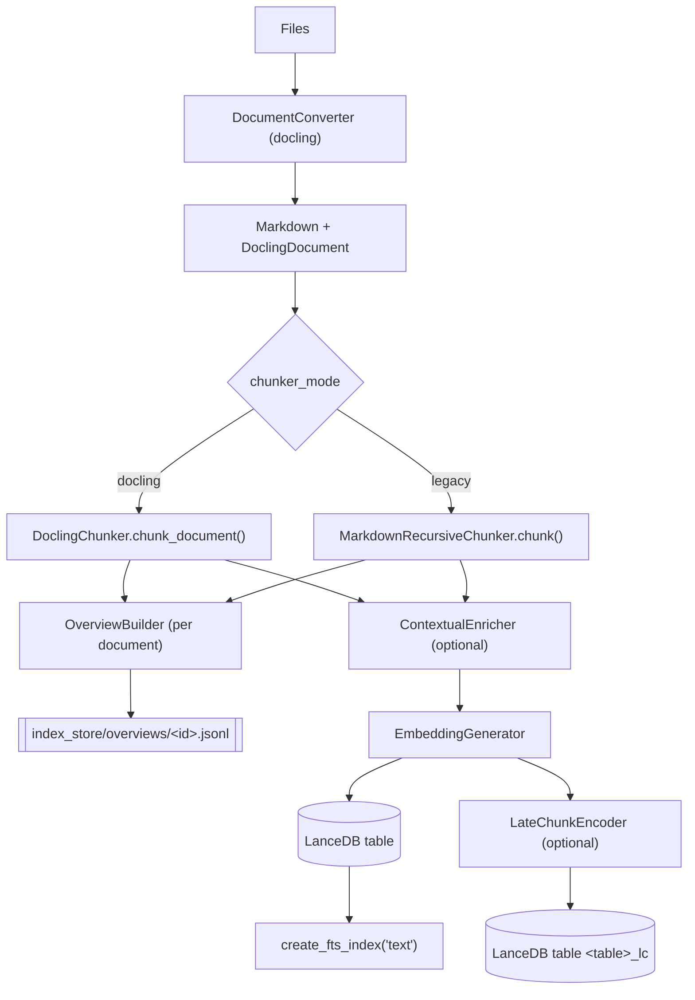

# 🗂️ Indexing Pipeline

_Implementation entry-point: `rag_system/pipelines/indexing_pipeline.py`, with helpers in `rag_system/ingestion/` and `rag_system/indexing/`._

## Overview
Turns documents (PDF, DOCX, HTML/HTM, MD, TXT) into search-ready chunks with embeddings, writes them to LanceDB, builds a full-text index over the same table, and generates a per-document overview used by the triage routers.

Public entry point:

```python
IndexingPipeline.run(file_paths: list[str]) -> None
```

`run()` also accepts a legacy `documents=` keyword as an alias for `file_paths` (`indexing_pipeline.py:157-167`). It returns `None`; progress and results are printed.

## High-level diagram


```mermaid
flowchart TD
    A["Files"] --> B["DocumentConverter (docling)"]
    B --> C["Markdown + DoclingDocument"]
    C --> D{"chunker_mode"}
    D -- docling --> D1["DoclingChunker.chunk_document()"]
    D -- legacy --> D2["MarkdownRecursiveChunker.chunk()"]
    D1 --> OV["OverviewBuilder (per document)"]
    D2 --> OV
    OV --> OVF[["index_store/overviews/&lt;id&gt;.jsonl"]]
    D1 --> E["ContextualEnricher (optional)"]
    D2 --> E
    E --> F["EmbeddingGenerator"]
    F --> G[("LanceDB table")]
    G --> H["create_fts_index('text')"]
    F --> LC["LateChunkEncoder (optional)"]
    LC --> GLC[("LanceDB table &lt;table&gt;_lc")]
```

## Steps in detail

| Step | Module | Key classes | Notes |
|------|--------|-------------|-------|
| Conversion | `ingestion/document_converter.py` | `DocumentConverter` | docling for PDF/DOCX/HTML/MD; plain read for `.txt`. PyMuPDF (`fitz`) is used **only** to test whether a PDF already has a text layer. |
| Chunking | `ingestion/docling_chunker.py`, `ingestion/chunking.py` | `DoclingChunker`, `MarkdownRecursiveChunker` | Docling is the default. Both are token-aware via the embedding model's tokenizer. |
| Overview | `indexing/overview_builder.py` | `OverviewBuilder` | One LLM call per document, from its first N chunks. On by default. |
| Contextual enrichment | `indexing/contextualizer.py` | `ContextualEnricher` | One LLM call per chunk. On in the `default` profile. |
| Embedding | `indexing/representations.py` | `QwenEmbedder`, `OllamaEmbedder`, `EmbeddingGenerator` | `select_embedder()` picks HuggingFace vs Ollama. |
| LanceDB write | `indexing/embedders.py` | `LanceDBManager`, `VectorIndexer` | Appends to an existing table, creates it otherwise. Vector width is taken from the produced embeddings. |
| Full-text index | `pipelines/indexing_pipeline.py:264-284` | – | `tbl.create_fts_index("text", use_tantivy=False)`. This is what makes `hybrid` retrieval work. |
| Late chunking | `indexing/latechunk.py` | `LateChunkEncoder` | Optional second embedding pass into `<table>_lc`. |

Storage location is `storage.lancedb_uri` (also accepted as `storage.db_path` / `storage.lancedb_path`), which both profiles set to `./lancedb`. Per-index tables are named `text_pages_<index_id>` (`backend/database.py:351`); the profile fallback table is `text_pages_v4`.

## Control flow

**Through the UI**

1. `IndexForm` → `chatAPI.buildIndex()` → `POST :8000/indexes/<index_id>/build` (or `POST :8000/sessions/<id>/index` for session uploads).
2. `backend/server.py` normalises the option names (`INDEX_OPTIONS`, `server.py:58-70`), omits anything the caller did not send so pipeline defaults apply, and POSTs to `${RAG_API_URL}/index`.
3. `rag_system/api_server.py:392-473` validates the body, builds a per-request config from a deep copy of the pipeline profile (`_build_index_config_override`, `:197-236`), constructs a fresh `IndexingPipeline` with it, and calls `run(file_paths)`.
4. The chosen embedding model is written into the index's SQLite metadata (`api_server.py:445-449`); retrieval later re-applies it (`api_server.py:116-134`).

**From the command line**

```bash
python -m rag_system.main index /path/to/docs --mode default
```

`_collect_file_paths` (`rag_system/main.py:133-146`) walks a directory for `.pdf`, `.docx`, `.html`, `.htm`, `.md`, `.txt`, or accepts a single file; the `index` branch (`main.py:171-188`) then calls `factory.get_indexing_pipeline(mode).run(file_paths)`. `--mode` accepts `default` or `fast`. `python rag_system/main.py …` as a file path does not work — run it as a module from the project root.

`create_index_script.py` is a separate interactive/batch tool that creates a SQLite index row and points the pipeline at that index's own table (`--batch <config.json>`, `--config <pipeline.json>`, `--create-sample`).

## Request fields (`POST /index`)

Both camelCase and snake_case are accepted; the RAG API normalises to snake_case once at parse time (`api_server.py:51-76`).

| Field | Default | Effect |
|-------|---------|--------|
| `file_paths` | **required** | List of absolute paths. A missing or non-list value returns HTTP 400. |
| `session_id` | – | Sets `overview_path` to `index_store/overviews/<session_id>.jsonl`. |
| `table_name` | resolved from the session's index | Sets `storage.text_table_name` and `retrieval.dense.lancedb_table_name`. |
| `enable_latechunk` | `false` | Writes a second `<table>_lc` table of late-chunked vectors. |
| `enable_docling_chunk` | `true` | Maps to `chunker_mode: "docling"` when true, `"legacy"` when false. See the note below. |
| `chunk_size` | `512` | Token budget per chunk, for both chunkers. |
| `retrieval_mode` (alias `search_type`) | – | Validated against `hybrid` / `vector_only` / `fts_only` (HTTP 400 otherwise) and recorded on the index config as `retrieval.search_type`. It cannot change the artifacts written; it takes effect at query time. |
| `window_size` | `2` | Neighbour window for contextual enrichment. |
| `enable_enrich` | `true` | Contextual enrichment on/off. |
| `embedding_model` | profile value | Overrides `embedding_model_name` and is stamped into the index metadata. |
| `enrich_model` | – | Model for contextual enrichment. |
| `overview_model_name` (aliases `overviewModel`, `overview_model`) | – | Model for document overviews. |
| `batch_size_embed` | `50` | Embedding batch size. |
| `batch_size_enrich` | `25` | Enrichment batch size. |

Response (`api_server.py:451-467`):

```jsonc
{
  "message": "Indexing process for N file(s) completed successfully.",
  "table_name": "text_pages_<id>",
  "latechunk": false,
  "docling_chunk": true,
  "indexing_config": {
    "chunk_size": 512, "retrieval_mode": "hybrid", "window_size": 2,
    "enable_enrich": true, "embedding_model": "microsoft/harrier-oss-v1-0.6b",
    "enrich_model": null, "overview_model_name": null,
    "batch_size_embed": 50, "batch_size_enrich": 25
  }
}
```

`indexing_config.embedding_model` reports the model actually used, not the raw request value. There is no `indexed_files` field.

Unknown fields are ignored rather than rejected.

## Pipeline config keys

Read by `IndexingPipeline.__init__` and by `run()` for the table paths:

| Key | Default in code | `default` profile | `fast` profile |
|-----|-----------------|-------------------|----------------|
| `chunker_mode` | `docling` | not set | not set |
| `chunking.chunk_size` (aliases `chunk_size`, `max_tokens`) | `1500` | not set | not set |
| `overlap_sentences` | `1` | not set | not set |
| `embedding_model_name` | `EXTERNAL_MODELS["embedding_model"]` | `microsoft/harrier-oss-v1-0.6b` | same |
| `storage.lancedb_uri` / `db_path` / `lancedb_path` | – (raises if all absent) | `./lancedb` | `./lancedb` |
| `storage.text_table_name` | falls back to `retrieval.dense.lancedb_table_name`, then `default_text_table` | `text_pages_v4` | `text_pages_v4` |
| `indexing.embedding_batch_size` | `50` | `50` | `100` |
| `indexing.enrichment_batch_size` | `10` | `10` | `50` |
| `retrieval.dense.enabled` | `true` | `true` | `true` |
| `retrieval.latechunk.enabled` (also read as `late_chunking`) | `false` | `true` | `false` |
| `retrieval.latechunk.lancedb_table_name` / `table_suffix` | suffix `_lc` | not set | not set |
| `contextual_enricher.enabled` / `window_size` | `false` / `1` | `true` / `1` | `false` / `1` |
| `enrich_model` (then `enrichment_model_name`, then `OLLAMA_CONFIG["enrichment_model"]`, then `generation_model`) | – | – | – |
| `overview.enabled` | `true` | not set ⇒ on | not set ⇒ on |
| `overview_model_name` / `overview.model` | falls back to enrichment then generation model | not set | not set |
| `overview_first_n_chunks` / `overview.max_chunks` | `5` | not set | not set |
| `overview_path` | `index_store/overviews/overviews.jsonl` | not set | not set |

Note the layering: the CLI/profile path uses the code default `chunk_size` of **1500** tokens because `PIPELINE_CONFIGS` sets no `chunk_size`, while the HTTP path always sends **512**. Likewise `enrichment_batch_size` is 10 from the profile but 25 over HTTP.

## Conversion (`ingestion/document_converter.py`)

Three docling converters are built independently at construction time, so a failure in one does not disable the others (`:67-104`):

* **no-OCR** PDF converter,
* **OCR** PDF converter,
* **general** converter for DOCX/HTML/MD.

`.txt` files bypass docling entirely and are wrapped in a fenced code block (`:152-166`).

For PDFs, `_pdf_has_text()` opens the file with PyMuPDF and checks for any extractable text; if there is none, the OCR converter is used, otherwise the fast no-OCR converter (`:125-150`). When a PDF has no text layer but no OCR converter is available, the pipeline logs and retries without OCR rather than skipping the file.

**OCR engine selection** (`build_ocr_options`, `:22-48`) picks the first engine whose backend is actually installed:

| Order | docling options class | Requires |
|-------|----------------------|----------|
| 1 | `OcrMacOptions` | macOS only (`platform.system() == "Darwin"`) plus the `ocrmac` package |
| 2 | `EasyOcrOptions` | `easyocr` |
| 3 | `RapidOcrOptions` | `rapidocr` (or the older `rapidocr_onnxruntime` package name — either is accepted) |
| 4 | `TesseractOcrOptions` | `tesserocr` |
| 5 | `TesseractCliOcrOptions` | a `tesseract` binary on `PATH` |

If none is available it logs "No OCR engine available; using docling's default OCR settings." On Linux/Docker, install one of the non-macOS backends if you need scanned-PDF support — `ocrmac` is macOS-only and is excluded from `requirements-docker.txt`.

Conversion returns `[(markdown, metadata, DoclingDocument)]` for docling paths and `[(markdown, metadata)]` for `.txt`. A conversion error is caught per document and returns `[]` (`:190-192`), so one bad file does not abort the run.

## Chunking

`chunker_mode` defaults to `"docling"` (`indexing_pipeline.py:27`). `MarkdownRecursiveChunker` is reached when `chunker_mode` is anything else, or when `DoclingChunker` construction raises (`:48-54`).

> **Note:** the RAG API maps `enable_docling_chunk` straight to `chunker_mode` — `"docling"` when true, `"legacy"` when false (`api_server.py::_build_index_config_override`), and the HTTP default is `true`. The legacy chunker is also selectable by setting `chunker_mode: "legacy"` in a pipeline config (which `create_index_script.py` does).

**DoclingChunker** (`ingestion/docling_chunker.py`)

* `chunk_document(doc, …)` walks the `DoclingDocument` with docling's `iterate_items()`, which yields `(item, level)` in true reading order — tables included inline. Items labelled `table` are exported to markdown and emitted as atomic chunks where they appear in the flow; items labelled `section_header` (with their `level`) maintain a `heading_path` and are not emitted as content; page numbers are taken from each item's `prov`; paragraph text is token-packed until `max_tokens`. Anything unexpected in the walk falls back to `split_markdown`.
* A second consolidation pass merges consecutive paragraph chunks that share a page and heading path, up to `max_tokens` (`:199-246`).
* `split_markdown()` is the fallback when only Markdown is available: it runs the legacy chunker with a 10,000-token ceiling, then repacks sentences to `max_tokens`, carrying `overlap` sentences (default 1) into the next window (`:47-83`).
* `chunk_document()` is what runs for documents converted by docling; the pipeline picks it via `hasattr(self.chunker, "chunk_document")` (`indexing_pipeline.py:192-195`).

**MarkdownRecursiveChunker** (`ingestion/chunking.py`)

Recursively splits on `\n## `, `\n### `, `\n#### `, ```` ``` ````, `\n\n`, then on word boundaries, and merges adjacent pieces up to `max_chunk_size` while respecting `min_chunk_size` (`:34-124`). The pipeline passes `min_chunk_size = max(1, chunk_size // 4)`.

Both chunkers count tokens with `AutoTokenizer.from_pretrained(embedding_model_name)`. If the tokenizer cannot be loaded they log a warning and fall back to a 4-characters-per-token approximation.

There is **no chunk-overlap knob**. The docling path carries `overlap_sentences` (default 1) only in `split_markdown`; `chunk_document` emits non-overlapping consolidated blocks; the legacy path has no overlap logic at all.

After chunking, the pipeline stamps a sequential `metadata.chunk_index` on every chunk of the document (`indexing_pipeline.py:202-205`) — this is what context expansion and late-chunk merging use at query time.

## Document overviews

`OverviewBuilder.build_and_store(doc_id, chunks)` (`indexing/overview_builder.py:33-49`) runs once per document, inside the chunking loop and **before** enrichment. It sends the first `first_n_chunks` chunks (default 5), truncated to 5000 characters, to the overview model and appends one JSON line per document:

```jsonc
{"doc_id": "report.pdf", "overview": "…"}
```

Written in **append** mode to `overview_path`, which is one file per index (`index_store/overviews/<index_id>.jsonl` when the API supplies a `session_id`), not one file per document. Failures are caught per document and logged (`indexing_pipeline.py:208-212`). Set `overview.enabled: false` in the pipeline config to skip the stage; there is no HTTP field for it.

## Contextual enrichment

`ContextualEnricher.enrich_chunks(chunks, window_size)` (`indexing/contextualizer.py:82-144`) prepends an LLM-written summary to each chunk's embedded text and preserves the untouched original in `metadata.original_text`:

```
Context: <2-5 sentence summary>

---

<original chunk text>
```

Processing is **sequential**: `BatchProcessor.process_in_batches` is a plain `for` loop over slices with progress reporting and a `gc.collect()` every fifth batch (`utils/batch_processor.py:105-125`). "Batch size" controls reporting granularity and memory, not concurrency. Budget one LLM round-trip per chunk when sizing a run — there is no thread or process pool anywhere in the indexing path.

Chain-of-thought markers (`<think>…</think>`), assistant tags and a leading `Answer:` are stripped from the summary; a summary shorter than 5 characters is discarded and the chunk is indexed unenriched (`contextualizer.py:56-74`).

## Embedding

`select_embedder(model_name, ollama_host)` (`indexing/representations.py:167-173`) is a two-way dispatch:

* the name contains `/` or starts with `http` → `QwenEmbedder` (HuggingFace `AutoModel`, loaded in-process);
* anything else → `OllamaEmbedder`, one HTTP call to `/api/embeddings` per text.

`QwenEmbedder` (`representations.py:15-94`):

* device order CUDA → MPS → CPU; `float16` off CPU;
* weights cached per model name in a module-level dict, so repeated construction reuses them;
* tokenizer is loaded with `padding_side="left"`, and pooling takes the **last real token**, not a mean — with left padding that is simply the final column, and the right-padding case is handled explicitly (`:66-76`);
* `max_length` is `min(tokenizer.model_max_length, 8192)` so `truncation=True` actually truncates;
* NaN/Inf values are replaced with zeros and logged.

`LateChunkEncoder` mean-pools over each span instead (`indexing/latechunk.py:82`) — the two paths deliberately use different pooling and write to different tables.

**Embedding dimensions are never hard-coded.** `VectorIndexer.index()` reads the width from the first produced vector (`indexing/embedders.py:47`) and builds the pyarrow schema from it. If the target table already exists with a different width, indexing raises:

> Table '…' stores N-dim vectors but the current embedding model produced M-dim vectors. Changing the embedding model requires rebuilding the index.

**Changing `EMBEDDING_MODEL` (or the per-request `embedding_model`) requires re-indexing.** `Qwen/Qwen3-Embedding-4B` produces 2560-dim vectors; `microsoft/harrier-oss-v1-0.6b` and `Qwen/Qwen3-Embedding-0.6B` both produce 1024-dim. They are not interchangeable against an existing table — and because a matching width does not make two models compatible, `VectorIndexer` also stamps the embedding model name (and an L2-`normalized` flag) into each table's metadata and refuses to write or read it with a different one.

## LanceDB write and full-text index

`VectorIndexer.index(table_name, chunks, embeddings)` (`indexing/embedders.py:39-135`) writes one row per chunk:

| Column | Content |
|--------|---------|
| `vector` | fixed-size float32 list, width from the model |
| `text` | the text that was embedded (enriched, if enrichment ran) |
| `chunk_id`, `document_id`, `chunk_index` | flattened identifiers used by context expansion |
| `metadata` | the whole chunk dict as a JSON string, including `original_text` |

Chunks whose vector contains NaN or Inf are skipped with a warning. The table is created when it does not exist; when it does, re-indexing a document first deletes that document's existing rows (delete-by-`document_id` before append — `VectorIndexer.index`), so re-running a build **replaces** the previous chunks instead of duplicating them. The `<table>_lc` late-chunk table gets the same treatment. `tbl.add(..., on_bad_vectors='drop')` is retried with a zero-fill strategy on failure.

Immediately after the vector write, the pipeline ensures a Lance native full-text index on the `text` column (`indexing_pipeline.py:264-284`), guarding against both the LanceDB default name `text_idx` and this project's older name `fts_text` so a rebuild does not raise. This index is what the `hybrid` and `fts_only` retrieval modes query — there is no separate BM25 store on disk and no `bm25_path` config key.

No ANN index is created. `create_index` / IVF-PQ appears nowhere in `rag_system/`, so vector search is an exhaustive scan. That is fine for the corpus sizes this project targets and avoids the training-set-size requirements of IVF-PQ.

## Late chunking (optional)

When `retrieval.latechunk.enabled` is true, a second pass runs per document (`indexing_pipeline.py:286-327`):

1. Concatenate the document's chunk texts with newlines and record each chunk's character span.
2. Feed the whole document through `LateChunkEncoder.encode()` — one forward pass, truncated at 8192 tokens — and mean-pool the token hidden states inside each span.
3. Write those vectors to `<table>_lc` (or `latechunk.lancedb_table_name` when set) with the same chunk rows.

Each chunk vector is therefore produced with knowledge of the whole document. A per-document encode failure, or a vector/chunk count mismatch, logs a warning and skips that document. The cost is a second full copy of the embedding model in memory and roughly double the vectors written.

The retrieval side reads `<table>_lc` with the same default suffix — see `retrieval_pipeline.md`.

## Knowledge graph — removed 2026-08-09

There is no knowledge-graph step any more. `indexing/graph_extractor.py`, the
`retrieval.graph.*` config keys and the `.gml` writer were deleted at roadmap
item 2.5. The path had never been armed (both shipped profiles set
`enabled: false`), and the evidence argues against reviving it: GraphRAG *loses*
on single-hop retrieval, its multi-hop gains span +3 to +27 points depending on
how well the vector baseline is tuned, and it costs **41–57× at indexing** and up
to **~377× in query tokens** — see
[`research/academic-evidence-2026.md`](research/academic-evidence-2026.md) §6.
`networkx` was dropped from `requirements.txt` in the same change.

An index built before this change is unaffected: the graph lived in a standalone
`.gml` file that nothing else read. A stale `index_store/graph/` directory can be
deleted by hand.

## Error handling

* **Per file** — conversion or chunking errors are caught, logged as `❌ Error processing <path>`, counted by the progress tracker, and the run continues (`indexing_pipeline.py:219-222`).
* **No chunks at all** — the run raises `RuntimeError` ("No text chunks were generated from the supplied documents…"), which surfaces as a 500 from `POST /index` so a failed conversion is never reported as a successful build (`:226-231`).
* **Duplicate table** — `VectorIndexer` appends instead of recreating (`embedders.py:105-120`); the backend additionally treats an "already exists" error from the RAG API as non-fatal and reports "Index already built – skipping rebuild." (`backend/server.py`, `handle_build_index`).
* **Dimension mismatch** — hard `ValueError`, on purpose. Silently dropping or recreating an index would corrupt it.
* **FTS index** — creation failures are logged, not raised; the vectors are already written and `vector_only` retrieval still works.
* **Overview / late-chunk / enrichment failures** — logged and skipped; the main vector index is still produced.

At the end, `_print_final_statistics` reports files processed, chunks generated, average chunks per file, which components ran, and the batch sizes used (`indexing_pipeline.py:349-372`).

## Not integrated

* **Vision / multimodal.** There is no vision model anywhere in the pipeline: no image embeddings are produced and no image table is written. PDF understanding is docling's layout parsing plus OCR. Models such as GLM-OCR or Qwen3-VL would be reasonable extensions, but no code path exists for them today.
* **Parallel document processing.** Documents are processed one at a time and enrichment is one sequential LLM call per chunk. There is no `ProcessPoolExecutor` or `ThreadPoolExecutor` in the indexing path.

---
_Keep this document updated when stages, config keys, or the `/index` contract change._
