# 🗂️ Indexing Pipeline

_Implementation entry-point: `rag_system/pipelines/indexing_pipeline.py` + helpers in `indexing/` & `ingestion/`._

## Overview
Transforms raw documents (PDF, TXT, etc.) into search-ready **chunks** with embeddings, storing them in LanceDB and generating auxiliary assets (overviews, context summaries).

## High-Level Diagram

```mermaid
flowchart TD
    A["Uploaded Files"] --> B{Converter}
    B -->|PDF→text| C["Plain Text"]
    C --> D{Chunker}
    D -->|docling| D1[DocLing Chunking]
    D -->|latechunk| D2[Late Chunking]
    D -->|standard| D3[Fixed-size]
    D1 & D2 & D3 --> E["Contextual Enricher"]
    E -->|local ctx summary| F["Embedding Generator"]
    F -->|vectors| G[(LanceDB Table)]
    E --> H["Overview Builder"]
    H -->|JSONL| OVR[[`index_store/overviews/<idx>.jsonl`]]
```


## Steps in Detail
| Step | Module | Key Classes | Notes |
|------|--------|------------|-------|
| Conversion | `ingestion/pdf_converter.py` | `PDFConverter` | Uses `Docling` library to extract text with structure preservation. |
| Chunking | `ingestion/chunking.py`, `indexing/latechunk.py`, `ingestion/docling_chunker.py` | `MarkdownRecursiveChunker`, `DoclingChunker` | Controlled by flags `latechunk`, `doclingChunk`, `chunkSize`, `chunkOverlap`. |
| Contextual Enrichment | `indexing/contextualizer.py` | `ContextualEnricher` | Generates per-chunk summaries (LLM call). |
| Embedding | `indexing/embedders.py`, `indexing/representations.py` | `QwenEmbedder`, `EmbeddingGenerator` | Batch size tunable (`batchSizeEmbed`). Uses Qwen3-Embedding models. |
| LanceDB Ingest | `index_store/lancedb/…` | – | Each index has a dedicated table `text_pages_<index_id>`. |
| Overview | `indexing/overview_builder.py` | `OverviewBuilder` | First-N chunks summarised for triage routing. |

### Control Flow (Code)
1. **backend/server.py → handle_build_index()** collects files + opts and POSTs to `/index` endpoint on advanced RAG API (local process).
2. **indexing_pipeline.IndexingPipeline.run()** orchestrates conversion → chunking → enrichment → embedding → storage.
3. Metadata (chunk_size, models, etc.) stored in SQLite `indexes` table.

## Configuration Flags
| Flag | Description | Default |
|------|-------------|---------|
| `latechunk` | Merge k adjacent sibling chunks at query time | false |
| `doclingChunk` | Use DocLing structural chunking | false |
| `chunkSize` / `chunkOverlap` | Standard fixed slicing | 512 / 64 |
| `enableEnrich` | Run contextual summaries | true |
| `embeddingModel` | Override embedder | `Qwen/Qwen3-Embedding-0.6B` |
| `overviewModel` | Model used in `OverviewBuilder` | `qwen3:0.6b` |
| `batchSizeEmbed / Enrich` | Batch sizes | 50 / 25 |

## Error Handling
* Duplicate LanceDB table ➟ now idempotent (commit `af99b38`).
* Failed PDF parse ➟ chunker skips file, logs warning.

## Extension Ideas
* Add OCR layer before PDF conversion.
* Store embeddings in Remote LanceDB instance (update URL in config).

## Detailed Implementation Analysis

### Pipeline Architecture Pattern
The `IndexingPipeline` uses a **sequential processing pattern** with parallel batch operations. Each stage processes all documents before moving to the next stage, enabling efficient memory usage and progress tracking.

```python
def run(self, file_paths: List[str]):
    with timer("Complete Indexing Pipeline"):
        # Stage 1: Document Processing & Chunking
        all_chunks = []
        doc_chunks_map = {}
        
        # Stage 2: Contextual Enrichment (optional)
        if self.contextual_enricher:
            all_chunks = self.contextual_enricher.enrich_batch(all_chunks)
        
        # Stage 3: Dense Indexing (embedding + storage)
        if self.vector_indexer:
            self.vector_indexer.index_chunks(all_chunks, table_name)
        
        # Stage 4: Graph Extraction (optional)
        if self.graph_extractor:
            self.graph_extractor.extract_and_store(all_chunks)
```

### Document Processing Deep-Dive

#### PDF Conversion Strategy
```python
# PDFConverter uses Docling for robust text extraction with structure
def convert_to_markdown(self, file_path: str) -> List[Tuple[str, Dict, Any]]:
    # Quick heuristic: if PDF has text layer, skip OCR for speed
    use_ocr = not self._pdf_has_text(file_path)
    converter = self.converter_ocr if use_ocr else self.converter_no_ocr
    
    result = converter.convert(file_path)
    markdown_content = result.document.export_to_markdown()
    
    metadata = {"source": file_path}
    # Return DoclingDocument object for advanced chunkers
    return [(markdown_content, metadata, result.document)]
```

**Benefits**:
- Preserves document structure (headings, lists, tables)
- Automatic OCR fallback for image-based PDFs
- Maintains page-level metadata for source attribution
- Structured output supports advanced chunking strategies

#### Chunking Strategy Selection
```python
# Dynamic chunker selection based on config
chunker_mode = config.get("chunker_mode", "legacy")

if chunker_mode == "docling":
    self.chunker = DoclingChunker(
        max_tokens=chunk_size,
        overlap=overlap_sentences,
        tokenizer_model="Qwen/Qwen3-Embedding-0.6B"
    )
else:
    self.chunker = MarkdownRecursiveChunker(
        max_chunk_size=chunk_size,
        min_chunk_size=min(chunk_overlap, chunk_size // 4)
    )
```

#### Recursive Markdown Chunking Algorithm
```python
def chunk(self, text: str, document_id: str, metadata: Dict) -> List[Dict]:
    # Priority hierarchy for splitting
    separators = [
        "\n\n# ",      # H1 headers (highest priority)
        "\n\n## ",     # H2 headers
        "\n\n### ",    # H3 headers
        "\n\n",        # Paragraph breaks
        "\n",          # Line breaks
        ". ",          # Sentence boundaries
        " "            # Word boundaries (last resort)
    ]
    
    chunks = []
    current_chunk = ""
    
    for separator in separators:
        if len(current_chunk) <= self.max_chunk_size:
            continue
            
        # Split on current separator
        parts = current_chunk.split(separator)
        
        # Reassemble with overlap
        for i, part in enumerate(parts):
            if len(part) > self.max_chunk_size:
                # Recursively split large parts
                continue
            
            # Add overlap from previous chunk
            if i > 0 and len(chunks) > 0:
                overlap_text = chunks[-1]["text"][-self.chunk_overlap:]
                part = overlap_text + separator + part
            
            chunks.append({
                "text": part,
                "document_id": document_id,
                "metadata": {**metadata, "chunk_index": len(chunks)}
            })
```

### DocLing Chunking Implementation

#### Token-Aware Sentence Packing
```python
class DoclingChunker:
    def __init__(self, max_tokens: int = 512, overlap: int = 1, 
                 tokenizer_model: str = "Qwen/Qwen3-Embedding-0.6B"):
        self.tokenizer = AutoTokenizer.from_pretrained(tokenizer_model)
        self.max_tokens = max_tokens
        self.overlap = overlap  # sentences of overlap
    
    def split_markdown(self, markdown: str, document_id: str, metadata: Dict):
        sentences = self._sentence_split(markdown)
        chunks = []
        window = []
        
        while sentences:
            # Add sentences until token limit
            while (sentences and 
                   self._token_len(" ".join(window + [sentences[0]])) <= self.max_tokens):
                window.append(sentences.pop(0))
            
            if not window:  # Single sentence > limit
                window.append(sentences.pop(0))
            
            # Create chunk
            chunk_text = " ".join(window)
            chunks.append({
                "chunk_id": f"{document_id}_{len(chunks)}",
                "text": chunk_text,
                "metadata": {
                    **metadata,
                    "chunk_index": len(chunks),
                    "heading_path": metadata.get("heading_path", []),
                    "block_type": metadata.get("block_type", "paragraph")
                }
            })
            
            # Add overlap for next chunk
            if self.overlap and sentences:
                overlap_sentences = window[-self.overlap:]
                sentences = overlap_sentences + sentences
            window = []
        
        return chunks
```

#### Document Structure Preservation
```python
def chunk_document(self, doc, document_id: str, metadata: Dict):
    """Walk DoclingDocument tree and emit structured chunks."""
    chunks = []
    current_heading_path = []
    buffer = []
    
    # Process document elements in reading order
    for txt_item in doc.texts:
        role = getattr(txt_item, "role", None)
        
        if role == "heading":
            self._flush_buffer(buffer, chunks, current_heading_path)
            level = getattr(txt_item, "level", 1)
            # Update heading hierarchy
            current_heading_path = current_heading_path[:level-1]
            current_heading_path.append(txt_item.text.strip())
            continue
        
        # Accumulate text in token-aware buffer
        text_piece = txt_item.text
        if self._buffer_would_exceed_limit(buffer, text_piece):
            self._flush_buffer(buffer, chunks, current_heading_path)
        
        buffer.append(text_piece)
    
    self._flush_buffer(buffer, chunks, current_heading_path)
    return chunks
```

### Contextual Enrichment Implementation

#### Batch Processing Pattern
```python
class ContextualEnricher:
    def enrich_batch(self, chunks: List[Dict]) -> List[Dict]:
        enriched_chunks = []
        
        # Process in batches to manage memory
        for i in range(0, len(chunks), self.batch_size):
            batch = chunks[i:i + self.batch_size]
            
            # Parallel enrichment within batch
            with concurrent.futures.ThreadPoolExecutor(max_workers=4) as executor:
                futures = [
                    executor.submit(self._enrich_single_chunk, chunk)
                    for chunk in batch
                ]
                
                for future in concurrent.futures.as_completed(futures):
                    enriched_chunks.append(future.result())
        
        return enriched_chunks
```

#### Contextual Prompt Engineering
```python
def _generate_context_summary(self, chunk_text: str, surrounding_context: str) -> str:
    prompt = f"""
    Analyze this text chunk and provide a concise summary that captures:
    1. Main topics and key information
    2. Context within the broader document
    3. Relevance for search and retrieval
    
    Document Context:
    {surrounding_context}
    
    Chunk to Analyze:
    {chunk_text}
    
    Summary (max 2 sentences):
    """
    
    response = self.llm_client.complete(
        prompt=prompt,
        model=self.ollama_config["enrichment_model"]  # qwen3:0.6b
    )
    
    return response.strip()
```

### Embedding Generation Pipeline

#### Model Selection Strategy
```python
def select_embedder(model_name: str, ollama_host: str = None):
    """Select appropriate embedder based on model name."""
    if "Qwen3-Embedding" in model_name:
        return QwenEmbedder(model_name=model_name)
    elif "bge-" in model_name:
        return BGEEmbedder(model_name=model_name)
    elif ollama_host and model_name in ["nomic-embed-text"]:
        return OllamaEmbedder(model_name=model_name, host=ollama_host)
    else:
        # Default to Qwen embedder
        return QwenEmbedder(model_name="Qwen/Qwen3-Embedding-0.6B")
```

#### Batch Embedding Generation
```python
class QwenEmbedder:
    def create_embeddings(self, texts: List[str]) -> np.ndarray:
        """Generate embeddings in batches for efficiency."""
        embeddings = []
        
        for i in range(0, len(texts), self.batch_size):
            batch = texts[i:i + self.batch_size]
            
            # Tokenize and encode
            inputs = self.tokenizer(
                batch, 
                padding=True, 
                truncation=True, 
                max_length=512,
                return_tensors='pt'
            )
            
            with torch.no_grad():
                outputs = self.model(**inputs)
                # Mean pooling over token embeddings
                batch_embeddings = outputs.last_hidden_state.mean(dim=1)
                embeddings.append(batch_embeddings.cpu().numpy())
        
        return np.vstack(embeddings)
```

### LanceDB Storage Implementation

#### Table Management Strategy
```python
class LanceDBManager:
    def create_table_if_not_exists(self, table_name: str, schema: Schema):
        """Create LanceDB table with proper schema."""
        try:
            table = self.db.open_table(table_name)
            print(f"Table {table_name} already exists")
            return table
        except FileNotFoundError:
            # Table doesn't exist, create it
            table = self.db.create_table(
                table_name,
                schema=schema,
                mode="create"
            )
            print(f"Created new table: {table_name}")
            return table
    
    def index_chunks(self, chunks: List[Dict], table_name: str):
        """Store chunks with embeddings in LanceDB."""
        table = self.get_table(table_name)
        
        # Prepare data for insertion
        records = []
        for chunk in chunks:
            record = {
                "chunk_id": chunk["chunk_id"],
                "text": chunk["text"],
                "vector": chunk["embedding"].tolist(),
                "metadata": json.dumps(chunk["metadata"]),
                "document_id": chunk["metadata"]["document_id"],
                "chunk_index": chunk["metadata"]["chunk_index"]
            }
            records.append(record)
        
        # Batch insert
        table.add(records)
        
        # Create vector index for fast similarity search
        table.create_index("vector", config=IvfPq(num_partitions=256))
```

### Overview Building for Query Routing

#### Document Summarization Strategy
```python
class OverviewBuilder:
    def build_overview(self, chunks: List[Dict], document_id: str) -> Dict:
        """Generate document overview for query routing."""
        # Take first N chunks for overview (usually most important)
        sample_chunks = chunks[:self.max_chunks_for_overview]
        combined_text = "\n\n".join([c["text"] for c in sample_chunks])
        
        overview_prompt = f"""
        Analyze this document and create a brief overview that includes:
        1. Main topic and purpose
        2. Key themes and concepts
        3. Document type and domain
        4. Relevant search keywords
        
        Document text:
        {combined_text}
        
        Overview (max 3 sentences):
        """
        
        overview = self.llm_client.complete(
            prompt=overview_prompt,
            model=self.overview_model  # qwen3:0.6b for speed
        )
        
        return {
            "document_id": document_id,
            "overview": overview.strip(),
            "chunk_count": len(chunks),
            "keywords": self._extract_keywords(combined_text),
            "created_at": datetime.now().isoformat()
        }
    
    def save_overview(self, overview: Dict):
        """Save overview to JSONL file for query routing."""
        overview_path = f"./index_store/overviews/{overview['document_id']}.jsonl"
        
        with open(overview_path, 'w') as f:
            json.dump(overview, f)
```

### Performance Optimizations

#### Memory Management
```python
class IndexingPipeline:
    def __init__(self, config: Dict, ollama_client: OllamaClient, ollama_config: Dict):
        # Lazy initialization to save memory
        self._pdf_converter = None
        self._chunker = None
        self._embedder = None
        
    def _get_embedder(self):
        """Lazy load embedder to avoid memory overhead."""
        if self._embedder is None:
            model_name = self.config.get("embedding_model_name", "Qwen/Qwen3-Embedding-0.6B")
            self._embedder = select_embedder(model_name)
        return self._embedder
    
    def process_document_batch(self, file_paths: List[str]):
        """Process documents in batches to manage memory."""
        for batch_start in range(0, len(file_paths), self.batch_size):
            batch = file_paths[batch_start:batch_start + self.batch_size]
            
            # Process batch
            self._process_batch(batch)
            
            # Cleanup to free memory
            if hasattr(self, '_embedder') and self._embedder:
                self._embedder.cleanup()
```

#### Parallel Processing
```python
def run_parallel_processing(self, file_paths: List[str]):
    """Process multiple documents in parallel."""
    with concurrent.futures.ProcessPoolExecutor(max_workers=4) as executor:
        futures = []
        
        for file_path in file_paths:
            future = executor.submit(self._process_single_file, file_path)
            futures.append(future)
        
        # Collect results
        results = []
        for future in concurrent.futures.as_completed(futures):
            try:
                result = future.result(timeout=300)  # 5 minute timeout
                results.append(result)
            except Exception as e:
                print(f"Error processing file: {e}")
        
        return results
```

### Error Handling and Recovery

#### Graceful Degradation
```python
def run(self, file_paths: List[str], table_name: str):
    """Main pipeline with comprehensive error handling."""
    processed_files = []
    failed_files = []
    
    for file_path in file_paths:
        try:
            # Attempt processing
            chunks = self._process_single_file(file_path)
            
            if chunks:
                # Store successfully processed chunks
                self._store_chunks(chunks, table_name)
                processed_files.append(file_path)
            else:
                print(f"⚠️ No chunks generated from {file_path}")
                failed_files.append((file_path, "No chunks generated"))
                
        except Exception as e:
            print(f"❌ Error processing {file_path}: {e}")
            failed_files.append((file_path, str(e)))
            continue  # Continue with other files
    
    # Return summary
    return {
        "processed": len(processed_files),
        "failed": len(failed_files),
        "processed_files": processed_files,
        "failed_files": failed_files
    }
```

#### Recovery Mechanisms
```python
def recover_from_partial_failure(self, table_name: str, document_id: str):
    """Recover from partial indexing failures."""
    try:
        # Check what was already processed
        table = self.db_manager.get_table(table_name)
        existing_chunks = table.search().where(f"document_id = '{document_id}'").to_list()
        
        if existing_chunks:
            print(f"Found {len(existing_chunks)} existing chunks for {document_id}")
            return True
            
        # Cleanup partial data
        self._cleanup_partial_data(table_name, document_id)
        return False
        
    except Exception as e:
        print(f"Recovery failed: {e}")
        return False
```

### Configuration and Customization

#### Pipeline Configuration Options
```python
DEFAULT_CONFIG = {
    "chunking": {
        "strategy": "docling",  # "docling", "recursive", "fixed"
        "max_tokens": 512,
        "overlap": 64,
        "min_chunk_size": 100
    },
    "embedding": {
        "model_name": "Qwen/Qwen3-Embedding-0.6B",
        "batch_size": 32,
        "max_length": 512
    },
    "enrichment": {
        "enabled": True,
        "model": "qwen3:0.6b",
        "batch_size": 16
    },
    "overview": {
        "enabled": True,
        "max_chunks": 5,
        "model": "qwen3:0.6b"
    },
    "storage": {
        "create_index": True,
        "index_type": "IvfPq",
        "num_partitions": 256
    }
}
```

#### Custom Processing Hooks
```python
class IndexingPipeline:
    def __init__(self, config: Dict, hooks: Dict = None):
        self.hooks = hooks or {}
    
    def _run_hook(self, hook_name: str, *args, **kwargs):
        """Execute custom processing hooks."""
        if hook_name in self.hooks:
            return self.hooks[hook_name](*args, **kwargs)
        return None
    
    def process_chunk(self, chunk: Dict) -> Dict:
        """Process single chunk with custom hooks."""
        # Pre-processing hook
        chunk = self._run_hook("pre_chunk_process", chunk) or chunk
        
        # Standard processing
        if self.contextual_enricher:
            chunk = self.contextual_enricher.enrich_chunk(chunk)
        
        # Post-processing hook
        chunk = self._run_hook("post_chunk_process", chunk) or chunk
        
        return chunk
```

---

## Current Implementation Status

### Completed Features ✅
- DocLing-based PDF processing with OCR fallback
- Multiple chunking strategies (DocLing, Recursive, Fixed-size)
- Qwen3-Embedding-0.6B integration
- Contextual enrichment with qwen3:0.6b
- LanceDB storage with vector indexing
- Overview generation for query routing
- Batch processing and parallel execution
- Comprehensive error handling

### In Development 🚧
- Graph extraction and knowledge graph building
- Multimodal processing for images and tables
- Advanced late-chunking optimization
- Distributed processing support

### Planned Features 📋
- Custom model fine-tuning pipeline
- Real-time incremental indexing
- Cross-document relationship extraction
- Advanced metadata enrichment

---

## Performance Benchmarks

| Document Type | Processing Speed | Memory Usage | Storage Efficiency |
|---------------|------------------|--------------|-------------------|
| Text PDFs | 2-5 pages/sec | 2-4GB | 1MB/100 pages |
| Image PDFs | 0.5-1 page/sec | 4-8GB | 2MB/100 pages |
| Technical Docs | 1-3 pages/sec | 3-6GB | 1.5MB/100 pages |
| Research Papers | 2-4 pages/sec | 2-4GB | 1.2MB/100 pages |

## Extension Points

### Custom Chunkers
```python
class CustomChunker(BaseChunker):
    def chunk(self, text: str, document_id: str, metadata: Dict) -> List[Dict]:
        # Implement custom chunking logic
        pass
```

### Custom Embedders
```python
class CustomEmbedder(BaseEmbedder):
    def create_embeddings(self, texts: List[str]) -> np.ndarray:
        # Implement custom embedding generation
        pass
```

### Custom Enrichers
```python
class CustomEnricher(BaseEnricher):
    def enrich_chunk(self, chunk: Dict) -> Dict:
        # Implement custom enrichment logic
        pass
``` 