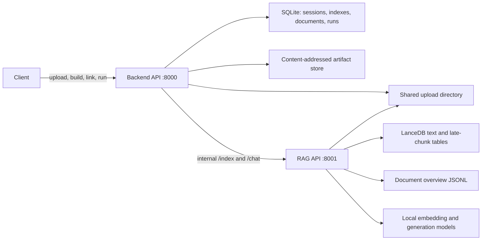

# Ingestion and Retrieval Pipeline

This is the canonical description of the implemented LocalGPT document path as
of 2026-07-15. It follows a file from the public backend API, through conversion
and indexing in the RAG service, to retrieval, answer generation, citations, and
durable run storage.

The focused [indexing pipeline](indexing_pipeline.md) and
[retrieval pipeline](retrieval_pipeline.md) pages summarize individual stages.
The implementation links at the end of this document are the source of truth
when behavior changes.

## Service and storage boundaries



The backend owns public identity and persistence: sessions, index records,
session-to-index links, upload artifacts, run state, events, and messages. The
RAG service owns document conversion, chunking, vector/FTS tables, retrieval,
and grounded synthesis. Public clients should call the backend rather than
constructing LanceDB table names or sending arbitrary local paths to the RAG
service.

## Ingestion pipeline

### 1. Create an index or stage documents in a session

There are two supported entry paths:

- Reusable index: `POST /indexes`, `POST /indexes/{index_id}/upload`, then
  `POST /indexes/{index_id}/build` (synchronous wait) or
  `POST /v1/index-jobs` (durable asynchronous job).
- Session convenience path: `POST /sessions/{session_id}/upload`, then
  `POST /sessions/{session_id}/index`. The backend creates an index, builds it,
  links it to the session, and clears the session's staging rows after success.

Creating an index stores normalized build options and assigns a dedicated,
opaque `vector_table_name`. A session upload does not become searchable until
the session indexing operation completes.

### 2. Validate and persist uploads

The backend performs these checks before registering a document:

1. Reject empty names, path components, traversal, and unsupported extensions.
2. Read at most `LOCALGPT_MAX_UPLOAD_BYTES` (50 MiB by default).
3. Reject empty files, executable signatures, invalid PDF/Office signatures,
   binary nulls in text formats, and suspicious Office ZIP expansion.
4. Store the file beneath the configured shared upload directory using a
   UUID-prefixed name and exclusive creation.
5. Store a content-addressed artifact with filename, MIME type, scope, and
   upload provenance.
6. Record the original filename and absolute stored path in SQLite.

Accepted extensions are `.pdf`, `.docx`, `.pptx`, `.xlsx`, `.html`, `.htm`,
`.md`, `.txt`, `.csv`, `.json`, and `.eml`.

This preflight is not malware scanning. A production deployment that accepts
untrusted files should scan or quarantine them before indexing.

Multi-file upload is currently processed one file at a time without a database
transaction spanning the request. If a later file is rejected, files accepted
earlier in the same request remain stored and registered.

### 3. Submit a durable indexing run

The backend reads the index's registered paths and normalized options, then
submits an indexing run. Run state moves through `queued`, `running`, and a
terminal `completed`, `failed`, or `cancelled` state. The worker sends the RAG
service an internal `/index` request containing:

- the absolute shared-upload paths;
- the backend-assigned text table name;
- the index ID;
- the effective parser, chunking, embedding, enrichment, and retrieval options.

At the RAG boundary, every path is resolved again and must be a supported file
inside `LOCALGPT_UPLOAD_DIR`. This prevents the internal endpoint from becoming
an arbitrary filesystem reader.

### 4. Convert documents to Markdown and metadata

`DocumentConverter` uses dependency-light native parsers for text, Markdown,
HTML, CSV, JSON, and EML. PDF and Office formats use Docling, loaded lazily.

For PDF files, PyMuPDF first checks whether any page has a text layer:

- text-layer PDF: Docling conversion with OCR disabled;
- scanned/image-only PDF: Docling conversion with full-page OCR enabled;
- macOS: OCRMac is selected only when its runtime is installed; otherwise the
  available Docling OCR configuration is used.

The active converter returns Markdown plus source/filename metadata. A Docling
document object is also retained when available so the structural chunker can
use it. Conversion does not currently emit a stable page/region/image contract.

### 5. Chunk each document independently

The selected chunker is explicit:

- `enable_docling_chunk=false`: recursive Markdown chunking;
- `enable_docling_chunk=true`: Docling structure-aware token chunking.

Each chunk receives `document_id`, a document-local sequential `chunk_index`,
text, and source metadata. The configured `chunk_size` and `chunk_overlap` are
validated before model work. Chunk lists remain separated by document so
contextual enrichment and late-chunk processing cannot cross file boundaries.

### 6. Build routing overviews and optional enriched text

The pipeline rewrites document overview JSONL on every build. Overviews are
used later by the triage/router to recognize document-related questions.

When contextual enrichment is enabled, the enrichment model summarizes or
augments chunks using neighbors from the same document only. The enriched text
is the text embedded and indexed. Per-document overview and enrichment failures
are counted in the build result.

### 7. Embed and index

The selected local or Hugging Face text embedder processes chunks in batches.
The main LanceDB table is replaced on rebuild and stores:

| Field | Purpose |
|---|---|
| `chunk_id` | Stable result/citation identifier for the indexed row |
| `text` | Chunk text used by lexical search and synthesis |
| `vector` | Text embedding |
| `metadata` | Serialized source, filename, parser, and other provenance |
| `document_id` | Top-level document boundary for filtering/neighbor lookup |
| `chunk_index` | Top-level document-local ordering for neighbor lookup |

The pipeline then ensures a LanceDB full-text index exists on `text`, allowing
the same rows to support dense, lexical, and hybrid search.

When late chunking is enabled, the pipeline encodes a document as a whole,
pools hidden states over each chunk span, and rebuilds a companion
`<table_name>_lc` table. Late-chunk failures are recorded per document. Optional
knowledge-graph extraction is present but disabled in the normal configuration.

### 8. Finalize backend metadata

The RAG response reports requested and processed file counts, indexed chunk
count, table name, optional-stage counters, and effective configuration. The
backend stores the result against the index and invalidates semantic retrieval
cache entries affected by that index.

The build is:

- `complete` when all requested documents and enabled stages succeed;
- `partial` when usable chunks exist but a document or optional per-document
  stage fails;
- `empty` when conversion produces no searchable chunks; the public build path
  treats this as failure rather than a usable index.

The main and late-chunk tables use replace semantics, so rebuilding does not
append stale vectors from a previous build.

## Canonical index options

| Option | Default | Effect |
|---|---:|---|
| `chunk_size` | 512 | Positive chunk token/window target |
| `chunk_overlap` | 64 | Must be from 0 through `chunk_size - 1` |
| `enable_docling_chunk` | false | Use Docling structural chunking |
| `enable_latechunk` | false | Build/query the companion late-chunk table |
| `enable_enrich` | true | Enable document-local contextual enrichment |
| `window_size` | 2 | Enrichment/context neighbor window |
| `embedding_model` | configured default | Text embedding model used to build vectors |
| `enrich_model` | configured default | Contextual enrichment model |
| `overview_model` | configured default | Routing overview model |
| `retrieval_mode` | `hybrid` | `hybrid`, `dense`, or `lexical` |
| `batch_size_embed` | 50 | Embedding batch size |
| `batch_size_enrich` | 25 | Enrichment batch size |

The normalizer accepts documented snake_case keys and legacy camelCase aliases.
Explicit `false` values are preserved.

## Retrieval and answer pipeline


### 1. Link indexes to the session

`POST /sessions/{session_id}/indexes/{index_id}` makes an existing built index
available to that session. At query time the backend, not the client, resolves
those links to the authoritative LanceDB table names. It passes the resulting
list to the internal RAG `/chat` call; an explicitly empty list means the
session has no searchable index.

Important current limitation: the link operation does **not** verify that all
linked indexes use the same embedding model or vector dimension. Dense search
requires the query embedder to match each table. Mixing incompatible indexes
can therefore cause a table search to fail and be omitted. Until per-table
embedder selection exists, deployments should only link indexes built with the
same embedding model to a session.

### 2. Start the answer run

The public durable interface is `POST /v1/runs`. With `force_rag=true`, the
agent invokes the built-in `search_knowledge` tool directly. Otherwise the
agent may choose tools according to its allowed-tool and permission policy.
Direct generation returns no document citations; grounded document answers use
the retrieval tool.

Clients can inspect `GET /v1/runs/{run_id}` and resume the SSE event stream at
`GET /v1/runs/{run_id}/events` with `Last-Event-ID`. Successful session runs
persist the user/assistant exchange and citation metadata in SQLite.

### 3. Route and transform the query

The RAG agent can triage a request as direct answer, document RAG, or graph RAG
when graph support is configured. A caller can bypass ambiguity with forced RAG.
Conversation history can be restored for contextual query handling.

When query decomposition is enabled, subqueries run in parallel. Their unique
evidence is retained and the system either composes subanswers or performs one
final synthesis over the aggregated context. This is the path used for
questions whose answer depends on multiple documents.

### 4. Retrieve from every linked table

For each table, `MultiVectorRetriever` supports:

- `dense` / `vector`: embed the query and perform vector similarity search;
- `lexical` / `fts` / `bm25`: use LanceDB full-text search;
- `hybrid`: run dense and lexical legs concurrently and combine their ranks.

Each leg initially requests up to twice `k`. Hybrid results use weighted
reciprocal-rank fusion with rank constant 60:

```text
score = (1 - dense_weight) / (60 + lexical_rank)
      + dense_weight       / (60 + dense_rank)
```

`dense_weight` is clamped to 0-1 and defaults to 0.7. Results from every linked
index are then deduplicated by chunk identity and globally trimmed to
`retrieval_k`; this is not a separate top-k quota per document.

If late chunking is enabled for the request/configuration, the matching
companion tables are searched as an additional representation. Semantic cache
namespaces include session, selected tables, search mode, and dense weight so
answers are not reused across unrelated document scopes.

### 5. Refine evidence

Depending on configuration and request overrides, retrieval can then apply:

1. optional ColBERT/Qwen AI reranking;
2. entity-scope filtering;
3. adjacent chunk expansion using the hit's own `_table_name`, `document_id`,
   and `chunk_index`;
4. optional Provence sentence pruning.

Reranker initialization and non-thread-safe ranking calls are protected by
locks because decomposed subqueries can run concurrently. Neighbor expansion
never reads from a different index table or document.

### 6. Synthesize and return citations

The remaining chunk texts are concatenated as context and passed to the
configured local generation model. The RAG response contains `answer` and the
exact `source_documents` used for synthesis. The backend converts those rows to
ordered citations containing rank, chunk/document identifiers, chunk index,
page when available, text, and score.

The current citation contract is chunk-oriented. Page is populated only when
conversion metadata supplies `page` or `page_number`; bounding boxes, image
artifact IDs, and evidence modality are not yet part of normal retrieval.

Optional answer verification runs after RAG synthesis when enabled. It checks
the generated answer against the retrieved context; it does not replace the
retrieval evidence or add sources that were not retrieved.

## Retrieval request controls

| Setting | Typical default | Effect |
|---|---:|---|
| `retrieval_k` | 8 at public tool boundary | Global evidence candidate limit |
| `search_type` | `hybrid` | Dense, lexical, or hybrid search |
| `dense_weight` | 0.7 | Dense contribution to weighted RRF |
| `query_decompose` | configuration | Split complex/multi-document questions |
| `compose_sub_answers` | configuration | Compose subanswers before final response |
| `ai_rerank` | configuration | Enable model-based reranking |
| `reranker_top_k` | configuration | Evidence retained after reranking |
| `context_expand` | configuration | Add adjacent same-document chunks |
| `context_window_size` | configuration | Number of adjacent chunks on each side |
| `provence_prune` | configuration | Sentence-level evidence pruning |
| `verify` | configuration | Post-synthesis groundedness verification |

## Current multimodal boundary

The active path is document-aware and can OCR scans, but it is not end-to-end
multimodal retrieval:

- the indexed evidence channel contains text embeddings only;
- OCR/Docling output may describe pictures or tables as text, but page images
  and crops are not stored in a visual vector index;
- `MultiVectorRetriever` is constructed with `vision_model=None`;
- queries are not embedded into a shared image/text space;
- no retrieved images are sent to a vision-capable synthesis model;
- citations do not prove visual provenance.

Therefore an answer extracted from OCR labels is text retrieval, not proof that
the system understood arrow direction, chart magnitude, layout, or other visual
relationships. The deterministic multimodal harness intentionally fails strict
diagram, chart, and visual-provenance cases until these pieces exist.

The proposed extension is documented in
[Multimodal parser research and retrieval design](multimodal_parser_research.md):
normalize LiteParse/Docling output into page and region records, preserve page
images and bounding boxes, build related text and visual indexes, fuse their
ranks, send selected images to a VLM, and return modality-aware page/region
citations.

## Known implementation limitations

- Multi-file upload is not atomic; a partially accepted request requires the
  caller to inspect the response/state and clean up or retry deliberately.
- Session-to-index linking does not enforce embedding model or vector-dimension
  compatibility.
- Failure to create the FTS index is logged but does not fail the build. Dense
  retrieval can still work, while lexical/hybrid behavior is degraded.
- A failed search of one linked LanceDB table is converted to an empty result
  for that table. The answer can complete from other indexes without exposing a
  structured partial-retrieval warning to the caller.
- Citations do not yet carry parser version, bounding box, evidence modality,
  or immutable image-artifact provenance.

## Operational checks

For a real end-to-end validation, confirm all of the following rather than only
checking that an upload endpoint returned success:

1. The index reports every requested file processed and a non-zero chunk count.
2. LanceDB contains the expected main table, row count, vector dimension, and
   FTS index; the optional late-chunk table exists when requested.
3. Every configured embedding model receives a real probe and its dimension
   matches the table it queries.
4. A forced-RAG run returns an answer plus citations from the intended session
   tables.
5. Multi-document questions cite every document required for the conclusion.
6. Scanned PDFs are answered from OCR-derived indexed text.
7. Visual cases require page-level visual provenance and are not counted as
   multimodal success merely because OCR found labels.

Run the multimodal evaluation harness with:

```bash
python scripts/evaluate_multimodal.py \
  --mode all \
  --embedding-model qwen3-embedding:0.6b \
  --vision-model gemma3:12b \
  --parser-backend docling \
  --strict \
  --output data/evals/multimodal-retrieval.json
```

## Implementation map

| Concern | Primary implementation |
|---|---|
| Upload validation and option normalization | `localgpt_runtime.py` |
| Public upload, build, link, and run APIs | `backend/api.py` |
| SQLite session/index/document metadata | `backend/database.py` |
| Durable indexing and agent run lifecycle | `backend/agent_runtime/service.py` |
| Backend-owned session/table retrieval scope | `backend/agent_runtime/builtin_tools.py` |
| Conversion and OCR routing | `rag_system/ingestion/document_converter.py` |
| Recursive chunking | `rag_system/ingestion/chunking.py` |
| Structural chunking | `rag_system/ingestion/docling_chunker.py` |
| Embedding and LanceDB writes | `rag_system/indexing/representations.py`, `rag_system/indexing/embedders.py` |
| Index orchestration | `rag_system/pipelines/indexing_pipeline.py` |
| Dense, lexical, and hybrid table search | `rag_system/retrieval/retrievers.py` |
| Rank fusion | `rag_system/retrieval/fusion.py` |
| Reranking, expansion, pruning, synthesis | `rag_system/pipelines/retrieval_pipeline.py` |
| Triage, decomposition, verification | `rag_system/agent/loop.py` |
| Real multimodal evaluation corpus and matrix | `scripts/evaluate_multimodal.py`, `rag_system/evaluation/multimodal_harness.py` |
