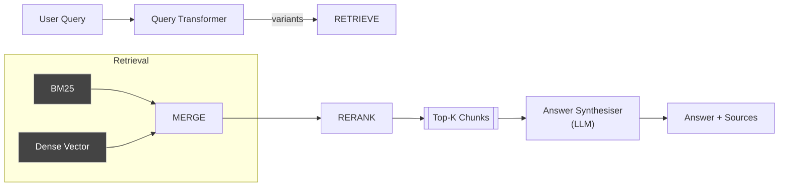

# 📥 Retrieval Pipeline

_Maps to `rag_system/pipelines/retrieval_pipeline.py` and helpers in `retrieval/`, `rerankers/`._

## Role
Given a **user query** and one or more indexed tables, retrieve the most relevant text chunks and synthesise an answer.

## Sub-components
| Stage | Module | Key Classes / Fns | Notes |
|-------|--------|-------------------|-------|
| Query Pre-processing | `retrieval/query_transformer.py` | `QueryTransformer`, `HyDEGenerator`, `GraphQueryTranslator` | Expands, rewrites, or translates the raw query. |
| Retrieval | `retrieval/retrievers.py` | `BM25Retriever`, `DenseRetriever`, `HybridRetriever` | Abstract over LanceDB vector + FTS search. |
| Reranking | `rerankers/reranker.py` | `ColBERTSmall`, fallback `bge-reranker` | Optionally improves result ordering. |
| Synthesis | `pipelines/retrieval_pipeline.py` | `_synthesize_final_answer()` | Calls LLM with evidence snippets. |

## End-to-End Flow



### Narrative
1. **Query Transformer** may expand the query (keyword list, HyDE doc, KG translation) depending on `searchType`.
2. **Retrievers** execute BM25 and/or dense similarity against LanceDB.  Combination controlled by `retrievalMode` and `denseWeight`.
3. **Reranker** (if `aiRerank=true` or hybrid search) scores snippets; top `rerankerTopK` chosen.
4. **Synthesiser** streams an LLM completion using the prompt described in `prompt_inventory.md` (`retrieval_pipeline.synth_final`).

## Configuration Flags (passed from UI → backend)
| Flag | Default | Effect |
|------|---------|--------|
| `searchType` | `fts` | UI label (FTS / Dense / Hybrid). |
| `retrievalK` | 10 | Initial candidate count per retriever. |
| `contextWindowSize` | 5 | How many adjacent chunks to merge (late-chunk). |
| `rerankerTopK` | 20 | How many docs to pass into AI reranker. |
| `denseWeight` | 0.5 | When `hybrid`, linear mix weight. |
| `aiRerank` | bool | Toggle reranker. |
| `verify` | bool | If true, pass answer to **Verifier** component. |

## Interfaces
* Reads from **LanceDB** tables `text_pages_<index>`.
* Calls **Ollama** generation model specified in `PIPELINE_CONFIGS`.
* Exposes `RetrievalPipeline.answer_stream()` iterator consumed by SSE API.

## Extension Points
* Plug new retriever by inheriting `BaseRetriever` and registering in `retrievers.py`.
* Swap reranker model via `EXTERNAL_MODELS['reranker_model']`.
* Custom answer prompt can be overridden by passing `prompt_override` to `_synthesize_final_answer()` (not yet surfaced in UI).

##  Detailed Implementation Analysis

### Core Architecture Pattern
The `RetrievalPipeline` uses **lazy initialization** for all components to avoid heavy memory usage during startup. Each component (embedder, retrievers, rerankers) is only loaded when first accessed via private `_get_*()` methods.

```python
def _get_text_embedder(self):
    if self.text_embedder is None:
        self.text_embedder = select_embedder(
            self.config.get("embedding_model_name", "Qwen/Qwen3-Embedding-0.6B"),
            self.ollama_config.get("host")
        )
    return self.text_embedder
```

### Thread Safety Implementation
**Critical Issue**: ColBERT reranker and model loading are not thread-safe. The system uses multiple locks:

```python
# Global locks to prevent race conditions
_rerank_lock: Lock = Lock()           # Protects .rank() calls
_ai_reranker_init_lock: Lock = Lock() # Prevents concurrent model loading
_sentence_pruner_lock: Lock = Lock()  # Serializes Provence model init
```

When multiple queries run in parallel, only one thread can initialize heavy models or perform reranking operations.

### Retrieval Strategy Deep-Dive

#### 1. Multi-Vector Dense Retrieval (`_get_dense_retriever()`)
```python
self.dense_retriever = MultiVectorRetriever(
    db_manager,           # LanceDB connection
    text_embedder,        # Qwen3-Embedding embedder
    vision_model=None,    # Optional multimodal
    fusion_config={}      # Score combination rules
)
```

**Process**:
1. Query → embedding vector (1024D for Qwen3-Embedding-0.6B)
2. LanceDB ANN search using IVF-PQ index
3. Cosine similarity scoring
4. Returns top-K with metadata

#### 2. BM25 Full-Text Search (`_get_bm25_retriever()`)
```python
# Uses SQLite FTS5 under the hood
SELECT chunk_id, text, bm25(fts_table) as score 
FROM fts_table 
WHERE fts_table MATCH ? 
ORDER BY bm25(fts_table) 
LIMIT ?
```

**Token Processing**:
- Stemming via Porter algorithm
- Stop-word removal
- N-gram tokenization (configurable)

#### 3. Hybrid Score Fusion
When both retrievers are enabled:
```python
final_score = (1 - dense_weight) * bm25_score + dense_weight * dense_score
```
Default `dense_weight = 0.7` favors semantic over lexical matching (updated from 0.5).

### Late-Chunk Merging Algorithm

**Problem**: Small chunks lose context; large chunks dilute relevance.  
**Solution**: Retrieve small chunks, then expand with neighbors.

```python
def _get_surrounding_chunks_lancedb(self, chunk, window_size):
    start_index = max(0, chunk_index - window_size)
    end_index = chunk_index + window_size
    
    sql_filter = f"document_id = '{document_id}' AND chunk_index >= {start_index} AND chunk_index <= {end_index}"
    results = tbl.search().where(sql_filter).to_list()
    
    # Sort by chunk_index to maintain document order
    return sorted(results, key=lambda x: x.get("chunk_index", 0))
```

**Benefits**:
- Maintains granular search precision
- Provides richer context for answer generation
- Configurable window size (default: 5 chunks = ~2500 tokens)

### AI Reranker Implementation

#### ColBERT Strategy (via rerankers-lib)
```python
from rerankers import Reranker
self.ai_reranker = Reranker("answerdotai/answerai-colbert-small-v1", model_type="colbert")

# Usage
scores = reranker.rank(query, [doc.text for doc in candidates])
```

**ColBERT Architecture**:
- **Query encoding**: Each token → 128D vector
- **Document encoding**: Each token → 128D vector  
- **Interaction**: MaxSim between all query-doc token pairs
- **Advantage**: Fine-grained token-level matching

#### Fallback: BGE Cross-Encoder
```python
# When ColBERT fails/unavailable
from sentence_transformers import CrossEncoder
model = CrossEncoder('BAAI/bge-reranker-base')
scores = model.predict([(query, doc.text) for doc in candidates])
```

### Answer Synthesis Pipeline

#### Prompt Engineering Pattern
```python
def _synthesize_final_answer(self, query: str, facts: str, *, event_callback=None):
    prompt = f"""
You are an AI assistant specialised in answering questions from retrieved context.

Context you receive
• VERIFIED FACTS – text snippets retrieved from the user's documents.
• ORIGINAL QUESTION – the user's actual query.

Instructions
1. Evaluate each snippet for relevance to the ORIGINAL QUESTION
2. Synthesise an answer **using only information from relevant snippets**
3. If snippets contradict, mention the contradiction explicitly
4. If insufficient information: "I could not find that information in the provided documents."
5. Provide thorough, well-structured answer with relevant numbers/names
6. Do **not** introduce external knowledge

–––––  Retrieved Snippets  –––––
{facts}
––––––––––––––––––––––––––––––

ORIGINAL QUESTION: "{query}"
"""

    response = self.llm_client.complete_stream(
        prompt=prompt,
        model=self.ollama_config["generation_model"]  # qwen3:8b
    )
    
    for chunk in response:
        if event_callback:
            event_callback({"type": "answer_chunk", "content": chunk})
        yield chunk
```

**Advanced Features**:
- **Source Attribution**: Automatic citation generation
- **Confidence Scoring**: Based on retrieval scores and snippet relevance
- **Answer Verification**: Optional grounding check via Verifier component

### Query Processing and Transformation

#### Query Decomposition
```python
class QueryDecomposer:
    def decompose_query(self, query: str) -> List[str]:
        """Break complex queries into simpler sub-queries."""
        decomposition_prompt = f"""
        Break down this complex question into 2-4 simpler sub-questions that would help answer the original question.
        
        Original question: {query}
        
        Sub-questions:
        1.
        2.
        3.
        4.
        """
        
        response = self.llm_client.complete(
            prompt=decomposition_prompt,
            model=self.enrichment_model  # qwen3:0.6b for speed
        )
        
        # Parse response into list of sub-queries
        return self._parse_subqueries(response)
```

#### HyDE (Hypothetical Document Embeddings)
```python
class HyDEGenerator:
    def generate_hypothetical_doc(self, query: str) -> str:
        """Generate hypothetical document that would answer the query."""
        hyde_prompt = f"""
        Generate a hypothetical document passage that would perfectly answer this question:
        
        Question: {query}
        
        Hypothetical passage:
        """
        
        response = self.llm_client.complete(
            prompt=hyde_prompt,
            model=self.enrichment_model
        )
        
        return response.strip()
```

### Caching and Performance Optimization

#### Semantic Query Caching
```python
class RetrievalPipeline:
    def __init__(self, config, ollama_client, ollama_config):
        # TTL cache for embeddings and results
        self.query_cache = TTLCache(maxsize=100, ttl=300)  # 5 min TTL
        self.embedding_cache = LRUCache(maxsize=500)
        self.semantic_threshold = 0.98  # Similarity threshold for cache hits
    
    def get_cached_result(self, query: str, session_id: str = None) -> Optional[Dict]:
        """Check for semantically similar cached queries."""
        query_embedding = self._get_text_embedder().create_embeddings([query])[0]
        
        for cached_query, cached_data in self.query_cache.items():
            cached_embedding = cached_data["embedding"]
            similarity = cosine_similarity([query_embedding], [cached_embedding])[0][0]
            
            if similarity > self.semantic_threshold:
                # Check session scope if configured
                if self.cache_scope == "session" and cached_data.get("session_id") != session_id:
                    continue
                
                print(f"🎯 Cache hit: {similarity:.3f} similarity")
                return cached_data["result"]
        
        return None
```

#### Batch Processing Optimizations
```python
def process_query_batch(self, queries: List[str]) -> List[Dict]:
    """Process multiple queries efficiently."""
    # Batch embed all queries
    query_embeddings = self._get_text_embedder().create_embeddings(queries)
    
    # Batch search
    results = []
    for i, query in enumerate(queries):
        embedding = query_embeddings[i]
        
        # Search with pre-computed embedding
        dense_results = self._search_dense_with_embedding(embedding)
        bm25_results = self._search_bm25(query)
        
        # Combine and rerank
        combined = self._combine_results(dense_results, bm25_results)
        reranked = self._rerank_batch([query], [combined])[0]
        
        results.append(reranked)
    
    return results
```

### Advanced Search Features

#### Conversational Context Integration
```python
def answer_with_history(self, query: str, conversation_history: List[Dict], **kwargs):
    """Answer query with conversation context."""
    # Build conversational context
    context_prompt = self._build_conversation_context(conversation_history)
    
    # Expand query with context
    expanded_query = f"{context_prompt}\n\nCurrent question: {query}"
    
    # Process with expanded context
    return self.answer_stream(expanded_query, **kwargs)

def _build_conversation_context(self, history: List[Dict]) -> str:
    """Build context from conversation history."""
    context_parts = []
    
    for turn in history[-3:]:  # Last 3 turns for context
        if turn.get("role") == "user":
            context_parts.append(f"Previous question: {turn['content']}")
        elif turn.get("role") == "assistant":
            # Extract key points from previous answers
            context_parts.append(f"Previous context: {turn['content'][:200]}...")
    
    return "\n".join(context_parts)
```

#### Multi-Index Search
```python
def search_multiple_indexes(self, query: str, index_ids: List[str], **kwargs):
    """Search across multiple document indexes."""
    all_results = []
    
    for index_id in index_ids:
        table_name = f"text_pages_{index_id}"
        
        try:
            # Search individual index
            index_results = self._search_single_index(query, table_name, **kwargs)
            
            # Add index metadata
            for result in index_results:
                result["source_index"] = index_id
            
            all_results.extend(index_results)
            
        except Exception as e:
            print(f"⚠️ Error searching index {index_id}: {e}")
            continue
    
    # Global reranking across all indexes
    if len(all_results) > kwargs.get("retrieval_k", 20):
        all_results = self._rerank_global(query, all_results, **kwargs)
    
    return all_results
```

### Error Handling and Resilience

#### Graceful Degradation
```python
def answer_stream(self, query: str, **kwargs):
    """Main answer method with comprehensive error handling."""
    try:
        # Try full pipeline
        return self._answer_stream_full_pipeline(query, **kwargs)
        
    except Exception as e:
        print(f"⚠️ Full pipeline failed: {e}")
        
        try:
            # Fallback: Dense-only search
            kwargs["search_type"] = "dense"
            kwargs["ai_rerank"] = False
            return self._answer_stream_fallback(query, **kwargs)
            
        except Exception as e2:
            print(f"⚠️ Fallback failed: {e2}")
            
            # Last resort: Direct LLM answer
            return self._direct_llm_answer(query)

def _direct_llm_answer(self, query: str):
    """Direct LLM answer as last resort."""
    prompt = f"""
    The document retrieval system is temporarily unavailable. 
    Please provide a helpful response acknowledging this limitation.
    
    User question: {query}
    
    Response:
    """
    
    response = self.llm_client.complete_stream(
        prompt=prompt,
        model=self.ollama_config["generation_model"]
    )
    
    yield "⚠️ Document search unavailable. Providing general response:\n\n"
    
    for chunk in response:
        yield chunk
```

#### Recovery Mechanisms
```python
def recover_from_embedding_failure(self, query: str, **kwargs):
    """Recover when embedding model fails."""
    print("🔄 Attempting embedding model recovery...")
    
    # Try to reinitialize embedder
    try:
        self.text_embedder = None  # Clear failed instance
        embedder = self._get_text_embedder()  # Reinitialize
        
        # Test with simple query
        test_embedding = embedder.create_embeddings(["test"])
        
        if test_embedding is not None:
            print("✅ Embedding model recovered")
            return True
            
    except Exception as e:
        print(f"❌ Recovery failed: {e}")
    
    # Fallback to BM25-only search
    kwargs["search_type"] = "bm25"
    kwargs["ai_rerank"] = False
    print("🔄 Falling back to keyword search only")
    
    return False
```

### Performance Monitoring and Metrics

#### Query Performance Tracking
```python
class PerformanceTracker:
    def __init__(self):
        self.metrics = {
            "query_count": 0,
            "avg_response_time": 0,
            "cache_hit_rate": 0,
            "error_rate": 0,
            "embedding_time": 0,
            "retrieval_time": 0,
            "reranking_time": 0,
            "synthesis_time": 0
        }
    
    @contextmanager
    def track_query(self, query: str):
        """Context manager for tracking query performance."""
        start_time = time.time()
        
        try:
            yield
            
            # Success metrics
            duration = time.time() - start_time
            self.metrics["query_count"] += 1
            self.metrics["avg_response_time"] = (
                (self.metrics["avg_response_time"] * (self.metrics["query_count"] - 1) + duration) 
                / self.metrics["query_count"]
            )
            
        except Exception as e:
            # Error metrics
            self.metrics["error_rate"] = (
                self.metrics["error_rate"] * self.metrics["query_count"] + 1
            ) / (self.metrics["query_count"] + 1)
            
            raise e
        
        finally:
            self.metrics["query_count"] += 1
```

#### Resource Usage Monitoring
```python
def monitor_memory_usage(self):
    """Monitor memory usage of pipeline components."""
    import psutil
    import gc
    
    process = psutil.Process()
    memory_info = process.memory_info()
    
    print(f"Memory Usage: {memory_info.rss / 1024 / 1024:.1f} MB")
    
    # Component-specific monitoring
    if hasattr(self, 'text_embedder') and self.text_embedder:
        print(f"Embedder loaded: {type(self.text_embedder).__name__}")
    
    if hasattr(self, 'ai_reranker') and self.ai_reranker:
        print(f"Reranker loaded: {type(self.ai_reranker).__name__}")
    
    # Suggest cleanup if memory usage is high
    if memory_info.rss > 8 * 1024 * 1024 * 1024:  # 8GB
        print("⚠️ High memory usage detected - consider cleanup")
        gc.collect()
```

---

## Configuration Reference

### Default Pipeline Configuration
```python
RETRIEVAL_CONFIG = {
    "retriever": "multivector",
    "search_type": "hybrid",
    "retrieval_k": 20,
    "reranker_top_k": 10,
    "dense_weight": 0.7,
    "late_chunking": {
        "enabled": True,
        "window_size": 5
    },
    "ai_rerank": True,
    "verify_answers": False,
    "cache_enabled": True,
    "cache_ttl": 300,
    "semantic_cache_threshold": 0.98
}
```

### Model Configuration
```python
MODEL_CONFIG = {
    "embedding_model": "Qwen/Qwen3-Embedding-0.6B",
    "generation_model": "qwen3:8b",
    "enrichment_model": "qwen3:0.6b",
    "reranker_model": "answerdotai/answerai-colbert-small-v1",
    "fallback_reranker": "BAAI/bge-reranker-base"
}
```

### Performance Tuning
```python
PERFORMANCE_CONFIG = {
    "batch_sizes": {
        "embedding": 32,
        "reranking": 16,
        "synthesis": 1
    },
    "timeouts": {
        "embedding": 30,
        "retrieval": 60,
        "reranking": 30,
        "synthesis": 120
    },
    "memory_limits": {
        "max_cache_size": 1000,
        "max_results_per_query": 100,
        "chunk_size_limit": 2048
    }
}
```

## Extension Examples

### Custom Retriever Implementation
```python
class CustomRetriever(BaseRetriever):
    def search(self, query: str, k: int = 10) -> List[Dict]:
        """Implement custom search logic."""
        # Your custom retrieval implementation
        pass
    
    def get_embeddings(self, texts: List[str]) -> np.ndarray:
        """Generate embeddings for custom retrieval."""
        # Your custom embedding logic
        pass
```

### Custom Reranker Implementation
```python
class CustomReranker(BaseReranker):
    def rank(self, query: str, documents: List[Dict]) -> List[Dict]:
        """Implement custom reranking logic."""
        # Your custom reranking implementation
        pass
```

### Custom Query Transformer
```python
class CustomQueryTransformer:
    def transform(self, query: str, context: Dict = None) -> str:
        """Transform query based on context."""
        # Your custom query transformation logic
        pass
``` 