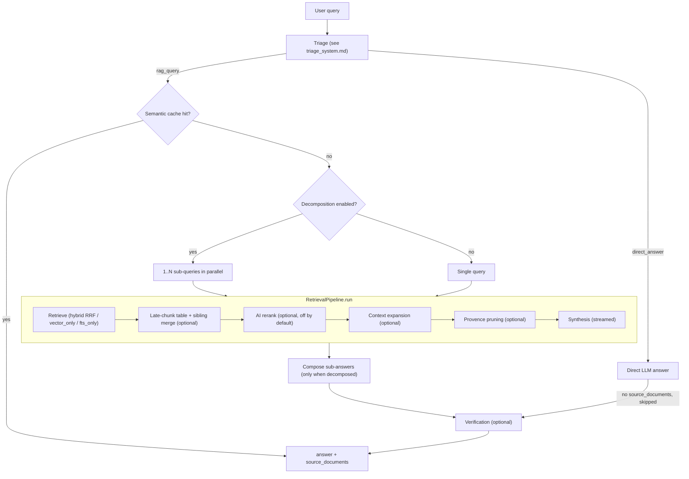

# 📥 Retrieval Pipeline

_Maps to `rag_system/pipelines/retrieval_pipeline.py`, orchestrated by `rag_system/agent/loop.py`, with helpers in `retrieval/` and `rerankers/`._

## Role
Given a user query and one LanceDB table, retrieve the most relevant chunks and synthesise an answer with its source documents.

Two objects share the work:

* **`Agent`** (`rag_system/agent/loop.py`) owns triage, the semantic cache, query decomposition, sub-answer composition, conversation history and verification.
* **`RetrievalPipeline`** (`rag_system/pipelines/retrieval_pipeline.py`) owns everything from retrieval to synthesis for a *single* query string. `Agent` may call it once, or once per sub-query in parallel.

## Sub-components

| Stage | Module | Key classes / functions | Notes |
|-------|--------|-------------------------|-------|
| Query decomposition | `retrieval/query_transformer.py` | `QueryDecomposer.decompose()` | Optional. Splits a query into standalone sub-queries; runs on the utility model. |
| Retrieval | `retrieval/retrievers.py` | `MultiVectorRetriever.retrieve()` | Runs LanceDB full-text and/or vector search over one table. There is no separate BM25 retriever class — lexical search is LanceDB's native FTS index. |
| Reranking | `pipelines/retrieval_pipeline.py`, `rerankers/reranker.py` | `_get_ai_reranker()`, `QwenRerankerScorer`, `rerankers.Reranker`, `CrossEncoderReranker` | Off by default. Qwen3-Reranker names go to `QwenRerankerScorer`; otherwise the model is loaded through the `rerankers` library. `CrossEncoderReranker` is the non-library fallback branch. |
| Sentence pruning | `rerankers/sentence_pruner.py` | `SentencePruner.prune_documents()` | Provence (`naver/provence-reranker-debertav3-v1`). Off unless requested. |
| Synthesis | `pipelines/retrieval_pipeline.py` | `_synthesize_final_answer()` | Streams an LLM completion on the generation model. |
| Verification | `agent/verifier.py` | `Verifier.verify_async()` | See `verifier.md`. |

### Removed: the graph path

`GraphQueryTranslator`, `GraphRetriever` and `GraphExtractor` were **deleted on
2026-08-09** (roadmap item 2.5). They were unreachable — no shipped profile ever
set `graph_strategy` — and the evidence is against re-adding them: GraphRAG
*loses* on single-hop retrieval, its multi-hop gains range from +3 points to +27
depending on how well the vector baseline is tuned, and it costs **41–57× at
indexing** and up to **~377× in query tokens**. See
[`research/academic-evidence-2026.md`](research/academic-evidence-2026.md) §6.
`networkx` and `fuzzywuzzy` left `requirements.txt` with them.

## End-to-end flow


```mermaid
flowchart TD
    Q["User query"] --> T["Triage (see triage_system.md)"]
    T -- direct_answer --> DA["Direct LLM answer"]
    T -- rag_query --> C{"Semantic cache hit?"}
    C -- yes --> OUT["answer + source_documents"]
    C -- no --> D{"Decomposition enabled?"}
    D -- yes --> SUB["1..N sub-queries in parallel"]
    D -- no --> ONE["Single query"]
    SUB --> RP
    ONE --> RP
    subgraph RP [RetrievalPipeline.run]
        R1["Retrieve (hybrid RRF / vector_only / fts_only)"] --> R2["Late-chunk table + sibling merge (optional)"]
        R2 --> R3["AI rerank (optional, off by default)"]
        R3 --> R4["Context expansion (optional)"]
        R4 --> R5["Provence pruning (optional)"]
        R5 --> R6["Synthesis (streamed)"]
    end
    RP --> COMP["Compose sub-answers (only when decomposed)"]
    COMP --> V["Verification (optional)"]
    DA -- "no source_documents, skipped" --> V
    V --> OUT
```

## Stage detail

### 1. Retrieval — `MultiVectorRetriever.retrieve()` (`retrievers.py:91-222`)

```python
retrieve(text_query: str, table_name: str, k: int, search_type: str = "hybrid") -> List[Dict]
```

`search_type` selects which LanceDB legs run. Unknown values log a warning and degrade to `hybrid` (`retrievers.py:99-102`).

| Mode | Legs | Score returned |
|------|------|----------------|
| `hybrid` (default) | FTS and vector, run concurrently on a 2-worker thread pool (`retrievers.py:139-143`), fused by reciprocal rank fusion | RRF score |
| `vector_only` | vector only | `1 / (1 + distance)` |
| `fts_only` | FTS only | LanceDB's BM25 score |

Details:

* **FTS leg** — `tbl.search(query=..., query_type="fts").limit(k)`. Single-word queries are rewritten to `"<word>* OR <word>~"` to add prefix and fuzzy matching (`retrievers.py:117-118`). This is LanceDB's built-in full-text index (created at index time, see `indexing_pipeline.md`) — no SQLite, no Porter stemming, no configurable stop-word or n-gram handling.
* **Vector leg** — the query is embedded once and memoised in a 256-entry `lru_cache` per retriever instance, then `tbl.search(vector).limit(k)`. Before searching, the retriever reads the table's embedder marker: a table written by a different embedding model raises `EmbedderMismatchError` (which is deliberately *not* swallowed by the catch-all below), and the query vector is L2-normalized only when the table's own vectors are, so LanceDB's default L2 ordering matches the cosine ordering the model cards specify. A table with no marker is searched the legacy, unnormalized way with a one-time warning.
* **Fusion** — each leg contributes `1 / (60 + rank)` (`_RRF_K = 60`, `retrievers.py:20`). Rows are deduplicated on `chunk_id`, falling back to `_rowid` then `text` (`retrievers.py:83-89`), summed, sorted, and truncated to `k`. There is no weighted linear blend and no `dense_weight` knob.
* Each leg fetches `k` rows, so hybrid examines up to `2k` candidates and returns `k`.
* Every returned doc carries a finite, higher-is-better `score`. The raw per-leg values `bm25` and `_distance` are attached **only** when that leg actually hit the row.
* `metadata` is accepted as either a dict or a JSON string; `text` falls back through `metadata.original_text` → `row.text` → `""` (`retrievers.py:179-202`).
* On any exception other than `EmbedderMismatchError` the method logs and returns `[]`, so a missing table degrades to zero results rather than an error. An embedder mismatch propagates instead — a wrong-model answer is worse than an error.

### 2. Late chunking at query time (`retrieval_pipeline.py:289-341`)

When the merged late-chunk config is enabled, two extra things happen:

1. A second `retrieve()` runs against the late-chunk table and its hits are appended to the candidate list (`:293-305`). The table name is `latechunk.lancedb_table_name` if set, otherwise `<table><table_suffix>` with `table_suffix` defaulting to `_lc` (`:85-92`) — the same name `IndexingPipeline` writes.
2. **Sibling merging** (`:316-341`): for every retrieved chunk, the ±1 neighbouring chunks from the same document are fetched from the main table and their text is concatenated into that chunk's `text`. This runs off the config flag alone, whether or not the `_lc` table exists.

The config block is merged across both container names and both spellings — `retrieval.late_chunking`, `retrieval.latechunk`, `retrievers.late_chunking`, `retrievers.latechunk`, later writes winning (`:70-83`) — so a profile setting and a runtime API override can come from different places and both apply.

The `default` profile enables late chunking at query time (`main.py:57-59`), while the RAG API's `/index` endpoint defaults `enable_latechunk` to `false` (`api_server.py:410`). Unless you explicitly index with late chunking on, the `_lc` table does not exist: the extra `retrieve()` logs "Could not search table …" and returns nothing, while sibling merging still applies.

### 2b. Evidence-sufficiency retry (`RetrievalPipeline.retrieve_candidates`)

_Roadmap item 2.1, shipped 2026-08-09. On in the `default` profile, off in `fast`._

One conditional second retrieval, and only one — the evidence for iterative
retrieval says iteration 1→2 captures ~95% of the gains and iterations ≥3 are
noise. It wraps the first stage **and** the rerank stage, so it sees the ranking
the caller would actually have got.

```python
"retrieval": {"retry": {"enabled": True, "min_top_score": 0.12, "max_attempts": 1}}
```

**The signal.** Not the raw top similarity. That was measured on the gold set and
is *anti*-correlated with success: the three `mixed` first-stage misses each
scored a **higher** top cosine than the median successful query, because absolute
similarity mostly encodes how close a query's phrasing sits to the corpus's
register. What carries signal is contrast — how far the best candidate stands
above everything else the query dragged in:

```
evidence = (cos_top − cos_background) / (1 − cos_background)
```

`cos_background` is the mean cosine of candidates from rank 6 down; the
denominator rescales against this query's reachable headroom, keeping the result
in 0–1 and comparable across queries. Cosine comes from LanceDB's squared-L2
`_distance` on the L2-normalized v4 tables (`cos = 1 − d/2`), so the retry is only
armed on a normalized table — on a legacy table, or in `fts_only` mode, the score
is `None` and nothing fires. **RRF scores are never used**: they encode rank, not
confidence, and are near-identical for every query.

When reranking is on, the top reranker score is preferred instead, but only when
it is a genuine 0–1 probability (`QwenRerankerScorer` returns P("yes")); an
arbitrary logit is rejected rather than compared against a probability threshold.
The threshold for that path is `min_rerank_score`, defaulting to `min_top_score`.

**What happens on a fire.** `_reformulate_query()` makes one `format="json"` call
on the **enrichment** model asking for a rewrite in the vocabulary a document
would use, the whole first stage + rerank runs again on it, and **the better of
the two result sets by the same score is kept** — a retry that does not improve
the evidence is discarded, never merged. A `retrieval_retry` event goes out
through `event_callback`, so the RAG API's SSE stream carries it and the UI
cascade shows a "Rechecking weak evidence" step.

**Measured** (`../eval/decisions/phase2-pipeline.md`): fires on **9.7% of `mixed`
queries** (7/72) and 20.8% of `docs`, and moved `mixed` first-stage nDCG@10 from
0.889 to 0.901/0.906 across two runs with **zero per-query regressions**. It
repaired `docs_d16`, a genuine recall@10 miss.

### 3. AI reranking (`retrieval_pipeline.py`, `_rerank_stage`)

Loaded lazily behind `_ai_reranker_init_lock` so only one thread performs the heavy `from_pretrained()`; the `.rank()` call itself is serialised behind `_rerank_lock` because the `rerankers` backends are not thread-safe.

Config keys read from `reranker`:

| Key | Default in code | `default` profile |
|-----|-----------------|-------------------|
| `enabled` | falsy | **`false`** — reranking is off by default ([`../eval/DECISIONS.md`](../eval/DECISIONS.md)) |
| `model_name` | none — missing logs a warning and skips reranking (`:145-148`) | `EXTERNAL_MODELS["reranker_model"]` = `Qwen/Qwen3-Reranker-4B`, loaded only if `enabled` is turned on |
| `strategy` | `rerankers-lib` | `rerankers-lib` |
| `model_type` | `cross-encoder` | not set ⇒ `cross-encoder` |
| `top_k` | all retrieved docs | `10` |
| `top_percent` | unset | unset — when set (0 < p ≤ 1) it overrides `top_k` with `max(1, len(docs) * p)` |

A model whose `model_type` is `qwen3`, or whose name contains `qwen3-reranker`, is routed to the in-repo `QwenRerankerScorer` — the `rerankers` library builds Qwen3-Reranker with a randomly initialised score head, so this route is what makes the default reranker model correct rather than merely loadable. Otherwise `strategy: "rerankers-lib"` loads `rerankers.Reranker(model_name, model_type=model_type)`, and any other value constructs the local `CrossEncoderReranker` (`rerankers/reranker.py:5`), an `AutoModelForSequenceClassification` cross-encoder with batched scoring and an early-exit heuristic.

**If the reranker fails to load, the pipeline logs `⚠️ Could not load reranker '<name>' (<err>). Continuing without reranking.` and continues with the unranked candidates.** There is no second fallback model.

#### Decomposition applies here, not at the first stage

_Roadmap item 2.2, shipped 2026-08-09._

Decomposing the **first stage** dilutes it semantically; the 2026 evidence
(MultiConIR/SSRB) puts the win at the reranking stage instead. So:

* The first stage **always** runs once, on the full original query.
* When sub-queries are supplied *and* the reranker is on, every candidate is
  scored against **every** sub-query and the per-sub-query scores are combined
  with `query_decomposition.rerank_aggregate` — `"mean"` (default) or `"max"`.
  `mean` is the default because it measured better than `max` on both halves of
  the A/B ([`../eval/decisions/phase2-pipeline.md`](../eval/decisions/phase2-pipeline.md) §3).
* When the reranker is off — the shipped default — there is no rerank stage, so
  the sub-queries are simply unused and this is plain single-query retrieval.

One path still fans the first stage out over sub-queries, and it is gated behind
its own pre-existing flag: `query_decomposition.compose_from_sub_answers` (true
in the `default` profile). That path needs a separate *answer* per sub-question
to compose from, which a single shared candidate set cannot produce, so it runs a
full `RetrievalPipeline.run()` per sub-query in parallel. Exactly what runs:

| `query_decomposition` | reranker | First stage | Rerank scored against |
|---|---|---|---|
| off | either | once, full query | full query |
| on, `compose_from_sub_answers: true` (profile default) | either | **once per sub-query**, in parallel | that sub-query |
| on, `compose_from_sub_answers: false` | on | once, full query | **all sub-queries, aggregated** |
| on, `compose_from_sub_answers: false` | off | once, full query | — (no rerank stage; sub-queries unused) |
| on, one sub-query after decomposition | either | once, the resolved query | the resolved query |

### 4. Context expansion (`retrieval_pipeline.py:400-441`)

When the effective window size is greater than 0, each surviving doc is expanded with its neighbours from the same document via a metadata-only LanceDB filter (`document_id = ... AND chunk_index BETWEEN ...`), run across a thread pool. The union is deduplicated on `chunk_id` and re-sorted by `rerank_score`, then `_distance`, then `score`, then document order.

Caveat worth knowing: immediately afterwards, `if any('rerank_score' in d for d in final_docs): final_docs = [d for d in final_docs if 'rerank_score' in d]` (`:445-446`). Only the reranked seed chunks carry a `rerank_score`, so **when the AI reranker ran, the freshly added neighbours are filtered back out**. Context expansion therefore only changes the context when reranking is disabled — which, since the Phase 1 adoption, is the default.

### 5. Provence sentence pruning (`retrieval_pipeline.py:448-462`)

Runs between context expansion and synthesis when `provence.enabled` is set. Loads `naver/provence-reranker-debertav3-v1` once behind `_sentence_pruner_lock`, drops sentences scoring below `provence.threshold` (default `0.1`, `:455`), and then removes any chunk whose text was pruned to nothing (`:460`). If the model cannot be downloaded or loaded, `SentencePruner` logs and `prune_documents()` echoes its input unchanged.

No shipped profile contains a `provence` block, so pruning is off unless a request enables it.

### 6. Synthesis (`retrieval_pipeline.py:223-261, 502-514`)

The surviving chunk texts are joined with blank lines and passed to `_synthesize_final_answer()`, which streams a completion on the **generation** model. Each token is pushed to `event_callback("token", {"text": ...})` — synthesis is push-based, not an iterator.

Before serialisation, `vector` and `_distance` are removed from every doc and NaN/Inf floats are nulled (`:479-500`). The return value is:

```jsonc
{ "answer": "...", "source_documents": [ /* chunk dicts */ ] }
```

with `{"answer": "I could not find an answer in the documents.", "source_documents": []}` when nothing survives (`:476-477`).

There are no inline citation markers. Sources are returned as the `source_documents` array and rendered by the UI as a collapsible list.

### 7. Semantic cache (`agent/loop.py:130-154, 305-324, 587-594`)

Owned by `Agent`, not by the pipeline:

* `TTLCache(maxsize=100, ttl=300)` (`loop.py:33`) keyed by raw query text, storing `{embedding, result, session_id}`.
* Looked up by cosine similarity against the freshly embedded query; a hit requires similarity ≥ `semantic_cache_threshold` (`0.98` in both profiles).
* `cache_scope` defaults to `"session"`: entries from a different `session_id` are skipped (`loop.py:141`). Set it to `"global"` to share cached answers across sessions — note that this can return one session's document-derived answer to another.
* Skipped entirely on the `direct_answer` route.
* Per-query embeddings are additionally memoised by the retriever's own 256-entry `lru_cache`.

## Configuration flags

Both camelCase and snake_case are accepted; the RAG API normalises them to snake_case once at parse time (`api_server.py:51-76`).

| Wire field | RAG API default when absent | `default` profile | `fast` profile | Effect |
|------------|-----------------------------|-------------------|----------------|--------|
| `retrieval_mode` (alias `search_type`) | not set ⇒ profile value | `hybrid` | `vector_only` | `hybrid` / `vector_only` / `fts_only`. Anything else is rejected with HTTP 400 (`api_server.py:161-168`). |
| `retrieval_k` | `20` | `20` | `10` | Rows fetched per leg, and the size of the fused candidate list. |
| `reranker_top_k` | `10` | `10` (only applies when reranking is switched on) | reranker off | Docs kept after reranking. |
| `context_window_size` | `1` | `0` | `0` | Neighbouring chunks merged around each hit. Because the API always sends a value, HTTP traffic effectively uses `1`; the profile's `0` applies only to direct programmatic use. |
| `ai_rerank` | not sent ⇒ profile value | reranker **disabled** | reranker disabled | Toggles `reranker.enabled`. |
| `query_decompose` | not sent ⇒ profile value | `true` | `false` | Toggles `query_decomposition.enabled`. |
| `compose_sub_answers` | not sent ⇒ profile value | `true` | — | Compose one answer from sub-answers vs. aggregating all sub-query documents into a single synthesis. |
| `context_expand` | not sent | — | — | `false` forces `window_size_override=0` for this request. |
| `verify` | not sent ⇒ profile value | `true` | `false` | See `verifier.md`. |
| `force_rag` | `false` | — | — | Skip triage, force the RAG path; all other toggles still apply. |
| `provence_prune` | not sent ⇒ disabled | absent | absent | Enable Provence sentence pruning. |
| `provence_threshold` | not sent ⇒ `0.1` | absent | absent | Pruning threshold. Not exposed in the UI. |
| `model` | not sent | — | — | Per-request generation model. Applied through a context manager that restores the previous value afterwards, and ignored with a warning when the id does not suit the active backend (`api_server.py:88-113`). |

UI defaults (`src/components/ui/session-chat.tsx:44-60`): compose `true`, decompose `true`, aiRerank `false`, contextExpand `true`, stream `true`, verify `true`, forceDocs `false`, provencePrune `false`, retrievalK `20`, contextWindowSize `1`, rerankerTopK `10`, searchType `hybrid`.

There is no `dense_weight` / `denseWeight` knob anywhere in the stack, and no `fusion` config block.

## Entry points

```python
# rag_system/pipelines/retrieval_pipeline.py:263
RetrievalPipeline.run(query, table_name=None, window_size_override=None, event_callback=None) -> Dict

# rag_system/agent/loop.py:237
Agent.run(query, table_name=None, session_id=None, compose_sub_answers=None, query_decompose=None,
          ai_rerank=None, context_expand=None, verify=None, retrieval_k=None, context_window_size=None,
          reranker_top_k=None, retrieval_mode=None, force_rag=False, event_callback=None) -> Dict
```

`Agent.run` is a synchronous wrapper around `_run_async`. Both `/chat` and `/chat/stream` go through `Agent.run` — including the `force_rag` path (`api_server.py:354-390`), so no request shape bypasses the toggles. `RetrievalPipeline` has no iterator/`answer_stream` entry point.

Build them with the factory, never by hand:

```python
from rag_system.factory import get_agent
agent = get_agent("default")          # deep copy of PIPELINE_CONFIGS["default"]
result = agent.run("What does the contract say about termination?")
```

## Streaming event protocol

`POST /chat/stream` returns `text/event-stream`; every frame is `data: {"type": <event>, "data": <payload>}\n\n` (`api_server.py:329-333`).

| Event | Payload | Emitted by |
|-------|---------|-----------|
| `analyze` | `{query}` | `loop.py:250-251` |
| `direct_answer` | `{}` | `loop.py:328-329` |
| `decomposition` | `{sub_queries}` | `loop.py:378-379` |
| `retrieval_started` | `{mode}` (pipeline) or `{count}` (decomposition) | `retrieval_pipeline.py:276-277`, `loop.py:384-385` |
| `retrieval_done` | `{count}` | `retrieval_pipeline.py:307-308`, `loop.py:401, 485` |
| `rerank_started` / `rerank_done` | `{count}` | `retrieval_pipeline.py:346-347, 394-395`, `loop.py:402-403, 418-419, 486` |
| `context_expand_started` / `context_expand_done` | `{count}` | `retrieval_pipeline.py:404-405, 438-439` |
| `prune_started` / `prune_done` | `{count}` | `retrieval_pipeline.py:453-454, 461-462` |
| `token` | `{text}` | synthesis and composition streams |
| `sub_query_token` | `{index, text, question}` | `loop.py:430` |
| `sub_query_result` | `{index, query, answer, source_documents}` | `loop.py:453-459` |
| `single_query_result` / `final_answer` | the result dict | `loop.py:397-398, 533-534` |
| `complete` | the final result dict | `api_server.py:338` |
| `error` | `{error}` | `api_server.py:344` |

## Interfaces

* Reads LanceDB tables at `storage.lancedb_uri` (`./lancedb`), table `text_pages_<index_id>` (`backend/database.py:351`) or the profile's `storage.text_table_name` (`text_pages_v4`) when a session has no linked index.
* Calls Ollama at `OLLAMA_CONFIG["host"]` — generation model for answers, utility model for routing/decomposition/verification.
* Embeddings come from `select_embedder()`: a model name containing `/` is loaded from HuggingFace in-process, anything else is treated as an Ollama tag. `_get_text_embedder()` **raises** when `embedding_model_name` is missing rather than substituting a default, because a wrong-dimensionality embedder silently returns nothing useful against an existing index (`retrieval_pipeline.py:103-116`).
* Vector search is a brute-force scan: nothing in `rag_system/` ever calls `create_index` for an ANN/IVF-PQ index. Only the full-text index is built.

## Extension points

* **New retriever** — the contract is duck-typed, not an ABC. Provide an object with `retrieve(text_query: str, table_name: str, k: int, search_type: str = "hybrid") -> List[Dict]` returning dicts with at least `chunk_id`, `text`, `score`, `document_id`, `chunk_index`, `metadata`, and return it from `RetrievalPipeline._get_dense_retriever()` (`retrieval_pipeline.py:118-133`). There is no `BaseRetriever` and no registry.
* **New reranker** — either point `reranker.model_name` / `reranker.model_type` at another `rerankers`-library model, or set `reranker.strategy` to something other than `rerankers-lib` and swap the class constructed in `_get_ai_reranker()` (`retrieval_pipeline.py:135-165`). There is no `BaseReranker`.
* **Answer prompt** — the synthesis prompt is an inline f-string at `retrieval_pipeline.py:225-250`. `_synthesize_final_answer(query, facts, *, event_callback=None)` takes no prompt-override argument; edit the literal.

## Operational notes

* The RAG API is a single-threaded `socketserver.TCPServer` (`api_server.py:527-530`), so requests are handled one at a time. Treat it as a single-concurrent-user service.
* `RAG_AGENT` and its `RetrievalPipeline` are process-wide singletons created once at startup (`api_server.py:34-37`). Per-request overrides write into that shared config object. Fields the API always sends (`retrieval_k`, `context_window_size`, `reranker_top_k`) are refreshed on every request; fields it only sends when present (`ai_rerank`, `provence_prune`, `provence_threshold`, `retrieval_mode`) persist until another request changes them.
* Changing the embedding model requires re-indexing. `VectorIndexer` raises a clear error if you try to append vectors of a different width to an existing table (`indexing/embedders.py:110-116`), and the query side will simply fail to match if the dimensions differ.

---
_Keep this document updated when stages, config keys, or the event protocol change._
