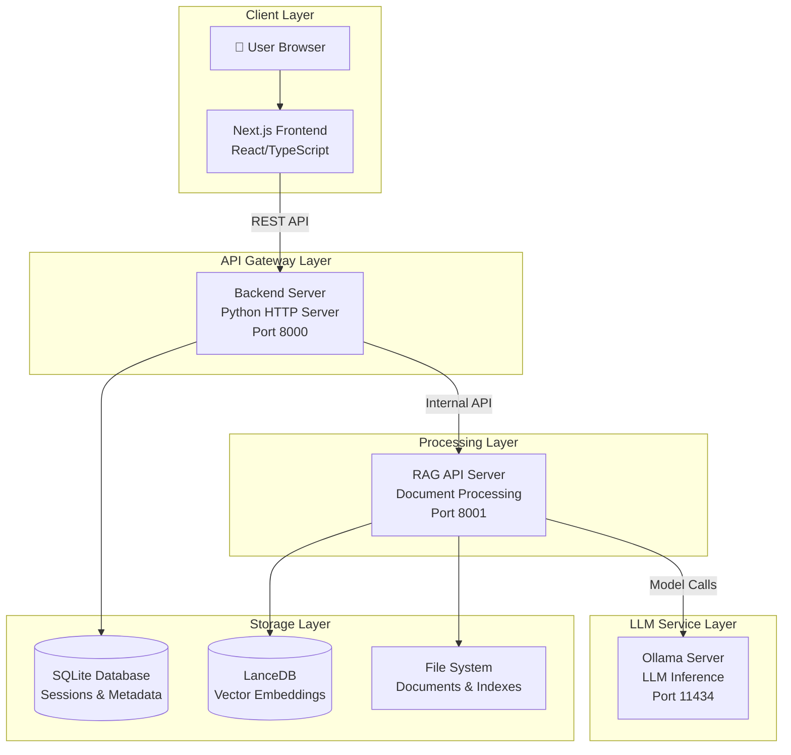

# 🏗️ RAG System - Complete System Overview

_Last updated: 2025-01-09_

This document provides a comprehensive overview of the Advanced Retrieval-Augmented Generation (RAG) System, covering its architecture, components, data flow, and operational characteristics.

---

## 1. System Architecture

### 1.1 High-Level Architecture

The RAG system implements a sophisticated 4-tier microservices architecture:



### 1.2 Component Breakdown

| Component | Technology | Port | Purpose |
|-----------|------------|------|---------|
| **Frontend** | Next.js 15, React 19, TypeScript | 3000 | User interface, chat interactions |
| **Backend** | Python 3.11, HTTP Server | 8000 | API gateway, session management, routing |
| **RAG API** | Python 3.11, Advanced NLP | 8001 | Document processing, retrieval, generation |
| **Ollama** | Go-based LLM server | 11434 | Local LLM inference (embedding, generation) |
| **SQLite** | Embedded database | - | Sessions, messages, index metadata |
| **LanceDB** | Vector database | - | Document embeddings, similarity search |

---

## 2. Core Functionality

### 2.1 Intelligent Dual-Layer Routing

The system's key innovation is its **dual-layer routing architecture** that optimizes both speed and intelligence:

#### **Layer 1: Speed Optimization Routing**
- **Location**: `backend/server.py`
- **Purpose**: Route simple queries to Direct LLM (~1.3s) vs complex queries to RAG Pipeline (~20s)
- **Decision Logic**: Pattern matching, keyword detection, query complexity analysis

```python
# Example routing decisions
"Hello!" → Direct LLM (greeting pattern)
"What does the document say about pricing?" → RAG Pipeline (document keyword)
"What's 2+2?" → Direct LLM (simple + short)
"Summarize the key findings from the report" → RAG Pipeline (complex + indicators)
```

#### **Layer 2: Intelligence Optimization Routing**
- **Location**: `rag_system/agent/loop.py`
- **Purpose**: Within RAG pipeline, route to optimal processing method
- **Methods**: 
  - `direct_answer`: General knowledge queries
  - `rag_query`: Document-specific queries requiring retrieval
  - `graph_query`: Entity relationship queries (future feature)

### 2.2 Document Processing Pipeline

#### **Indexing Process**
1. **Document Upload**: PDF files uploaded via web interface
2. **Text Extraction**: Docling library extracts text with layout preservation
3. **Chunking**: Intelligent chunking with configurable strategies (DocLing, Late Chunking, Standard)
4. **Embedding**: Text converted to vector embeddings using Qwen models
5. **Storage**: Vectors stored in LanceDB with metadata in SQLite

#### **Retrieval Process**
1. **Query Processing**: User query analyzed and contextualized
2. **Embedding**: Query converted to vector embedding
3. **Search**: Hybrid search combining vector similarity and BM25 keyword matching
4. **Reranking**: AI-powered reranking for relevance optimization
5. **Synthesis**: LLM generates final answer using retrieved context

### 2.3 Advanced Features

#### **Query Decomposition**
- Complex queries automatically broken into sub-queries
- Parallel processing of sub-queries for efficiency
- Intelligent composition of final answers

#### **Contextual Enrichment**
- Conversation history integration
- Context-aware query expansion
- Session-based memory management

#### **Verification System**
- Answer verification against source documents
- Confidence scoring and grounding checks
- Source attribution and citation

---

## 3. Data Architecture

### 3.1 Storage Systems

#### **SQLite Database** (`backend/chat_data.db`)
```sql
-- Core tables
sessions          -- Chat sessions with metadata
messages          -- Individual messages and responses
indexes           -- Document index metadata
session_indexes   -- Links sessions to their indexes
```

#### **LanceDB Vector Store** (`./lancedb/`)
```
tables/
├── text_pages_[uuid]     -- Document text embeddings
├── image_pages_[uuid]    -- Image embeddings (future)
└── metadata_[uuid]       -- Document metadata
```

#### **File System** (`./index_store/`)
```
index_store/
├── overviews/           -- Document summaries for routing
├── bm25/               -- BM25 keyword indexes
└── graph/              -- Knowledge graph data
```

### 3.2 Data Flow

1. **Document Upload** → File System (`shared_uploads/`)
2. **Processing** → Embeddings stored in LanceDB
3. **Metadata** → Index info stored in SQLite
4. **Query** → Search LanceDB + SQLite coordination
5. **Response** → Message history stored in SQLite

---

## 4. Model Architecture

### 4.1 Configurable Model Pipeline

The system supports multiple embedding and generation models with automatic switching:

#### **Current Model Configuration**
```python
EXTERNAL_MODELS = {
    "embedding_model": "Qwen/Qwen3-Embedding-0.6B",  # 1024D
    "reranker_model": "answerdotai/answerai-colbert-small-v1",  # ColBERT reranker
    "vision_model": "Qwen/Qwen-VL-Chat",  # Vision model for multimodal
    "fallback_reranker": "BAAI/bge-reranker-base",  # Backup reranker
}

OLLAMA_CONFIG = {
    "generation_model": "qwen3:8b",  # High-quality generation
    "enrichment_model": "qwen3:0.6b",  # Fast enrichment/routing
    "host": "http://localhost:11434"
}
```

#### **Model Switching**
- **Per-Session**: Each chat session can use different embedding models
- **Automatic**: System automatically switches models based on index metadata
- **Dynamic**: Models loaded just-in-time to optimize memory usage

### 4.2 Supported Models

#### **Embedding Models**
- `Qwen/Qwen3-Embedding-0.6B` (1024D) - Default, fast and high-quality

#### **Generation Models** (via Ollama)
- `qwen3:8b` - Primary generation model (high quality)
- `qwen3:0.6b` - Fast enrichment and routing model

#### **Reranking Models**
- `answerdotai/answerai-colbert-small-v1` - Primary ColBERT reranker
- `BAAI/bge-reranker-base` - Fallback cross-encoder reranker

#### **Vision Models** (Multimodal)
- `Qwen/Qwen-VL-Chat` - Vision-language model for image processing

---

## 5. Pipeline Configurations

### 5.1 Default Production Pipeline

```python
PIPELINE_CONFIGS = {
    "default": {
        "description": "Production-ready pipeline with hybrid search, AI reranking, and verification",
        "storage": {
            "lancedb_uri": "./lancedb",
            "text_table_name": "text_pages_v3", 
            "bm25_path": "./index_store/bm25",
            "graph_path": "./index_store/graph/knowledge_graph.gml"
        },
        "retrieval": {
            "retriever": "multivector",
            "search_type": "hybrid",
            "late_chunking": {
                "enabled": True,
                "table_suffix": "_lc_v3"
            },
            "dense": { 
                "enabled": True,
                "weight": 0.7
            },
            "bm25": { 
                "enabled": True,
                "index_name": "rag_bm25_index"
            }
        },
        "embedding_model_name": "Qwen/Qwen3-Embedding-0.6B",
        "reranker": {
            "enabled": True,
            "model_name": "answerdotai/answerai-colbert-small-v1",
            "top_k": 20
        }
    }
}
```

### 5.2 Processing Options

#### **Chunking Strategies**
- **Standard**: Fixed-size chunks with overlap
- **DocLing**: Structure-aware chunking using DocLing library
- **Late Chunking**: Small chunks expanded at query time

#### **Enrichment Options**
- **Contextual Enrichment**: AI-generated chunk summaries
- **Overview Building**: Document-level summaries for routing
- **Graph Extraction**: Entity and relationship extraction

---

## 6. Performance Characteristics

### 6.1 Response Times

| Operation | Time Range | Notes |
|-----------|------------|-------|
| Simple Chat | 1-3 seconds | Direct LLM, no retrieval |
| Document Query | 5-15 seconds | Includes retrieval and reranking |
| Complex Analysis | 15-30 seconds | Multi-step reasoning |
| Document Indexing | 2-5 min/100MB | Depends on enrichment settings |

### 6.2 Memory Usage

| Component | Memory Usage | Notes |
|-----------|--------------|-------|
| Embedding Model | 1-2GB | Qwen3-Embedding-0.6B |
| Generation Model | 8-16GB | qwen3:8b |
| Reranker Model | 500MB-1GB | ColBERT reranker |
| Database Cache | 500MB-2GB | LanceDB and SQLite |

### 6.3 Scalability

- **Concurrent Users**: 5-10 users with 16GB RAM
- **Document Capacity**: 10,000+ documents per index
- **Query Throughput**: 10-20 queries/minute per instance
- **Storage**: Approximately 1MB per 100 pages indexed

---

## 7. Security & Privacy

### 7.1 Data Privacy

- **Local Processing**: All AI models run locally via Ollama
- **No External Calls**: No data sent to external APIs
- **Document Isolation**: Documents stored locally with session-based access
- **User Isolation**: Each session maintains separate context

---

## 8. Configuration & Customization

### 8.1 Model Configuration
Models can be configured in `rag_system/main.py`:

```python
# Embedding model configuration
EXTERNAL_MODELS = {
    "embedding_model": "Qwen/Qwen3-Embedding-0.6B",  # Your preferred model
    "reranker_model": "answerdotai/answerai-colbert-small-v1",
}

# Generation model configuration
OLLAMA_CONFIG = {
    "generation_model": "qwen3:8b",  # Your LLM model
    "enrichment_model": "qwen3:0.6b",  # Your fast model
}
```

### 8.2 Pipeline Configuration
Processing behavior configured in `PIPELINE_CONFIGS`:

```python
PIPELINE_CONFIGS = {
    "retrieval": {
        "search_type": "hybrid",
        "dense": {"weight": 0.7},
        "bm25": {"enabled": True}
    },
    "chunking": {
        "chunk_size": 512,
        "chunk_overlap": 64,
        "enable_latechunk": True,
        "enable_docling": True
    }
}
```

### 8.3 UI Configuration
Frontend behavior configured in environment variables:

```bash
NEXT_PUBLIC_API_URL=http://localhost:8000
NEXT_PUBLIC_ENABLE_STREAMING=true
NEXT_PUBLIC_MAX_FILE_SIZE=50MB
```

---

## 9. Monitoring & Observability

### 9.1 Logging System
- **Structured Logging**: JSON-formatted logs with timestamps
- **Log Levels**: DEBUG, INFO, WARNING, ERROR
- **Log Rotation**: Automatic log file rotation
- **Component Isolation**: Separate logs per service

### 9.2 Health Monitoring
- **Health Endpoints**: `/health` on all services
- **Service Dependencies**: Cascading health checks
- **Performance Metrics**: Response times, error rates
- **Resource Monitoring**: Memory, CPU, disk usage

### 9.3 Debugging Features
- **Debug Mode**: Detailed operation tracing
- **Query Inspection**: Step-by-step query processing
- **Model Switching Logs**: Embedding model change tracking
- **Error Reporting**: Comprehensive error context

---

## ⚙️ Configuration Modes

The system supports multiple configuration modes optimized for different use cases:

### **Default Mode** (`"default"`)
- **Description**: Production-ready pipeline with full features
- **Search**: Hybrid (dense + BM25) with 0.7 dense weight
- **Reranking**: AI-powered ColBERT reranker
- **Query Processing**: Query decomposition enabled
- **Verification**: Grounding verification enabled
- **Performance**: ~3-8 seconds per query
- **Memory**: ~10-16GB (with models loaded)

### **Fast Mode** (`"fast"`)  
- **Description**: Speed-optimized pipeline with minimal overhead
- **Search**: Vector-only (no BM25, no late chunking)
- **Reranking**: Disabled
- **Query Processing**: Single-pass, no decomposition
- **Verification**: Disabled
- **Performance**: ~1-3 seconds per query
- **Memory**: ~8-12GB (with models loaded)

### **BM25 Mode** (`"bm25"`)
- **Description**: Traditional keyword-based search
- **Search**: BM25 only
- **Use Case**: Exact keyword matching, legacy compatibility

### **Graph RAG Mode** (`"graph_rag"`)
- **Description**: Knowledge graph integration (currently disabled)
- **Status**: Available for future implementation
- **Use Case**: Relationship-aware retrieval

---

## 10. Development & Extension

### 10.1 Architecture Principles
- **Modular Design**: Clear separation of concerns
- **Configuration-Driven**: Behavior controlled via config files
- **Lazy Loading**: Components loaded on-demand
- **Thread Safety**: Proper synchronization for concurrent access

### 10.2 Extension Points
- **Custom Retrievers**: Implement `BaseRetriever` interface
- **Custom Chunkers**: Extend chunking strategies
- **Custom Models**: Add new embedding or generation models
- **Custom Pipelines**: Create specialized processing workflows

### 10.3 Testing Strategy
- **Unit Tests**: Individual component testing
- **Integration Tests**: End-to-end workflow testing
- **Performance Tests**: Load and stress testing
- **Health Checks**: Automated system validation

---

> **Note**: This overview reflects the current implementation as of 2025-01-09. For the latest changes, check the git history and individual component documentation. 