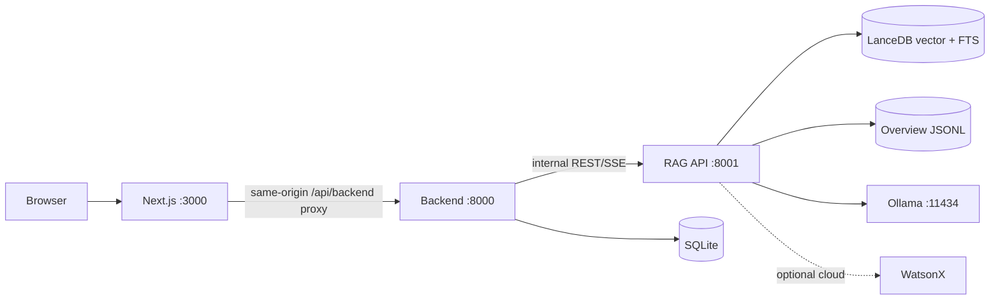

# LocalGPT System Overview

## Service architecture

```mermaid
flowchart LR
    Browser --> Next["Next.js :3000"]
    Next -->|"same-origin /api/backend proxy"| Backend["Backend :8000"]
    Backend -->|"internal REST/SSE"| RAG["RAG API :8001"]
    Backend --> SQLite[("SQLite")]
    RAG --> LanceDB[("LanceDB vector + FTS")]
    RAG --> Overviews[("Overview JSONL")]
    RAG --> Ollama["Ollama :11434"]
    RAG -. optional cloud .-> WatsonX["WatsonX"]
```

The backend owns sessions, index metadata, uploads, links, and all chat-message persistence. The RAG service owns conversion, indexing, retrieval, routing, synthesis, and verification. The frontend proxy can inject `LOCALGPT_API_TOKEN` without exposing it in client JavaScript and rejects cross-origin mutations before adding that token.

## Storage

SQLite contains `sessions`, `messages`, `session_documents`, `indexes`, `index_documents`, and `session_indexes`. Every connection enables foreign keys, WAL, and a busy timeout. Session deletion cascades to session-owned data and removes unindexed temporary uploads. Index deletion asks the RAG service to remove main/late tables and its overview before deleting links, metadata, and source uploads.

Each index has a dedicated LanceDB main table named by `indexes.vector_table_name`, plus an optional `<table>_lc` late-chunk table. LanceDB's FTS and vector search operate over the same text rows. Overview manifests live at `index_store/overviews/<index_id>.jsonl`.

## Indexing

Uploads are constrained before indexing. Supported formats are PDF, DOCX, HTML, Markdown, and text. The converter applies OCR fallback to image-only PDFs. Recursive or Docling structural chunking, real overlap, document-local contextual enrichment, embeddings, FTS, optional late chunking, and overview generation form one rebuild. Rebuilds replace previous artifacts, invalidate semantic-cache entries, persist status, and return build statistics. Documents attached in chat are converted into a normal dedicated index and linked to that session.

See [indexing_pipeline.md](indexing_pipeline.md).

## Chat and retrieval

The browser uses backend non-streaming or SSE session endpoints. The backend restores persisted history to the RAG agent and passes every linked table. The agent routes between direct generation and document RAG using actual per-index overviews. RAG supports vector-only, lexical-only, or weighted-RRF hybrid search; optional decomposition, reranking, context expansion, Provence pruning, and verification follow.

Linked indexes must use the same embedding model. Cache entries are isolated by session, table set, and retrieval settings.

See [retrieval_pipeline.md](retrieval_pipeline.md) and [triage_system.md](triage_system.md).

## Provider and privacy boundary

Ollama is the default generation provider and remains local. WatsonX is optional and sends prompts plus retrieved context to IBM Cloud. Hugging Face model downloads occur when local embedding/reranking weights are not already cached. Executing model-repository custom Python is disabled unless `LOCALGPT_TRUST_REMOTE_CODE=true` is explicitly set.

## Capability boundaries

PDF OCR and preserved table Markdown are active. Page-image embeddings and VLM answer synthesis are experimental scaffolding, not active product capabilities. Graph extraction/retrieval is optional and disabled by default.

## Runtime defaults

- Host binding: `127.0.0.1`; Docker publishes host ports only on loopback.
- CORS: configured by `LOCALGPT_ALLOWED_ORIGINS`.
- Optional auth: `LOCALGPT_API_TOKEN`.
- Upload limit: 50 MiB by default via `LOCALGPT_MAX_UPLOAD_BYTES`.
- Shared paths: `LOCALGPT_DB_PATH`, `LOCALGPT_UPLOAD_DIR`, `LOCALGPT_OVERVIEW_DIR`, and `LANCEDB_PATH`.

See [api_reference.md](api_reference.md) for exact routes and payloads.
