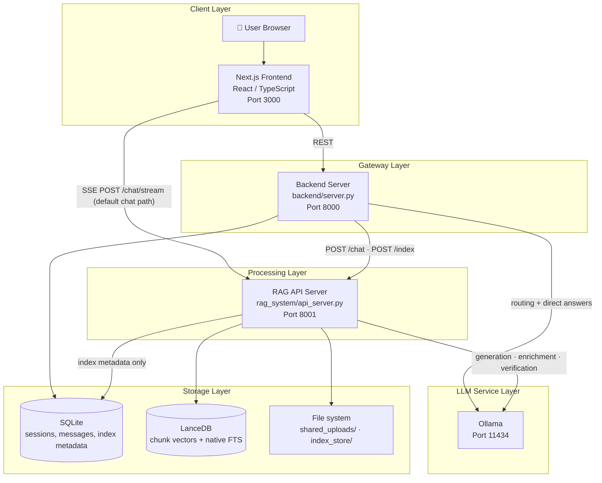

# 🏗️ localGPT — Complete System Overview

_Last updated: 2026-08-08_

A comprehensive overview of the localGPT Retrieval-Augmented Generation system: architecture, components, data flow, configuration and operational characteristics. Everything here was verified against the source in this repository; where a feature exists but is not wired up, it says so.

---

## 1. System Architecture

### 1.1 High-level architecture

Four processes. The browser talks to **two** of them.


```mermaid
graph TB
    subgraph "Client Layer"
        Browser["👤 User Browser"]
        UI["Next.js Frontend<br/>React / TypeScript<br/>Port 3000"]
        Browser --> UI
    end

    subgraph "Gateway Layer"
        Backend["Backend Server<br/>backend/server.py<br/>Port 8000"]
    end

    subgraph "Processing Layer"
        RAG["RAG API Server<br/>rag_system/api_server.py<br/>Port 8001"]
    end

    subgraph "LLM Service Layer"
        Ollama["Ollama<br/>Port 11434"]
    end

    subgraph "Storage Layer"
        SQLite[("SQLite<br/>sessions, messages, index metadata")]
        LanceDB[("LanceDB<br/>chunk vectors + native FTS")]
        FileSystem["File system<br/>shared_uploads/ · index_store/"]
    end

    UI -->|"REST"| Backend
    UI -->|"SSE POST /chat/stream (default chat path)"| RAG
    Backend -->|"POST /chat · POST /index"| RAG
    Backend -->|"routing + direct answers"| Ollama
    RAG -->|"generation · enrichment · verification"| Ollama
    Backend --> SQLite
    RAG -->|"index metadata only"| SQLite
    RAG --> LanceDB
    RAG --> FileSystem
```

### 1.2 Component breakdown

| Component | Technology | Port | Purpose |
|-----------|------------|------|---------|
| **Frontend** | Next.js 15, React 19, TypeScript, Tailwind v4 | 3000 | Chat UI, index management, retrieval settings |
| **Backend gateway** | Python 3.10+, `http.server` on `ThreadingTCPServer` | 8000 | Sessions, messages, uploads, index CRUD, first-layer routing |
| **RAG API** | Python 3.10+, `http.server` on `TCPServer` (serialized) | 8001 | Agent, retrieval pipeline, indexing pipeline |
| **Ollama** | External LLM server | 11434 | Generation and enrichment model inference |
| **SQLite** | Embedded | – | Sessions, messages, documents, index metadata |
| **LanceDB** | Embedded vector store | – | Chunk vectors + native full-text (BM25) index |

For the process topology, request sequences and threading model see [`architecture_overview.md`](architecture_overview.md).

---

## 2. Core Functionality

### 2.1 Two-layer routing

Routing happens twice, in two different processes. Layer 1 is a deterministic gate with no model call; layer 2 is the system's single LLM routing layer.

#### Layer 1 — gateway routing (`backend/server.py`, non-streaming path only)

`should_use_rag(message, idx_ids, force_rag)` — a module-level function, no LLM call, no network I/O:

1. `force_rag` → RAG, unconditionally.
2. Session has **no linked indexes** → direct LLM, no RAG.
3. Message is unmistakable smalltalk (`hello`, `thanks!`, `bye`, `ok` — a whole-message allowlist regex capped at six words) or a question about the assistant itself (`who are you`, `what model are you`) → direct LLM.
4. Everything else → RAG.

This is retrieval-first: escalate rather than pre-decide. The gate deliberately over-sends to RAG because layer 2 can still answer directly — the cost of a wrong "send to RAG" is one agent triage call, while the cost of a wrong "answer directly" is an unanswerable question. Pre-retrieval LLM routing was removed here in Phase 2.3: it is the weakest measured routing pattern (`Documentation/research/`), and it duplicated layer 2. The old `_simple_pattern_routing` keyword/length fallback (which misrouted any question containing the word "test") is gone with it.

A `force_rag: true` field on the request skips the gate and always calls the RAG API. This layer does **not** run on the streaming path, because the browser calls the RAG API directly.

#### Layer 2 — agent triage (`rag_system/agent/loop.py`, always)

`_triage_query_async()`:

1. `_route_via_overviews()` — the enrichment model classifies the query against the overviews loaded for the session, returning `direct_answer` or `rag_query`.
2. If conversation history exists for the session, short-circuit to `rag_query`.
3. Otherwise a fallback triage prompt (also on the enrichment model) picks `rag_query` or `direct_answer`.

`force_rag=true` on the RAG API pins `query_type = "rag_query"` and skips all three steps, while still honouring the reranking / decomposition / verification toggles.

Triage is two-way since the graph module was removed on 2026-08-09 (roadmap 2.5). `Agent._normalize_triage()` collapses anything that is not an explicit `direct_answer` — including a stray `graph_query` from a small utility model — to `rag_query`.

### 2.2 Indexing

1. **Upload** — files are stored under `shared_uploads/` with a UUID prefix and recorded in SQLite.
2. **Conversion** — `DocumentConverter` (Docling) produces markdown plus structure. OCR options are chosen by probing which backend is actually installed (OcrMac on macOS, then EasyOCR, RapidOCR, tesserocr, the `tesseract` CLI); when none is available Docling's defaults are used and text-layer PDFs still convert.
3. **Chunking** — `DoclingChunker` packs sentences up to a token budget (`chunk_size`, default 512 over HTTP) using the embedding model's tokenizer. A legacy `MarkdownRecursiveChunker` exists and is selected by `chunker_mode: "legacy"` (used by `create_index_script.py`; over HTTP, `enable_docling_chunk: false` on `POST :8001/index` selects it — the HTTP default is `true`).
4. **Overviews** — the first *n* chunks of each document (default 5) are summarised by the enrichment model into `index_store/overviews/<id>.jsonl`. The agent's triage router reads these; the gateway gate (§2.1) does not.
5. **Contextual enrichment** (optional) — the enrichment model summarises a window of surrounding chunks and prepends it to each chunk. The untouched text is kept in `metadata.original_text`.
6. **Embedding + indexing** — chunks are embedded and written to a LanceDB table; a native FTS index is created on the `text` column.
7. **Late chunking** (optional) — each document is re-encoded in one pass and per-chunk vectors are pooled from it, written to `<table>_lc`. Enrichment produces *copies* of the chunks, so this leg encodes the original text, not the enriched text.

The vector width is taken from the embeddings actually produced. If you point an existing table at a different-dimensional model, `VectorIndexer` raises with a message telling you to rebuild — it will not silently corrupt the table. Because two models can share a width, each table also records the embedding model that wrote it and whether its vectors are L2-normalized; a mismatch raises `EmbedderMismatchError` at index time and at query time, and a table with no marker (built before this existed) keeps working unnormalized with a warning.

### 2.3 Retrieval

1. **Query embedding** — the same embedding model used at index time (an LRU cache holds 256 single-query embeddings). Instruction-tuned families (harrier-oss-v1, Qwen3-Embedding) get the query-side `Instruct: … \nQuery: …` prefix their cards require; documents never do. The query vector is L2-normalized when the table's marker says its vectors are, so LanceDB's L2 ordering is the cosine ordering the cards specify.
2. **Search** — `MultiVectorRetriever.retrieve()` runs LanceDB full-text search and vector search **in parallel** and fuses them with **reciprocal rank fusion** (`1/(60 + rank)` per leg). `search_type` selects `hybrid` (both legs), `vector_only` or `fts_only`; an unrecognised value logs a warning and falls back to `hybrid`. Every returned document carries a finite, higher-is-better `score`.
3. **Late-chunk leg** (optional) — when late chunking is enabled the same query also runs against `<table>_lc` and those hits are appended. Every retrieved chunk (from either leg) then has its text replaced by the concatenation of its ±1 neighbours in the main table, so a hit on one sub-vector still yields readable context. Hits are de-duplicated across the vector/FTS legs on `(document_id, chunk_index)` (shipped 2026-08-14).
4. **Reranking** (**on by default** since arm G, 2026-08-14 — `reranker.enabled: True` with `min_score: 0.5` / `min_keep: 3` threshold-based selection; the measured reason is in [`../eval/DECISIONS.md`](../eval/DECISIONS.md)) — the default `Qwen/Qwen3-Reranker-4B` goes to the in-repo `QwenRerankerScorer`, and any other model is loaded through the `rerankers` library (`reranker.strategy: "rerankers-lib"`, `reranker.model_type: "cross-encoder"`); any other `strategy` value uses the in-repo `CrossEncoderReranker` (`transformers` `AutoModelForSequenceClassification`). The model is loaded lazily on the first reranked query. If the model fails to load, a warning is printed and **reranking is skipped** — there is no second reranker to fall back to.
5. **Context expansion** — each surviving chunk is widened to its neighbours within `context_window_size`.
6. **Sentence pruning** (opt-in, `provence.enabled`) — `naver/provence-reranker-debertav3-v1` drops sentences below `provence.threshold` (default `0.1`); chunks pruned to nothing are removed.
7. **Synthesis** — the generation model writes the answer, streamed token by token.
8. **Verification** (see §2.4).

Retrieval matches against the stored (possibly enriched) text, and chunks coming out of the retriever expose `metadata.original_text` as their `text` when enrichment ran — so enrichment improves recall without pushing its own prefix into the answer's context. Neighbour chunks pulled in by context expansion are returned exactly as stored, so those still carry the enrichment prefix.

### 2.4 Verification

When `verification.enabled` is on (or `verify: true` is sent) **and** the result has source documents, `Verifier.verify_async()` asks the enrichment model for a JSON verdict and the confidence is appended to the answer **string**:

* `" [Confidence: N%]"` for any non-zero score;
* additionally `" [Warning: Low confidence. Groundedness: <bool>]"` when the answer is not grounded or the score is below 50;
* nothing at all when the score parses as 0 (treated as a parser failure).

There is no top-level `confidence` field in the response. Responses are `{answer, source_documents}`.

### 2.5 Query decomposition

Enabled in the `default` profile. The enrichment model splits the raw user query (plus up to 5 recent turns for pronoun resolution) into sub-queries, capped by `query_decomposition.max_sub_queries` (default 10). Sub-queries are retrieved in parallel with at most 3 worker threads. The shipped default (arm H, 2026-08-15) is the **pooled first stage** (`compose_from_sub_answers: false`, `pooled_first_stage: true`): the per-sub-query candidates are pooled and de-duplicated, then get ONE rerank pass and ONE synthesis over the union context. With `compose_from_sub_answers: true` the generation model instead answers each sub-query and composes a final answer from the sub-answers. A decomposition that yields a single sub-query skips the parallel machinery.

### 2.6 Semantic cache and conversation memory

* `TTLCache(maxsize=100, ttl=300)` keyed on the query embedding. A cached answer is reused when cosine similarity ≥ `semantic_cache_threshold` (`0.98`).
* `cache_scope` is `"session"` in both profiles: an entry is only reused inside the session that produced it. Setting it to `"global"` re-enables cross-session reuse — including answers derived from another session's documents.
* Conversation history for triage and query rewriting lives in an in-process `LRUCache(maxsize=100)` on the agent, keyed by `session_id`. It is **not** the SQLite message history and is lost on restart.

---

## 3. Data Architecture

### 3.1 SQLite (`backend/chat_data.db`, override with `DB_PATH`)

```sql
sessions          -- id, title, created_at, updated_at, model_used, message_count
messages          -- id, session_id, content, sender('user'|'assistant'), timestamp, metadata
session_documents -- files uploaded to a session
indexes           -- id, name, description, created_at, updated_at, vector_table_name, metadata
index_documents   -- files belonging to a named index
session_indexes   -- links sessions to indexes
```

Written by `backend/server.py`. The RAG API opens the same database but only reads/writes the `indexes` rows (index metadata); it never writes `messages`.

### 3.2 LanceDB (`./lancedb`, override with `LANCEDB_PATH`)

```
lancedb/
├── text_pages_v4            -- default table (storage.text_table_name)
├── text_pages_<index_id>    -- one table per index created via POST /indexes
└── <table>_lc               -- late-chunk vectors for the table above
```

Each table stores `chunk_id`, `text`, `document_id`, `chunk_index`, `metadata` (JSON) and `vector`, plus a native full-text index on `text`.

### 3.3 File system

```
shared_uploads/                       -- uploaded documents (<uuid>_<original name>)
index_store/overviews/<id>.jsonl      -- per-index / per-session document overviews
index_store/overviews/overviews.jsonl -- global fallback overview file
logs/                                 -- run_system.py service logs + run_system.pid
```

---

## 4. Models

### 4.1 Configured defaults (`rag_system/main.py`)

```python
OLLAMA_CONFIG = {
    "host": os.getenv("OLLAMA_HOST", "http://localhost:11434"),
    "generation_model": os.getenv("GENERATION_MODEL", "qwen3.5:9b"),
    "enrichment_model": os.getenv("ENRICHMENT_MODEL", "qwen3.5:4b"),
}

EXTERNAL_MODELS = {
    "embedding_model": os.getenv("EMBEDDING_MODEL", "microsoft/harrier-oss-v1-0.6b"),
    "reranker_model": os.getenv("RERANKER_MODEL", "Qwen/Qwen3-Reranker-4B"),
}
```

| Role | Default | Used for |
|------|---------|----------|
| Generation | `qwen3.5:9b` (Ollama) | Final answers, sub-answer composition, direct answers |
| Enrichment / utility | `qwen3.5:4b` (Ollama) | Agent triage (the only LLM router), query decomposition, contextual enrichment, document overviews, verification |
| Embedding | `microsoft/harrier-oss-v1-0.6b` (HuggingFace, MIT, 1024 dims) | Index and query embeddings |
| Reranker | `Qwen/Qwen3-Reranker-4B` (HuggingFace, own yes/no-logit scorer) | Reranking retrieved chunks — **on by default** (arm G, 2026-08-14), loaded lazily on the first reranked query ([`../eval/DECISIONS.md`](../eval/DECISIONS.md)) |
| Sentence pruner | `naver/provence-reranker-debertav3-v1` (HuggingFace) | Opt-in sentence-level pruning |

Approximate footprints published by the model authors (not measured here): `qwen3.5:9b` ≈ 6.6 GB at Q4, `qwen3.5:4b` ≈ 3.4 GB, `qwen3.6:27b` ≈ 17 GB, `microsoft/harrier-oss-v1-0.6b` ≈ 1.2 GB, `Qwen/Qwen3-Embedding-4B` ≈ 8 GB in bf16, `Qwen/Qwen3-Embedding-0.6B` ≈ 1.2 GB, `Qwen/Qwen3-Reranker-4B` ≈ 7.5 GB.

### 4.2 Documented alternatives

| Role | Options |
|------|---------|
| Generation | `qwen3.6:27b` (high-end), `qwen3.5:4b` (light) |
| Enrichment | `qwen3.5:2b` (light) |
| Embedding | `Qwen/Qwen3-Embedding-4B` (2560 dims, 32K context — for multilingual / long-context corpora), `Qwen/Qwen3-Embedding-0.6B` (1024 dims, light) |
| Reranker | `BAAI/bge-reranker-v2-m3` (cross-encoder, low latency — only pays off with a weaker embedder than the default), `answerdotai/answerai-colbert-small-v1` (late interaction — also set `reranker.model_type: "colbert"`), `Qwen/Qwen3-Reranker-0.6B` |

Set them with the `GENERATION_MODEL` / `ENRICHMENT_MODEL` / `EMBEDDING_MODEL` / `RERANKER_MODEL` environment variables, or edit `rag_system/main.py`.

> ⚠️ **Changing the embedding model requires re-indexing.** Vector width is derived from the loaded model, and `VectorIndexer` raises rather than appending mismatched vectors to an existing LanceDB table. Width alone is not a sufficient check — `harrier-oss-v1-0.6b` and `Qwen3-Embedding-0.6B` are both 1024 dims — so every table also records the embedding model that wrote it, and indexing into or querying it with a different one raises `EmbedderMismatchError`. Ollama embedding tags are also supported: `select_embedder()` treats a name containing `/` as a HuggingFace repo and anything else as an Ollama tag.

### 4.3 Model selection at runtime

* **Per request** — `model` on `POST :8000/sessions/{id}/messages` and on the RAG API chat endpoints overrides the generation model for that request only. The RAG API rejects ids that do not match the active backend (an Ollama tag will not be forced onto a WatsonX deployment).
* **Per index** — when an index records an `embedding_model` in its metadata, the RAG API switches the retrieval pipeline's embedder to it before querying that index.
* Generation model precedence on the gateway's direct-LLM path: request `model` → the session's `model_used` → `GENERATION_MODEL`.

### 4.4 Vision / multimodal — not integrated

There is **no** vision model in the configuration and no multimodal path in the pipelines: PDF parsing and OCR are handled entirely by Docling. Models such as GLM-OCR or Qwen3-VL could be added as an extension; wiring them up is not done today.

### 4.5 Alternative LLM backend: WatsonX

`LLM_BACKEND=watsonx` swaps the Ollama client for `WatsonXClient` (`WATSONX_CONFIG`: `WATSONX_API_KEY`, `WATSONX_PROJECT_ID`, `WATSONX_URL`, `WATSONX_GENERATION_MODEL`, `WATSONX_ENRICHMENT_MODEL`). It requires `pip install ibm-watsonx-ai` — the root `requirements.txt` lists it as an optional, commented dependency. Embedding and reranking still run locally through HuggingFace. See [`../WATSONX_README.md`](../WATSONX_README.md).

---

## 5. Pipeline Configurations

`PIPELINE_CONFIGS` in `rag_system/main.py` contains exactly two profiles, `default` and `fast`. `RAG_CONFIG_MODE` selects the one the RAG API server uses (default `default`); an unknown value silently falls back to `default`. `factory.get_pipeline_config()` hands out a deep copy, so runtime overrides never mutate the master config.

### 5.1 `default`

```python
"default": {
    "description": "Production-ready pipeline with hybrid search, query decomposition, and verification",
    "storage": {
        "lancedb_uri": "./lancedb",
        "text_table_name": "text_pages_v4"
    },
    "retrieval": {
        "search_type": "hybrid",
        "latechunk": {"enabled": True},
        "dense": {"enabled": True},
        "retry": {"enabled": True, "min_top_score": 0.12, "max_attempts": 1},
        # Phase-4 features, all off until benchmarked:
        "document_escalation": {"enabled": False, "max_documents": 1, "token_budget": 6000},
        "crossref_hop": {"enabled": False, "max_hops": 1, "chunks_per_hop": 3},
        "overview_prefilter": {"enabled": False, "top_documents": 5, "mode": "boost"}
    },
    "embedding_model_name": EXTERNAL_MODELS["embedding_model"],
    "reranker": {
        "enabled": True,           # arm G, 2026-08-14 — see eval/DECISIONS.md
        "model_type": "cross-encoder",
        "strategy": "rerankers-lib",
        "model_name": EXTERNAL_MODELS["reranker_model"],
        "top_k": 10,
        "min_score": 0.5,
        "min_keep": 3
    },
    # Arm H (2026-08-15): pooled first stage is the shipped default — per-sub-query
    # retrieval, pooled + deduped candidates, ONE rerank + ONE synthesis.
    "query_decomposition": {
        "enabled": True,
        "compose_from_sub_answers": False,
        "pooled_first_stage": True
    },
    "verification": {"enabled": True},
    "retrieval_k": 20,
    "context_window_size": 0,
    "semantic_cache_threshold": 0.98,
    "cache_scope": "session",
    "contextual_enricher": {"enabled": True, "window_size": 1},
    "indexing": {
        "embedding_batch_size": 50,
        "enrichment_batch_size": 10,
        "extract_crossrefs": True
    }
}
```

### 5.2 `fast`

```python
"fast": {
    "description": "Speed-optimized pipeline with minimal overhead",
    "storage": {"lancedb_uri": "./lancedb", "text_table_name": "text_pages_v4"},
    "retrieval": {
        "search_type": "vector_only",
        "latechunk": {"enabled": False},
        "dense": {"enabled": True}
    },
    "embedding_model_name": EXTERNAL_MODELS["embedding_model"],
    "reranker": {"enabled": False},
    "query_decomposition": {"enabled": False},
    "verification": {"enabled": False},
    "retrieval_k": 10,
    "context_window_size": 0,
    "semantic_cache_threshold": 0.98,
    "cache_scope": "session",
    "contextual_enricher": {"enabled": False, "window_size": 1},
    "indexing": {
        "embedding_batch_size": 100,
        "enrichment_batch_size": 50
    }
}
```

One key in the blocks above currently has no consumer and is inert: the profile's `description`. (`indexing.enable_progress_tracking` used to be listed here; it was assigned to an attribute that is never checked — progress is always tracked — and has since been removed from the profiles.)

### 5.3 Keys read at runtime but absent from the profiles

These have code defaults and can be added to a profile if you want to change them:

| Key | Default | Effect |
|-----|---------|--------|
| `chunking.chunk_size` | `1500` (profile absent) / `512` (HTTP requests) | Token budget per chunk |
| `chunker_mode` | `"docling"` | `"docling"` or `"legacy"` |
| `query_decomposition.max_sub_queries` | `10` | Cap on sub-queries |
| `query_decomposition.rerank_aggregate` | `"mean"` | `mean` or `max`; how per-sub-query rerank scores combine (roadmap 2.2) |
| `retrieval.retry.min_rerank_score` | falls back to `min_top_score` | Retry threshold used when the reranker returns a 0–1 probability |
| `verification.model` / `VERIFIER_MODEL` | unset | HuggingFace NLI/verifier model; unset keeps the LLM-prompt verifier (roadmap 2.4) |
| `verification.threshold` | `0.5` | Grounded/ungrounded cut for the local verifier |
| `reranker.model_type` | `"cross-encoder"` | `rerankers` library model type |
| `reranker.top_percent` | – | Keep a fraction of candidates instead of `top_k` |
| `provence.enabled` / `provence.threshold` | `False` / `0.1` | Sentence-level pruning |
| `overview.enabled` / `overview.model` / `overview.max_chunks` | `True` / enrichment model / `5` | Document overview generation |
| `enrich_model` | enrichment model | Overrides the model used for contextual enrichment |
| `overview_path` | `index_store/overviews/overviews.jsonl` | Where overviews are written |

### 5.4 Where the 20/1/10 request defaults come from

The `retrieval_k: 20`, `context_window_size: 1` and `reranker_top_k: 10` defaults are owned by the **frontend** (`src/components/ui/session-chat.tsx`), not by the RAG API. `rag_system/api_server.py` passes `None` for every option the client omits — `verify`, `ai_rerank`, `query_decompose`, `compose_sub_answers`, `context_expand`, `retrieval_mode` and the three values above — so the profile wins.

Note the practical consequence: for UI clients, context expansion of ±1 chunk is on by default even though both profiles set `context_window_size: 0`. A non-UI HTTP client that omits the field gets the profile value (`0`).

---

## 6. Resource Notes

There are no benchmarks in this repository, so no latency or throughput figures are published here. What determines cost:

* **Memory** is dominated by the models you load: the Ollama generation model, plus the embedding model and (if enabled) the reranker and Provence pruner, which run in the RAG API process via `transformers`.
* **Concurrency** is bounded by the RAG API's single-threaded server: one RAG request at a time per process. The backend gateway is threaded, so session and index CRUD stay responsive while a query runs.
* **Indexing cost** scales with contextual enrichment (one LLM call per chunk — the contextualizer loops chunks inside each batch) and late chunking (a second full encode of every document, plus a second vector table).
* **Query cost** scales with query decomposition (one retrieval per sub-query, then one rerank and one synthesis over the pooled candidates), reranking and verification. The `fast` profile turns all of these off.

Use `python system_health_check.py` to print the resolved configuration, the embedding dimension of the loaded model, and the LanceDB tables that actually exist.

---

## 7. Configuration

### 7.1 Environment variables

Every variable below is read by this repository's code, except `HF_TOKEN` which is consumed by the HuggingFace client libraries. See [`.env.example`](../.env.example) for the annotated file.

| Variable | Default | Read by |
|----------|---------|---------|
| `OLLAMA_HOST` | `http://localhost:11434` | `rag_system/main.py`, `backend/ollama_client.py` |
| `RAG_API_URL` | `http://localhost:8001` | `backend/server.py` (all calls to the RAG API) |
| `NEXT_PUBLIC_API_URL` | `http://localhost:8000` | `src/lib/api.ts` — **inlined at build time** |
| `NEXT_PUBLIC_RAG_API_URL` | `http://localhost:8001` | `src/lib/api.ts` — **inlined at build time** |
| `DB_PATH` | `backend/chat_data.db` (`/app/backend/chat_data.db` in Docker) | `backend/database.py` |
| `LANCEDB_PATH` | `storage.lancedb_uri`, else `./lancedb` | `rag_system/main.py` (pipeline profiles), `backend/database.py`, `system_health_check.py` |
| `GENERATION_MODEL` | `qwen3.5:9b` | `rag_system/main.py`, `backend/server.py`, `run_system.py` |
| `ENRICHMENT_MODEL` | `qwen3.5:4b` | same |
| `EMBEDDING_MODEL` | `microsoft/harrier-oss-v1-0.6b` | `rag_system/main.py` |
| `RERANKER_MODEL` | `Qwen/Qwen3-Reranker-4B` (loaded lazily on the first reranked query) | `rag_system/main.py` |
| `RAG_CONFIG_MODE` | `default` | `rag_system/api_server.py` |
| `LLM_BACKEND` | `ollama` | `rag_system/main.py`, `rag_system/factory.py` |
| `RAG_API_TIMEOUT` | `600` (seconds) | `backend/server.py` — chat calls |
| `RAG_API_INDEX_TIMEOUT` | `3600` (seconds) | `backend/server.py` — indexing calls |
| `HF_TOKEN` | – | `huggingface_hub` (library) — gated model downloads |

`NEXT_PUBLIC_*` values are baked into the JavaScript bundle by `next build`; changing them at runtime has no effect on an already-built frontend. The compose files pass them as build args as well as runtime environment.

Service **ports** are not environment-configurable: `PORT = 8000` in `backend/server.py`, `8001` in `start_server()`, `3000` from Next.js.

### 7.2 Per-request options

Retrieval and indexing behaviour is controlled per request, not by editing a config file. See [`api_reference.md`](api_reference.md) for the full field list. Both casings are accepted end to end: the frontend historically sent camelCase, the gateway sends snake_case, and both the gateway and the RAG API normalise every option to one canonical snake_case key at parse time.

### 7.3 Command-line entry points

```bash
# Index a file or a directory (walks for .pdf .docx .html .htm .md .txt)
python -m rag_system.main index /path/to/docs --mode default

# One-shot query, prints JSON
python -m rag_system.main chat "What does the contract say about termination?" --mode default

# Start the RAG API
python -m rag_system.main api --port 8001
```

`python rag_system/main.py …` does **not** work — the module must be run with `-m` from the project root. Programmatically, `from rag_system.factory import get_agent, get_indexing_pipeline` is the supported entry point; `IndexingPipeline.run(file_paths)` is the public indexing call.

---

## 8. Operations

### 8.0 Prerequisites

* **Python 3.10+** (3.11 recommended — both Docker images are `python:3.11-slim`).
* **Node 20+** for the frontend (`Dockerfile.frontend` is `node:20-alpine`).
* **Ollama** installed and running, with the generation and enrichment models pulled.
* Python dependencies: `pip install -r requirements.txt`. `backend/requirements.txt` is the minimal set for running only the gateway. `pip install ibm-watsonx-ai` is additionally required for `LLM_BACKEND=watsonx`.

### 8.1 Local launcher

```bash
python run_system.py                 # dev mode: all four services
python run_system.py --mode prod     # runs `npm run build` before `npm run start`
python run_system.py --no-frontend   # backend stack only
python run_system.py --health        # HTTP probes each service, exits non-zero if unhealthy
python run_system.py --stop          # terminates the processes recorded in logs/run_system.pid
python run_system.py --logs-only     # tails logs/*.log without starting anything
```

`--health` probes `http://localhost:11434/api/tags`, `:8001/health`, `:8000/health` and `:3000/`. On startup the launcher checks that `GENERATION_MODEL` and `ENRICHMENT_MODEL` are present in Ollama.

### 8.2 Docker

`docker compose --env-file docker.env up -d --build` brings up `rag-api`, `backend` and `frontend`; Ollama runs on the host by default (`OLLAMA_HOST=http://host.docker.internal:11434`, with `extra_hosts: host.docker.internal:host-gateway` so it also resolves on Linux). A containerised Ollama is available behind the `with-ollama` profile. `backend` and `rag-api` bind-mount `./backend`, `./lancedb`, `./index_store` and `./shared_uploads`, so both processes share one SQLite file and one vector store. Health checks use `/health` on both Python services and busybox `wget` for the frontend. See [`docker_usage.md`](docker_usage.md) and [`../DOCKER_README.md`](../DOCKER_README.md).

### 8.3 Health and logging

| Endpoint | Response |
|----------|----------|
| `GET :8000/health` | `{status, ollama_running, available_models, database_stats}` |
| `GET :8001/health` | `{"status": "ok"}` |

`run_system.py` writes per-service logs to `logs/<service>.log` plus `logs/system.log`, with a coloured console formatter. Logging is plain text — there is no JSON formatter and no log rotation (see [`improvement_plan.md`](improvement_plan.md)). The RAG API routes its handler output through the `logging` module; the agent and both pipelines still print progress with `print()`, which is what you see in `logs/rag-api.log`.

---

## 9. Security & Privacy

* **Local by default** — generation, embedding, reranking and pruning all run locally (Ollama + HuggingFace models). Nothing leaves the machine unless you set `LLM_BACKEND=watsonx`, which sends prompts to IBM Cloud.
* **Model downloads** — HuggingFace models are fetched on first use and cached; that is the only outbound traffic in the default setup.
* **No authentication** — neither server implements auth, and both send `Access-Control-Allow-Origin: *`. Ports 8000 and 8001 must not be exposed to an untrusted network.
* **Session isolation** — retrieval is scoped to the tables of the indexes linked to a session, and the semantic cache is session-scoped by default. Setting `cache_scope: "global"` allows one session's document-derived answer to be returned in another.
* **Deletion** — deleting an index removes its rows and drops its LanceDB table. Uploaded files in `shared_uploads/` are not deleted.

---

## 10. Development & Extension

### 10.1 Principles

* Configuration-driven: profiles in `rag_system/main.py`, construction in `rag_system/factory.py`.
* Lazy loading: embedders, rerankers and the pruner are built on first use and cached on the pipeline instance.
* One factory, one RAG API server, one owner per store.

### 10.2 Extension points

| To add… | Do this |
|---------|---------|
| A retriever | Implement the duck-typed contract `retrieve(text_query: str, table_name: str, k: int, search_type: str = "hybrid") -> List[Dict]` and return it from `RetrievalPipeline._get_dense_retriever()`. There is no `BaseRetriever` ABC. |
| A reranker | Plug it into `RetrievalPipeline._get_ai_reranker()`; a `rerankers`-library model only needs `reranker.model_name` + `reranker.model_type`. |
| A chunker | Add a `chunker_mode` branch in `IndexingPipeline.__init__`. |
| An embedding model | Point `EMBEDDING_MODEL` at a HuggingFace repo (contains `/`) or an Ollama tag, then re-index. |
| A pipeline profile | Add an entry to `PIPELINE_CONFIGS` and select it with `RAG_CONFIG_MODE` or `--mode`. |

### 10.3 Validation

There is no automated test suite in this repository. What exists:

* `python system_health_check.py` — imports, configuration dump, LanceDB connectivity, agent construction, embedding dimension, and a sample query against the first available table.
* `python run_system.py --health` — HTTP health probes of all four services.
* `./test_docker_build.sh` — builds the images and probes the container health endpoints.

Building the automated tests is tracked in [`improvement_plan.md`](improvement_plan.md) §8.

---

## 11. Known Limitations

1. **Streamed chat turns are persisted via a follow-up call.** The stream itself (`POST :8001/chat/stream`) writes nothing to SQLite; the UI posts the completed turn to `POST :8000/sessions/{id}/messages/save` when the stream finishes. Direct stream consumers must do the same to get history.
2. **The RAG API serializes requests** — one chat or indexing run at a time per process. Per-request option overrides are scoped to the request: the agent snapshots its config before applying them and restores it afterwards, so they no longer leak into subsequent requests.
3. **`enable_latechunk` defaults to `false` on `POST :8001/index`**, so an HTTP index build without that flag produces no late-chunk table even though the `default` profile enables late chunking. The CLI (`python -m rag_system.main index`) uses the profile value.
4. **A reranker that fails to load is skipped**, not replaced — there is no fallback reranker.
5. **`requirements-docker.txt` has drifted** from `requirements.txt` and still lists packages with no importers.

---

> This overview describes the implementation as of 2026-08-08. When behaviour changes, update [`architecture_overview.md`](architecture_overview.md) and this file together.
