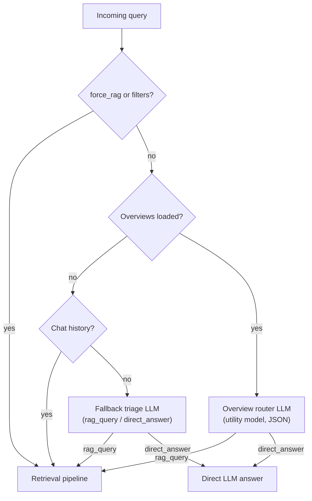

# 🔀 Triage / Routing System

_One deterministic gate and one LLM router, in two processes:_
* _`should_use_rag()` in `backend/server.py` (gateway, port 8000) — deterministic, no LLM call; see "Backend gate" below._
* _`Agent._triage_query_async` in `rag_system/agent/loop.py` (RAG API, port 8001) — the only LLM routing layer._

## Purpose
Decide, per query, whether to answer with:
1. **Direct LLM generation** — no retrieval, faster and cheaper; or
2. **Retrieval-Augmented Generation** — search the indexed documents first.

## Which router actually runs

| Request path | Router(s) involved |
|--------------|--------------------|
| Streaming chat (UI default): browser → `POST :8001/chat/stream` (`src/lib/api.ts:509`, toggle at `session-chat.tsx:48`, default on) | Agent router only. The backend gateway is not in this path. |
| Non-streaming chat: browser → `POST :8000/sessions/<id>/messages` → `POST :8001/chat` | Backend router first (`server.py:382`), then the agent router again inside the RAG API. |
| `POST :8000/chat` (`handle_chat`) | Neither. That endpoint always calls Ollama directly. |

On the non-streaming path the backend gate decides `use_rag` locally; when it routes to RAG it forwards the query (and `force_rag`, when set) to the RAG API, where the agent triages again and may still choose `direct_answer`. Over-sending to RAG is therefore safe.

## Agent router (`rag_system/agent/loop.py`)

Order of evaluation in `_triage_query_async` (`loop.py:175-223`):

1. **Overview routing** — `_route_via_overviews(query)` (`loop.py:602-644`). Returns `None` immediately when no overviews are loaded (`loop.py:605-607`); otherwise it builds a `DOCUMENT OVERVIEWS:` block from the first 40 loaded overviews (`loop.py:612-613`), interpolates it into the router prompt (`loop.py:615-630`) and calls the utility model with `format="json"`. Parses `{"category": ...}`, defaulting to `rag_query` on a parse failure.
2. **History short-circuit** — if the overview router returned `None` **and** the session already has chat history, the query is treated as a follow-up and routed to `rag_query` without any LLM call (`loop.py:188-193`).
3. **LLM fallback triage** — a two-way classifier (`rag_query` / `direct_answer`) on the utility model, defaulting to `rag_query` if the JSON cannot be parsed. `Agent._normalize_triage()` runs on every verdict and collapses anything that is not an explicit `direct_answer` to `rag_query`, so a small model that emits the retired `graph_query` label still lands on the RAG path.

`force_rag=true` — or a compiled metadata `filters` object on the request — skips all three: `query_type` is pinned to `rag_query` (`if force_rag or compiled_filters is not None` in `_run_async_inner`) while the `verify` / `ai_rerank` / `query_decompose` / `compose_sub_answers` / `context_expand` toggles all still apply.

Both LLM routing calls run at `temperature: 0` (deterministic routing).

There is no regex or keyword stage in the agent.

## Backend gate (`backend/server.py`)

Since the Phase-2 routing change (see `eval/decisions/phase2-gateway.md`), the gateway makes **no LLM call and reads no files** to route. `should_use_rag()` (module-level, unit-tested in `backend/test_gateway_routing.py`) evaluates in order:

1. **`force_rag`** ⇒ RAG, unconditionally (also forwarded, so agent triage is skipped too).
2. **No indexes linked** to the session ⇒ direct LLM (nothing to retrieve from).
3. **Smalltalk / assistant-meta** — a whole-message anchored allowlist (greetings, thanks, goodbyes, "who are you?"-style meta) capped at ~6 words ⇒ direct LLM.
4. **Everything else** ⇒ RAG.

The old per-message enrichment-model router (`_route_using_overviews`) and the keyword/length fallback (`_simple_pattern_routing`) were deleted — the fallback's substring matching misrouted most real document questions (`'hi'` matched *this* and *machine*). Over-sending to RAG is safe because the agent-side triage above can still answer directly; the gateway gate exists only to skip obvious non-retrieval turns at zero cost (~750 ms saved per routed message).

## Flow

The backend gate is not in this diagram: it is a deterministic pre-filter (force_rag → indexes → smalltalk allowlist) with no LLM call, described above.

## Overviews: where they come from

| Step | Code |
|------|------|
| Written at index time, one JSON line per document: `{"doc_id": ..., "overview": ...}` | `rag_system/indexing/overview_builder.py:33-49` |
| Default file `index_store/overviews/overviews.jsonl`; the RAG API overrides it to `index_store/overviews/<session_or_index_id>.jsonl` | `overview_builder.py:24`, `api_server.py:233-234` |
| Loaded per request by the RAG API before the agent runs | `api_server.py:362-366` → `Agent.load_overviews_for_indexes` (`loop.py:79-107`) |
| Falls back to the global `overviews.jsonl` when no per-index file exists | `loop.py:104-107` |

If no overview file exists for the session, the agent's overview router returns `None` and routing falls through to the history short-circuit or the fallback triage prompt. (The backend gate does not read overview files at all.)

## Models

Only the agent-side router costs an LLM call, on the utility model — `Agent._utility_model()` resolves `ENRICHMENT_MODEL` env var → `OLLAMA_CONFIG["enrichment_model"]` → `qwen3.5:4b`. The gateway gate is pure Python. Routing is never charged to the generation model, and a per-request `model` override does not change the routing model: the RAG API applies that override only for the duration of the request via a context manager, and the router reads `enrichment_model`, not `generation_model`.

## Configuration

| Knob | Where | Effect |
|------|-------|--------|
| `force_rag` (`forceRag`) | request body on `/chat`, `/chat/stream` (`api_server.py:191`) and on the backend's `/sessions/<id>/messages` (`server.py:381`) | Skips triage entirely and forces the RAG path. Surfaced in the UI as the "Always search documents" toggle (`session-chat.tsx:51`, default off). |

The third outcome, `graph_query`, and the `graph_strategy` config block that armed it were **removed on 2026-08-09** (roadmap item 2.5) along with the rest of the graph module. Evidence: GraphRAG loses on single-hop retrieval, its multi-hop gains are contested, and it costs 41–57× at indexing and up to ~377× in query tokens — [`research/academic-evidence-2026.md`](research/academic-evidence-2026.md) §6.

There is no global triage on/off switch and no similarity threshold. `PIPELINE_CONFIGS` has no `triage` key, and no `TRIAGE_OVERVIEW_THRESHOLD` environment variable is read anywhere.

## Failure / fallback modes

| Failure | Agent | Backend |
|---------|-------|---------|
| No overviews on disk | `_route_via_overviews` returns `None`; history short-circuit or fallback triage decides | n/a — gateway gate reads no files |
| Router LLM returns unparseable JSON / unexpected text | defaults to `rag_query` | n/a — gateway gate makes no LLM call |
| Router LLM call fails (timeout / connection / bad status) | the client catches the request error and returns `{}`, so the unparseable-JSON default applies — triage fails closed to `rag_query` | n/a |

---

_Keep this document updated whenever routing order, prompts, or fallback behaviour change._
