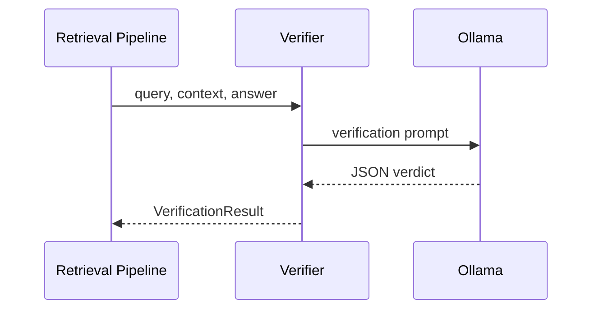

# ✅ Answer Verifier

_File: `rag_system/agent/verifier.py`_

## Objective
Assess whether an answer produced by RAG is **grounded** in the retrieved context snippets.

## Prompt (see `prompt_inventory.md` `verifier.fact_check`)
Strict JSON schema:
```jsonc
{
  "verdict": "SUPPORTED" | "NOT_SUPPORTED" | "NEEDS_CLARIFICATION",
  "is_grounded": true | false,
  "reasoning": "< ≤30 words >",
  "confidence_score": 0-100
}
```

## Sequence Diagram


## Usage Sites
| Caller | Code | When |
|--------|------|------|
| `RetrievalPipeline.answer_stream()` | `pipelines/retrieval_pipeline.py` | If `verify=true` flag from frontend. |
| `Agent.loop.run()` | fallback path | Experimental for composed answers. |

## Config
| Flag | Default | Meaning |
|------|---------|---------|
| `verify` | false | Frontend toggle; if true verifier runs. |
| `generation_model` | `qwen3:8b` | Same model as answer generation.

## Failure Modes
* If LLM returns invalid JSON → parse exception handled, result = NOT_SUPPORTED.
* If verification call times out → pipeline logs but still returns answer (unverified).

---
_Keep updated when schema or usage flags change._ 