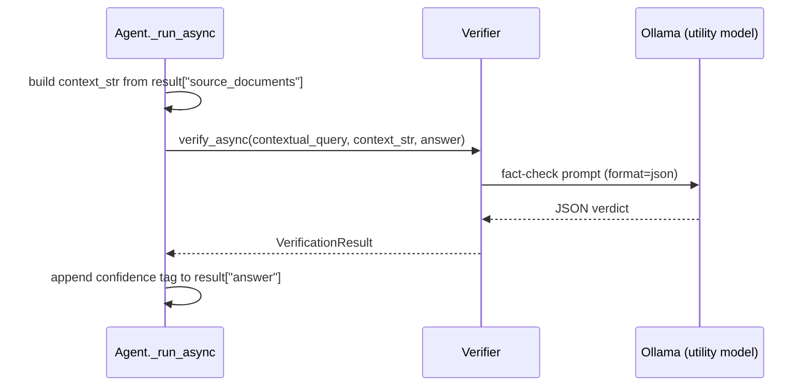

# ✅ Answer Verifier

_File: `rag_system/agent/verifier.py`. Sole caller: `rag_system/agent/loop.py:560-578`._

## Objective
Assess whether an answer produced by the RAG path is **grounded** in the retrieved context snippets, and annotate the answer with the model's self-reported confidence.

Two interchangeable backends implement it. The **LLM-prompt verifier below is what
ships**; a local NLI/verifier model is opt-in via `VERIFIER_MODEL` (see
[Local verifier model](#local-verifier-model-opt-in)).

> **`[Confidence: N%]` is UX, not a measurement.** It is whatever the verifier
> emitted, rescaled to a percent. Neither backend is calibrated: an 80% does not
> mean the answer is right four times in five. Swapping the LLM prompt for an NLI
> model changes where the number comes from, not that caveat.

## Prompt
See `prompt_inventory.md` → `verifier.fact_check` (`verifier.py:25-85`). The prompt carries three few-shot examples and then a `# TASK` block into which the query, the context (clamped to the first 4000 characters at `verifier.py:76`) and the answer are injected. It is sent asynchronously with `format="json"` (`verifier.py:86`).

Expected response, one line of JSON:

```jsonc
{
  "verdict": "SUPPORTED" | "NOT_SUPPORTED" | "NEEDS_CLARIFICATION",
  "is_grounded": true | false,
  "reasoning": "<short explanation>",
  "confidence_score": 0-100
}
```

It is parsed into a `VerificationResult` (`verifier.py:4-9`) with those four fields.

## Sequence


```mermaid
sequenceDiagram
    participant A as Agent._run_async
    participant V as Verifier
    participant LLM as Ollama (utility model)

    A->>A: build context_str from result["source_documents"]
    A->>V: verify_async(contextual_query, context_str, answer)
    V->>LLM: fact-check prompt (format=json)
    LLM-->>V: JSON verdict
    V-->>A: VerificationResult
    A->>A: append confidence tag to result["answer"]
```

## Call site

| Caller | Code | When it runs |
|--------|------|--------------|
| `Agent._run_async()` | `rag_system/agent/loop.py`, end of `_run_async` | After every branch (direct answer, decomposed/composed, single-query RAG), when verification is enabled **and** `result["source_documents"]` is non-empty. |

There is exactly one call site in the repository. `rag_system/pipelines/retrieval_pipeline.py` does not import or reference `Verifier`. Only the async `verify_async()` exists — the synchronous `verify()` was removed (`verifier.py:20`).

Because the check is gated on non-empty `source_documents`, the `direct_answer` route (which returns `source_documents: []`) is never verified.

## Configuration

| Knob | Where | Default | Meaning |
|------|-------|---------|---------|
| `verification.enabled` | `rag_system/main.py:80` (`default` profile) | `true` | Profile-level switch. |
| `verification.enabled` | `rag_system/main.py:109` (`fast` profile) | `false` | Verification off in the speed profile. |
| — | `loop.py:560` | `true` | Fallback used when the profile has no `verification` block. |
| `verify` | HTTP request field on `/chat` and `/chat/stream` (`api_server.py:186`) | not sent ⇒ profile value wins | Per-request override; forwarded to `Agent.run(verify=...)`. Also accepted by the backend gateway as `verify` (`backend/server.py:48`). |
| model | `loop.py`, `Agent.__init__` | utility model (`enrichment_model`, default `qwen3.5:4b`) | Which Ollama model runs the LLM-prompt verifier. Verification runs on the small model, not the answer model. |
| `verification.model` / `VERIFIER_MODEL` | pipeline config, or the env var | unset ⇒ LLM-prompt verifier | A HuggingFace model name switches the backend to a local NLI/verifier model. |
| `verification.threshold` | pipeline config | `0.5` | Score at or above which the local verifier calls an answer grounded. Ignored by the LLM-prompt backend. |
| `VERIFIER_TRUST_REMOTE_CODE` | env var | unset | Must be `1` to load a verifier that ships custom modelling code (e.g. Vectara HHEM). |

## Local verifier model (opt-in)

_Roadmap item 2.4, shipped 2026-08-09 as a **seam**: the default is unchanged._

```bash
VERIFIER_MODEL=MoritzLaurer/DeBERTa-v3-base-mnli-fever-anli python -m rag_system.main api
```

`LocalNLIVerifier` (`rag_system/agent/verifier.py`) loads any HuggingFace
sequence-classification model **lazily on first use**, splits the answer into
sentences, scores each one against the retrieved evidence as the premise, and
takes the **minimum** — one unsupported sentence makes the answer ungrounded,
matching the binary semantics `eval/judge.py` already uses. The "supported" logit
is resolved from `id2label` (`entailment` / `consistent` / `supported` / `1`),
falling back to the last class for binary checkers.

A model that cannot be loaded **raises** with the list of names that were
checked; it does not silently fall back to the LLM prompt. A verifier that
quietly is not the verifier you configured is worse than an error.

### Availability, checked 2026-08-09

| Candidate | Verdict |
|---|---|
| **ThinknCheck** (arXiv 2604.01652, UPenn, 1B, 78.1 BAcc) | **No public weights.** The paper is real, but a HuggingFace Hub search for `thinkncheck` returns zero models and the paper links no release. Cannot be wired. |
| `ibm-granite/granite-guardian-3.3-8b` | Exists, Apache-2.0 — but 8B / ~16 GB, far over the budget this seam is for. |
| `ibm-granite/granite-guardian-hap-38m` | Exists, 38M, Apache-2.0 — but it is a **hate/abuse/profanity** RoBERTa classifier. Wrong task: it does not score answer-vs-evidence entailment. |
| `MoritzLaurer/DeBERTa-v3-base-mnli-fever-anli` | ✅ MIT, 369 MB, no custom code. Generic NLI. |
| `lytang/MiniCheck-DeBERTa-v3-Large` | ✅ MIT, 1.74 GB, no custom code. Purpose-built grounded claim verification (the baseline ThinknCheck benchmarks against). |
| `vectara/hallucination_evaluation_model` (HHEM-2.1-open) | Apache-2.0, 438 MB, but ships custom modelling code — needs `VERIFIER_TRUST_REMOTE_CODE=1`. |

The same table is embedded in the code as `VERIFIER_AVAILABILITY_NOTES` and is
printed verbatim when a configured verifier fails to load.

The UI initialises its verify toggle to `true` (`src/components/ui/session-chat.tsx:49`), so verification is on by default for chat traffic.

## Effect on the answer

The verifier does **not** add a field to the response. It mutates the answer string (`loop.py:568-578`):

* `confidence_score > 0` → appends `" [Confidence: N%]"`.
* Additionally, when `is_grounded` is false **or** the score is below 50 → appends `" [Warning: Low confidence. Groundedness: <bool>]"`.
* `confidence_score == 0` → nothing is appended (0 is treated as a parse failure) and a warning is logged to stdout.

The API response shape is unchanged: `{"answer": ..., "source_documents": [...]}`.

## Failure modes

* Invalid JSON or a missing `response` key → the `except (json.JSONDecodeError, AttributeError)` at `verifier.py:95` returns `VerificationResult(False, "Failed async parse", "NOT_SUPPORTED", 0)`, and because the score is 0 no tag is appended — the answer is returned unannotated.
* If the LLM call itself raises, the exception propagates out of `_run_async` to the API handler, which returns a 500 (or an SSE `error` event on the streaming endpoint). There is no try/except around the `verify_async` call.

## Cost

Verification is one extra LLM round-trip per answered query, on the utility model, with a prompt containing up to 4000 characters of context. Set `verify: false` on the request, or run the `fast` profile, to skip it.

---
_Keep updated when the schema, the gating conditions, or the answer annotations change._
