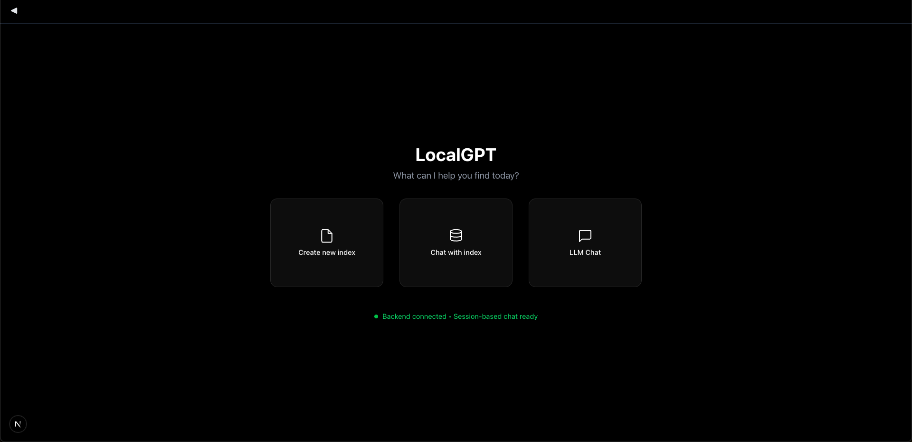
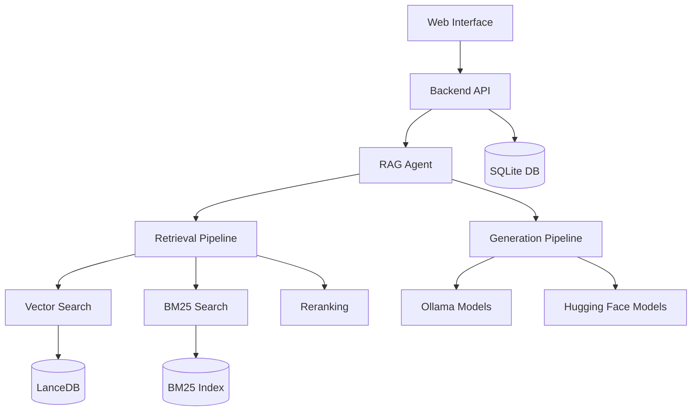
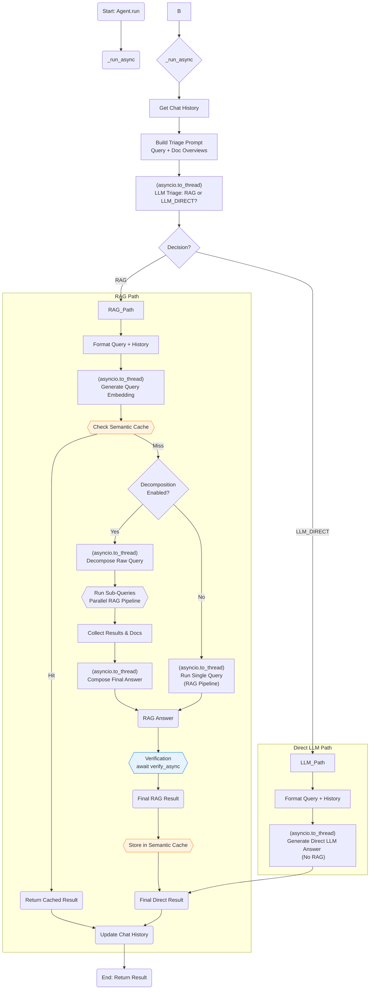

# LocalGPT - Private Document Intelligence Platform

<div align="center">

<p align="center">
<a href="https://trendshift.io/repositories/2947" target="_blank"></a>
</p>

[](https://github.com/PromtEngineer/localGPT/stargazers)
[](https://github.com/PromtEngineer/localGPT/network/members)
[](https://github.com/PromtEngineer/localGPT/issues)
[](https://github.com/PromtEngineer/localGPT/pulls)
[](https://www.python.org/downloads/)
[](LICENSE)
[](https://www.docker.com/)

<p align="center">
    <a href="https://x.com/engineerrprompt">
      
    </a>
    <a href="https://discord.gg/tUDWAFGc">
      
    </a>
  </p>
</div>

## 🚀 What is LocalGPT?

LocalGPT is a **fully private, on-premise Document Intelligence platform**. Ask questions, summarise, and uncover insights from your files with state-of-the-art AI—no data ever leaves your machine.

More than a traditional RAG (Retrieval-Augmented Generation) tool, LocalGPT features a **hybrid search engine** that blends semantic similarity, keyword matching, and [Late Chunking](https://jina.ai/news/late-chunking-in-long-context-embedding-models/) for long-context precision. A **smart router** automatically selects between RAG and direct LLM answering for every query, while **contextual enrichment** and sentence-level [Context Pruning](https://huggingface.co/naver/provence-reranker-debertav3-v1) surface only the most relevant content. An independent **verification** pass adds an extra layer of accuracy.

The architecture is **modular and lightweight**—enable only the components you need. With a pure-Python core and minimal dependencies, LocalGPT is simple to deploy, run, and maintain on any infrastructure.The system has minimal dependencies on frameworks and libraries, making it easy to deploy and maintain. The RAG system is pure python and does not require any additional dependencies.

## ▶️ Video
Watch this [video](https://youtu.be/JTbtGH3secI) to get started with LocalGPT. 

| Home | Create Index | Chat |
|------|--------------|------|
|  |  |  |

## ✨ Features

- **Utmost Privacy**: Your data remains on your computer, ensuring 100% security.
- **Versatile Model Support**: Seamlessly integrate a variety of open-source models via Ollama.
- **Diverse Embeddings**: Choose from a range of open-source embeddings.
- **Reuse Your LLM**: Once downloaded, reuse your LLM without the need for repeated downloads.
- **Chat History**: Remembers your previous conversations (in a session).
- **API**: LocalGPT has an API that you can use for building RAG Applications.
- **GPU, CPU, HPU & MPS Support**: Supports multiple platforms out of the box, Chat with your data using `CUDA`, `CPU`, `HPU (Intel® Gaudi®)` or `MPS` and more!

### 📖 Document Processing
- **Multi-format Support**: PDF, DOCX, TXT, Markdown, and more (Currently only PDF is supported)
- **Contextual Enrichment**: Enhanced document understanding with AI-generated context, inspired by [Contextual Retrieval](https://www.anthropic.com/news/contextual-retrieval)
- **Batch Processing**: Handle multiple documents simultaneously

### 🤖 AI-Powered Chat
- **Natural Language Queries**: Ask questions in plain English
- **Source Attribution**: Every answer includes document references
- **Smart Routing**: Automatically chooses between RAG and direct LLM responses
- **Query Decomposition**: Breaks complex queries into sub-questions for better answers
- **Semantic Caching**: TTL-based caching with similarity matching for faster responses
- **Session-Aware History**: Maintains conversation context across interactions
- **Answer Verification**: Independent verification pass for accuracy
- **Multiple AI Models**: Ollama for inference, HuggingFace for embeddings and reranking


### 🛠️ Developer-Friendly
- **RESTful APIs**: Complete API access for integration
- **Real-time Progress**: Live updates during document processing
- **Flexible Configuration**: Customize models, chunk sizes, and search parameters
- **Extensible Architecture**: Plugin system for custom components

### 🎨 Modern Interface
- **Intuitive Web UI**: Clean, responsive design
- **Session Management**: Organize conversations by topic
- **Index Management**: Easy document collection management
- **Real-time Chat**: Streaming responses for immediate feedback

---

## 🚀 Quick Start

Note: The installation is currently only tested on macOS. 

### Prerequisites
- Python 3.8 or higher (tested with Python 3.11.5)
- Node.js 16+ and npm (tested with Node.js 23.10.0, npm 10.9.2)
- Docker (optional, for containerized deployment)
- 8GB+ RAM (16GB+ recommended)
- Ollama (required for both deployment approaches)

### ***NOTE***
Before this brach is moved to the main branch, please clone this branch for instalation:

```bash
git clone -b localgpt-v2 https://github.com/PromtEngineer/localGPT.git
cd localGPT
```

### Option 1: Docker Deployment 

```bash
# Clone the repository
git clone https://github.com/PromtEngineer/localGPT.git
cd localGPT

# Install Ollama locally (required even for Docker)
curl -fsSL https://ollama.ai/install.sh | sh
ollama pull qwen3:0.6b
ollama pull qwen3:8b

# Start Ollama
ollama serve

# Start with Docker (in a new terminal)
./start-docker.sh

# Access the application
open http://localhost:3000
```

**Docker Management Commands:**
```bash
# Check container status
docker compose ps

# View logs
docker compose logs -f

# Stop containers
./start-docker.sh stop
```

### Option 2: Direct Development (Recommended for Development)

```bash
# Clone the repository
git clone https://github.com/PromtEngineer/localGPT.git
cd localGPT

# Install Python dependencies
pip install -r requirements.txt

# Key dependencies installed:
# - torch==2.4.1, transformers==4.51.0 (AI models)
# - lancedb (vector database)
# - rank_bm25, fuzzywuzzy (search algorithms)
# - sentence_transformers, rerankers (embedding/reranking)
# - docling (document processing)
# - colpali-engine (multimodal processing - support coming soon)

# Install Node.js dependencies
npm install

# Install and start Ollama
curl -fsSL https://ollama.ai/install.sh | sh
ollama pull qwen3:0.6b
ollama pull qwen3:8b
ollama serve

# Start the system (in a new terminal)
python run_system.py

# Access the application
open http://localhost:3000
```

**System Management:**
```bash
# Check system health (comprehensive diagnostics)
python system_health_check.py

# Check service status and health
python run_system.py --health

# Start in production mode
python run_system.py --mode prod

# Skip frontend (backend + RAG API only)
python run_system.py --no-frontend

# View aggregated logs
python run_system.py --logs-only

# Stop all services
python run_system.py --stop
# Or press Ctrl+C in the terminal running python run_system.py
```

**Service Architecture:**
The `run_system.py` launcher manages four key services:
- **Ollama Server** (port 11434): AI model serving
- **RAG API Server** (port 8001): Document processing and retrieval
- **Backend Server** (port 8000): Session management and API endpoints
- **Frontend Server** (port 3000): React/Next.js web interface

### Option 3: Manual Component Startup

```bash
# Terminal 1: Start Ollama
ollama serve

# Terminal 2: Start RAG API
python -m rag_system.api_server

# Terminal 3: Start Backend
cd backend && python server.py

# Terminal 4: Start Frontend
npm run dev

# Access at http://localhost:3000
```

---

### Detailed Installation

#### 1. Install System Dependencies

**Ubuntu/Debian:**
```bash
sudo apt update
sudo apt install python3.8 python3-pip nodejs npm docker.io docker-compose
```

**macOS:**
```bash
brew install python@3.8 node npm docker docker-compose
```

**Windows:**
```bash
# Install Python 3.8+, Node.js, and Docker Desktop
# Then use PowerShell or WSL2
```

#### 2. Install AI Models

**Install Ollama (Recommended):**
```bash
# Install Ollama
curl -fsSL https://ollama.ai/install.sh | sh

# Pull recommended models
ollama pull qwen3:0.6b          # Fast generation model
ollama pull qwen3:8b            # High-quality generation model
```

#### 3. Configure Environment

```bash
# Copy environment template
cp .env.example .env

# Edit configuration
nano .env
```

**Key Configuration Options:**
```env
# AI Models (referenced in rag_system/main.py)
OLLAMA_HOST=http://localhost:11434

# Database Paths (used by backend and RAG system)
DATABASE_PATH=./backend/chat_data.db
VECTOR_DB_PATH=./lancedb

# Server Settings (used by run_system.py)
BACKEND_PORT=8000
FRONTEND_PORT=3000
RAG_API_PORT=8001

# Optional: Override default models
GENERATION_MODEL=qwen3:8b
ENRICHMENT_MODEL=qwen3:0.6b
EMBEDDING_MODEL=Qwen/Qwen3-Embedding-0.6B
RERANKER_MODEL=answerdotai/answerai-colbert-small-v1
```

#### 4. Initialize the System

```bash
# Run system health check
python system_health_check.py

# Initialize databases
python -c "from backend.database import ChatDatabase; ChatDatabase().init_database()"

# Test installation
python -c "from rag_system.main import get_agent; print('✅ Installation successful!')"

# Validate complete setup
python run_system.py --health
```

---

## 🎯 Getting Started

### 1. Create Your First Index

An **index** is a collection of processed documents that you can chat with.

#### Using the Web Interface:
1. Open http://localhost:3000
2. Click "Create New Index"
3. Upload your documents (PDF, DOCX, TXT)
4. Configure processing options
5. Click "Build Index"

#### Using Scripts:
```bash
# Simple script approach
./simple_create_index.sh "My Documents" "path/to/document.pdf"

# Interactive script
python create_index_script.py
```

#### Using API:
```bash
# Create index
curl -X POST http://localhost:8000/indexes \
  -H "Content-Type: application/json" \
  -d '{"name": "My Index", "description": "My documents"}'

# Upload documents
curl -X POST http://localhost:8000/indexes/INDEX_ID/upload \
  -F "files=@document.pdf"

# Build index
curl -X POST http://localhost:8000/indexes/INDEX_ID/build
```

### 2. Start Chatting

Once your index is built:

1. **Create a Chat Session**: Click "New Chat" or use an existing session
2. **Select Your Index**: Choose which document collection to query
3. **Ask Questions**: Type natural language questions about your documents
4. **Get Answers**: Receive AI-generated responses with source citations

### 3. Advanced Features

#### Custom Model Configuration
```bash
# Use different models for different tasks
curl -X POST http://localhost:8000/sessions \
  -H "Content-Type: application/json" \
  -d '{
    "title": "High Quality Session",
    "model": "qwen3:8b",
    "embedding_model": "Qwen/Qwen3-Embedding-4B"
  }'
```

#### Batch Document Processing
```bash
# Process multiple documents at once
python demo_batch_indexing.py --config batch_indexing_config.json
```

#### API Integration
```python
import requests

# Chat with your documents via API
response = requests.post('http://localhost:8000/chat', json={
    'query': 'What are the key findings in the research papers?',
    'session_id': 'your-session-id',
    'search_type': 'hybrid',
    'retrieval_k': 20
})

print(response.json()['response'])
```

---

## 🔧 Configuration

### Model Configuration

LocalGPT supports multiple AI model providers with centralized configuration:

#### Ollama Models (Local Inference)
```python
OLLAMA_CONFIG = {
    "host": "http://localhost:11434",
    "generation_model": "qwen3:8b",        # Main text generation
    "enrichment_model": "qwen3:0.6b"       # Lightweight routing/enrichment
}
```

#### External Models (HuggingFace Direct)
```python
EXTERNAL_MODELS = {
    "embedding_model": "Qwen/Qwen3-Embedding-0.6B",           # 1024 dimensions
    "reranker_model": "answerdotai/answerai-colbert-small-v1", # ColBERT reranker
    "fallback_reranker": "BAAI/bge-reranker-base"             # Backup reranker
}
```

### Pipeline Configuration

LocalGPT offers two main pipeline configurations:

#### Default Pipeline (Production-Ready)
```python
"default": {
    "description": "Production-ready pipeline with hybrid search, AI reranking, and verification",
    "storage": {
        "lancedb_uri": "./lancedb",
        "text_table_name": "text_pages_v3",
        "bm25_path": "./index_store/bm25"
    },
    "retrieval": {
        "retriever": "multivector",
        "search_type": "hybrid",
        "late_chunking": {"enabled": True},
        "dense": {"enabled": True, "weight": 0.7},
        "bm25": {"enabled": True}
    },
    "reranker": {
        "enabled": True,
        "type": "ai",
        "strategy": "rerankers-lib",
        "model_name": "answerdotai/answerai-colbert-small-v1",
        "top_k": 10
    },
    "query_decomposition": {"enabled": True, "max_sub_queries": 3},
    "verification": {"enabled": True},
    "retrieval_k": 20,
    "contextual_enricher": {"enabled": True, "window_size": 1}
}
```

#### Fast Pipeline (Speed-Optimized)
```python
"fast": {
    "description": "Speed-optimized pipeline with minimal overhead",
    "retrieval": {
        "search_type": "vector_only",
        "late_chunking": {"enabled": False}
    },
    "reranker": {"enabled": False},
    "query_decomposition": {"enabled": False},
    "verification": {"enabled": False},
    "retrieval_k": 10,
    "contextual_enricher": {"enabled": False}
}
```

### Search Configuration

```python
SEARCH_CONFIG = {
    'hybrid': {
        'dense_weight': 0.7,
        'sparse_weight': 0.3,
        'retrieval_k': 20,
        'reranker_top_k': 10
    }
}
```
---

## 🛠️ Troubleshooting

### Common Issues

#### Installation Problems
```bash
# Check Python version
python --version  # Should be 3.8+

# Check dependencies
pip list | grep -E "(torch|transformers|lancedb)"

# Reinstall dependencies
pip install -r requirements.txt --force-reinstall
```

#### Model Loading Issues
```bash
# Check Ollama status
ollama list
curl http://localhost:11434/api/tags

# Pull missing models
ollama pull qwen3:0.6b
```

#### Database Issues
```bash
# Check database connectivity
python -c "from backend.database import ChatDatabase; db = ChatDatabase(); print('✅ Database OK')"

# Reset database (WARNING: This deletes all data)
rm backend/chat_data.db
python -c "from backend.database import ChatDatabase; ChatDatabase().init_database()"
```

#### Performance Issues
```bash
# Check system resources
python system_health_check.py

# Monitor memory usage
htop  # or Task Manager on Windows

# Optimize for low-memory systems
export PYTORCH_CUDA_ALLOC_CONF=max_split_size_mb:512
```

### Getting Help

1. **Check Logs**: The system creates structured logs in the `logs/` directory:
   - `logs/system.log`: Main system events and errors
   - `logs/ollama.log`: Ollama server logs
   - `logs/rag-api.log`: RAG API processing logs
   - `logs/backend.log`: Backend server logs
   - `logs/frontend.log`: Frontend build and runtime logs

2. **System Health**: Run comprehensive diagnostics:
   ```bash
   python system_health_check.py  # Full system diagnostics
   python run_system.py --health  # Service status check
   ```

3. **Health Endpoints**: Check individual service health:
   - Backend: `http://localhost:8000/health`
   - RAG API: `http://localhost:8001/health`
   - Ollama: `http://localhost:11434/api/tags`

4. **Documentation**: Check the [Technical Documentation](TECHNICAL_DOCS.md)
5. **GitHub Issues**: Report bugs and request features
6. **Community**: Join our Discord/Slack community

---

## 🔗 API Reference

### Core Endpoints

#### Chat API
```http
# Session-based chat (recommended)
POST /sessions/{session_id}/chat
Content-Type: application/json

{
  "query": "What are the main topics discussed?",
  "search_type": "hybrid",
  "retrieval_k": 20,
  "ai_rerank": true,
  "context_window_size": 5
}

# Legacy chat endpoint
POST /chat
Content-Type: application/json

{
  "query": "What are the main topics discussed?",
  "session_id": "uuid",
  "search_type": "hybrid",
  "retrieval_k": 20
}
```

#### Index Management
```http
# Create index
POST /indexes
Content-Type: application/json
{
  "name": "My Index",
  "description": "Description",
  "config": "default"
}

# Get all indexes
GET /indexes

# Get specific index
GET /indexes/{id}

# Upload documents to index
POST /indexes/{id}/upload
Content-Type: multipart/form-data
files: [file1.pdf, file2.pdf, ...]

# Build index (process uploaded documents)
POST /indexes/{id}/build
Content-Type: application/json
{
  "config_mode": "default",
  "enable_enrich": true,
  "chunk_size": 512
}

# Delete index
DELETE /indexes/{id}
```

#### Session Management
```http
# Create session
POST /sessions
Content-Type: application/json
{
  "title": "My Session",
  "model": "qwen3:0.6b"
}

# Get all sessions
GET /sessions

# Get specific session
GET /sessions/{session_id}

# Get session documents
GET /sessions/{session_id}/documents

# Get session indexes
GET /sessions/{session_id}/indexes

# Link index to session
POST /sessions/{session_id}/indexes/{index_id}

# Delete session
DELETE /sessions/{session_id}

# Rename session
POST /sessions/{session_id}/rename
Content-Type: application/json
{
  "new_title": "Updated Session Name"
}
```

### Advanced Features

#### Query Decomposition
The system can break complex queries into sub-questions for better answers:
```http
POST /sessions/{session_id}/chat
Content-Type: application/json

{
  "query": "Compare the methodologies and analyze their effectiveness",
  "query_decompose": true,
  "compose_sub_answers": true
}
```

#### Answer Verification
Independent verification pass for accuracy using a separate verification model:
```http
POST /sessions/{session_id}/chat
Content-Type: application/json

{
  "query": "What are the key findings?",
  "verify": true
}
```

#### Contextual Enrichment
Document context enrichment during indexing for better understanding:
```bash
# Enable during index building
POST /indexes/{id}/build
{
  "enable_enrich": true,
  "window_size": 2
}
```

#### Late Chunking
Better context preservation by chunking after embedding:
```bash
# Configure in pipeline
"late_chunking": {"enabled": true}
```

#### Streaming Chat
```http
POST /chat/stream
Content-Type: application/json

{
  "query": "Explain the methodology",
  "session_id": "uuid",
  "stream": true
}
```

#### Batch Processing
```bash
# Using the batch indexing script
python demo_batch_indexing.py --config batch_indexing_config.json

# Example batch configuration (batch_indexing_config.json):
{
  "index_name": "Sample Batch Index",
  "index_description": "Example batch index configuration",
  "documents": [
    "./rag_system/documents/invoice_1039.pdf",
    "./rag_system/documents/invoice_1041.pdf"
  ],
  "processing": {
    "chunk_size": 512,
    "chunk_overlap": 64,
    "enable_enrich": true,
    "enable_latechunk": true,
    "enable_docling": true,
    "embedding_model": "Qwen/Qwen3-Embedding-0.6B",
    "generation_model": "qwen3:0.6b",
    "retrieval_mode": "hybrid",
    "window_size": 2
  }
}
```

```http
# API endpoint for batch processing
POST /batch/index
Content-Type: application/json

{
  "file_paths": ["doc1.pdf", "doc2.pdf"],
  "config": {
    "chunk_size": 512,
    "enable_enrich": true,
    "enable_latechunk": true,
    "enable_docling": true
  }
}
```

For complete API documentation, see [API_REFERENCE.md](API_REFERENCE.md).

---

## 🏗️ Architecture

LocalGPT is built with a modular, scalable architecture:



Overview of the Retrieval Agent



---

## 🤝 Contributing

We welcome contributions from developers of all skill levels! LocalGPT is an open-source project that benefits from community involvement.

### 🚀 Quick Start for Contributors

```bash
# Fork and clone the repository
git clone https://github.com/PromtEngineer/localGPT.git
cd localGPT

# Set up development environment
pip install -r requirements.txt
npm install

# Install Ollama and models
curl -fsSL https://ollama.ai/install.sh | sh
ollama pull qwen3:0.6b qwen3:8b

# Verify setup
python system_health_check.py
python run_system.py --mode dev
```

### 📋 How to Contribute

1. **🐛 Report Bugs**: Use our [bug report template](.github/ISSUE_TEMPLATE/bug_report.md)
2. **💡 Request Features**: Use our [feature request template](.github/ISSUE_TEMPLATE/feature_request.md)
3. **🔧 Submit Code**: Follow our [development workflow](CONTRIBUTING.md#development-workflow)
4. **📚 Improve Docs**: Help make our documentation better

### 📖 Detailed Guidelines

For comprehensive contributing guidelines, including:
- Development setup and workflow
- Coding standards and best practices
- Testing requirements
- Documentation standards
- Release process

**👉 See our [CONTRIBUTING.md](CONTRIBUTING.md) guide**

---

## 📄 License

This project is licensed under the MIT License - see the [LICENSE](LICENSE) file for details. For models, please check their respective licenses.

---

## 📞 Support

- **Documentation**: [Technical Docs](TECHNICAL_DOCS.md)
- **Issues**: [GitHub Issues](https://github.com/PromtEngineer/localGPT/issues)
- **Discussions**: [GitHub Discussions](https://github.com/PromtEngineer/localGPT/discussions)
- **Business Deployment and Customization**: [Contact Us](https://tally.so/r/wv6R2d)
---

<div align="center">

## Star History

[](https://star-history.com/#PromtEngineer/localGPT&Date)
