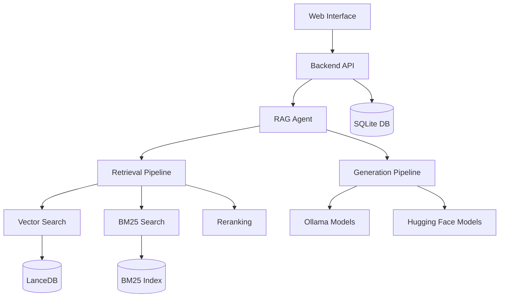

# LocalGPT - Private Document Intelligence Platform

<div align="center">


**Transform your documents into intelligent, searchable knowledge with complete privacy**

[](https://www.python.org/downloads/)
[](LICENSE)
[](https://www.docker.com/)

[Quick Start](#quick-start) • [Features](#features) • [Installation](#installation) • [Documentation](#documentation) • [API Reference](#api-reference)

</div>

## 🚀 What is LocalGPT?

LocalGPT is a **private, local document intelligence platform** that allows you to chat with your documents using advanced AI models - all while keeping your data completely private and secure on your own infrastructure.

### 🎯 Key Benefits

- **🔒 Complete Privacy**: Your documents never leave your server
- **🧠 Advanced AI**: State-of-the-art RAG (Retrieval-Augmented Generation) with smart routing
- **📚 Multi-Format Support**: PDFs, Word docs, text files, and more
- **🔍 Intelligent Search**: Hybrid search combining semantic similarity and keyword matching
- **⚡ High Performance**: Optimized for speed with batch processing and caching
- **🐳 Easy Deployment**: Docker support for simple setup and scaling

---

## ✨ Features

### 📖 Document Processing
- **Multi-format Support**: PDF, DOCX, TXT, Markdown, and more
- **Smart Chunking**: Intelligent text segmentation with overlap optimization
- **Contextual Enrichment**: Enhanced document understanding with AI-generated context
- **Batch Processing**: Handle multiple documents simultaneously

### 🤖 AI-Powered Chat
- **Natural Language Queries**: Ask questions in plain English
- **Source Attribution**: Every answer includes document references
- **Smart Routing**: Automatically chooses the best approach for each query
- **Multiple AI Models**: Support for Ollama, OpenAI, and Hugging Face models

### 🔍 Advanced Search
- **Hybrid Search**: Combines semantic similarity with keyword matching
- **Vector Embeddings**: State-of-the-art embedding models for semantic understanding
- **BM25 Ranking**: Traditional information retrieval for precise keyword matching
- **Reranking**: AI-powered result refinement for better relevance

### 🛠️ Developer-Friendly
- **RESTful APIs**: Complete API access for integration
- **Real-time Progress**: Live updates during document processing
- **Flexible Configuration**: Customize models, chunk sizes, and search parameters
- **Extensible Architecture**: Plugin system for custom components

### 🎨 Modern Interface
- **Intuitive Web UI**: Clean, responsive design
- **Session Management**: Organize conversations by topic
- **Index Management**: Easy document collection management
- **Real-time Chat**: Streaming responses for immediate feedback

---

## 🚀 Quick Start

### Prerequisites
- Python 3.8 or higher (tested with Python 3.11.5)
- Node.js 16+ and npm (tested with Node.js 23.10.0, npm 10.9.2)
- Docker (optional, for containerized deployment)
- 8GB+ RAM (16GB+ recommended)
- Ollama (required for both deployment approaches)

### Option 1: Docker Deployment (Recommended for Production)

```bash
# Clone the repository
git clone https://github.com/yourusername/localgpt.git
cd localgpt

# Install Ollama locally (required even for Docker)
curl -fsSL https://ollama.ai/install.sh | sh
ollama pull qwen3:0.6b
ollama pull qwen3:8b

# Start Ollama
ollama serve

# Start with Docker (in a new terminal)
./start-docker.sh

# Access the application
open http://localhost:3000
```

**Docker Management Commands:**
```bash
# Check container status
docker compose ps

# View logs
docker compose logs -f

# Stop containers
./start-docker.sh stop
```

### Option 2: Direct Development (Recommended for Development)

```bash
# Clone the repository
git clone https://github.com/yourusername/localgpt.git
cd localgpt

# Install Python dependencies
pip install -r requirements.txt

# Install Node.js dependencies
npm install

# Install and start Ollama
curl -fsSL https://ollama.ai/install.sh | sh
ollama pull qwen3:0.6b
ollama pull qwen3:8b
ollama serve

# Start the system (in a new terminal)
python run_system.py

# Access the application
open http://localhost:3000
```

**Direct Development Management:**
```bash
# Check system health (comprehensive diagnostics)
python system_health_check.py

# Check service status
python run_system.py --health

# Stop all services
python run_system.py --stop
# Or press Ctrl+C in the terminal running python run_system.py
```

### Option 3: Manual Component Startup

```bash
# Terminal 1: Start Ollama
ollama serve

# Terminal 2: Start RAG API
python -m rag_system.api_server

# Terminal 3: Start Backend
cd backend && python server.py

# Terminal 4: Start Frontend
npm run dev

# Access at http://localhost:3000
```

---

## 📋 Installation Guide

### System Requirements

| Component | Minimum | Recommended | Tested |
|-----------|---------|-------------|--------|
| Python | 3.8+ | 3.11+ | 3.11.5 |
| Node.js | 16+ | 18+ | 23.10.0 |
| RAM | 8GB | 16GB+ | 16GB+ |
| Storage | 10GB | 50GB+ | 50GB+ |
| CPU | 4 cores | 8+ cores | 8+ cores |
| GPU | Optional | NVIDIA GPU with 8GB+ VRAM | MPS (Apple Silicon) |

### Detailed Installation

#### 1. Install System Dependencies

**Ubuntu/Debian:**
```bash
sudo apt update
sudo apt install python3.8 python3-pip nodejs npm docker.io docker-compose
```

**macOS:**
```bash
brew install python@3.8 node npm docker docker-compose
```

**Windows:**
```bash
# Install Python 3.8+, Node.js, and Docker Desktop
# Then use PowerShell or WSL2
```

#### 2. Install AI Models

**Install Ollama (Recommended):**
```bash
# Install Ollama
curl -fsSL https://ollama.ai/install.sh | sh

# Pull recommended models
ollama pull qwen3:0.6b          # Fast generation model
ollama pull qwen3:8b            # High-quality generation model
```

#### 3. Configure Environment

```bash
# Copy environment template
cp .env.example .env

# Edit configuration
nano .env
```

**Key Configuration Options:**
```env
# AI Models
OLLAMA_HOST=http://localhost:11434
DEFAULT_EMBEDDING_MODEL=Qwen/Qwen3-Embedding-0.6B
DEFAULT_GENERATION_MODEL=qwen3:0.6b

# Database
DATABASE_PATH=./backend/chat_data.db
VECTOR_DB_PATH=./lancedb

# Server Settings
BACKEND_PORT=8000
FRONTEND_PORT=3000
```

#### 4. Initialize the System

```bash
# Run system health check
python system_health_check.py

# Initialize databases
python -c "from backend.database import ChatDatabase; ChatDatabase().init_database()"

# Test installation
python -c "from rag_system.main import get_agent; print('✅ Installation successful!')"

# Validate complete setup
python run_system.py --health
```

---

## 🎯 Getting Started

### 1. Create Your First Index

An **index** is a collection of processed documents that you can chat with.

#### Using the Web Interface:
1. Open http://localhost:3000
2. Click "Create New Index"
3. Upload your documents (PDF, DOCX, TXT)
4. Configure processing options
5. Click "Build Index"

#### Using Scripts:
```bash
# Simple script approach
./simple_create_index.sh "My Documents" "path/to/document.pdf"

# Interactive script
python create_index_script.py
```

#### Using API:
```bash
# Create index
curl -X POST http://localhost:8000/indexes \
  -H "Content-Type: application/json" \
  -d '{"name": "My Index", "description": "My documents"}'

# Upload documents
curl -X POST http://localhost:8000/indexes/INDEX_ID/upload \
  -F "files=@document.pdf"

# Build index
curl -X POST http://localhost:8000/indexes/INDEX_ID/build
```

### 2. Start Chatting

Once your index is built:

1. **Create a Chat Session**: Click "New Chat" or use an existing session
2. **Select Your Index**: Choose which document collection to query
3. **Ask Questions**: Type natural language questions about your documents
4. **Get Answers**: Receive AI-generated responses with source citations

### 3. Advanced Features

#### Custom Model Configuration
```bash
# Use different models for different tasks
curl -X POST http://localhost:8000/sessions \
  -H "Content-Type: application/json" \
  -d '{
    "title": "High Quality Session",
    "model": "qwen3:8b",
    "embedding_model": "Qwen/Qwen3-Embedding-4B"
  }'
```

#### Batch Document Processing
```bash
# Process multiple documents at once
python demo_batch_indexing.py --config batch_indexing_config.json
```

#### API Integration
```python
import requests

# Chat with your documents via API
response = requests.post('http://localhost:8000/chat', json={
    'query': 'What are the key findings in the research papers?',
    'session_id': 'your-session-id',
    'search_type': 'hybrid',
    'retrieval_k': 20
})

print(response.json()['response'])
```

---

## 🔧 Configuration

### Model Configuration

LocalGPT supports multiple AI model providers:

#### Ollama Models (Local)
```python
OLLAMA_CONFIG = {
    'host': 'http://localhost:11434',
    'generation_model': 'qwen3:0.6b',
    'embedding_model': 'nomic-embed-text'
}
```

#### Hugging Face Models
```python
EXTERNAL_MODELS = {
    'embedding': {
        'Qwen/Qwen3-Embedding-0.6B': {'dimensions': 1024},
        'Qwen/Qwen3-Embedding-4B': {'dimensions': 2048},
        'Qwen/Qwen3-Embedding-8B': {'dimensions': 4096}
    }
}
```

### Processing Configuration

```python
PIPELINE_CONFIGS = {
    'default': {
        'chunk_size': 512,
        'chunk_overlap': 64,
        'retrieval_mode': 'hybrid',
        'window_size': 5,
        'enable_enrich': True,
        'latechunk': True,
        'docling_chunk': True
    },
    'fast': {
        'chunk_size': 256,
        'chunk_overlap': 32,
        'retrieval_mode': 'vector',
        'enable_enrich': False
    }
}
```

### Search Configuration

```python
SEARCH_CONFIG = {
    'hybrid': {
        'dense_weight': 0.7,
        'sparse_weight': 0.3,
        'retrieval_k': 20,
        'reranker_top_k': 10
    }
}
```

---

## 📚 Use Cases

### 📊 Business Intelligence
- **Document Analysis**: Extract insights from reports, contracts, and presentations
- **Compliance**: Query regulatory documents and policies
- **Knowledge Management**: Build searchable company knowledge bases

### 🔬 Research & Academia
- **Literature Review**: Analyze research papers and academic publications
- **Data Analysis**: Query experimental results and datasets
- **Collaboration**: Share findings with team members securely

### ⚖️ Legal & Compliance
- **Case Research**: Search through legal documents and precedents
- **Contract Analysis**: Extract key terms and obligations
- **Regulatory Compliance**: Query compliance requirements and guidelines

### 🏥 Healthcare
- **Medical Records**: Analyze patient data and treatment histories
- **Research**: Query medical literature and clinical studies
- **Compliance**: Navigate healthcare regulations and standards

### 💼 Personal Productivity
- **Document Organization**: Create searchable personal knowledge bases
- **Research**: Analyze books, articles, and reference materials
- **Learning**: Build interactive study materials from textbooks

---

## 🛠️ Troubleshooting

### Common Issues

#### Installation Problems
```bash
# Check Python version
python --version  # Should be 3.8+

# Check dependencies
pip list | grep -E "(torch|transformers|lancedb)"

# Reinstall dependencies
pip install -r requirements.txt --force-reinstall
```

#### Model Loading Issues
```bash
# Check Ollama status
ollama list
curl http://localhost:11434/api/tags

# Pull missing models
ollama pull qwen3:0.6b
```

#### Database Issues
```bash
# Check database connectivity
python -c "from backend.database import ChatDatabase; db = ChatDatabase(); print('✅ Database OK')"

# Reset database (WARNING: This deletes all data)
rm backend/chat_data.db
python -c "from backend.database import ChatDatabase; ChatDatabase().init_database()"
```

#### Performance Issues
```bash
# Check system resources
python system_health_check.py

# Monitor memory usage
htop  # or Task Manager on Windows

# Optimize for low-memory systems
export PYTORCH_CUDA_ALLOC_CONF=max_split_size_mb:512
```

### Getting Help

1. **Check Logs**: Look at `logs/system.log` for detailed error messages
2. **System Health**: Run `python system_health_check.py`
3. **Documentation**: Check the [Technical Documentation](TECHNICAL_DOCS.md)
4. **GitHub Issues**: Report bugs and request features
5. **Community**: Join our Discord/Slack community

---

## 🔗 API Reference

### Core Endpoints

#### Chat API
```http
POST /chat
Content-Type: application/json

{
  "query": "What are the main topics discussed?",
  "session_id": "uuid",
  "search_type": "hybrid",
  "retrieval_k": 20
}
```

#### Index Management
```http
# Create index
POST /indexes
{"name": "My Index", "description": "Description"}

# Upload documents
POST /indexes/{id}/upload
Content-Type: multipart/form-data

# Build index
POST /indexes/{id}/build

# Get index status
GET /indexes/{id}
```

#### Session Management
```http
# Create session
POST /sessions
{"title": "My Session", "model": "qwen3:0.6b"}

# Get sessions
GET /sessions

# Link index to session
POST /sessions/{session_id}/indexes/{index_id}
```

### Advanced Features

#### Streaming Chat
```http
POST /chat/stream
Content-Type: application/json

{
  "query": "Explain the methodology",
  "session_id": "uuid",
  "stream": true
}
```

#### Batch Processing
```http
POST /batch/index
Content-Type: application/json

{
  "file_paths": ["doc1.pdf", "doc2.pdf"],
  "config": {
    "chunk_size": 512,
    "enable_enrich": true
  }
}
```

For complete API documentation, see [API_REFERENCE.md](API_REFERENCE.md).

---

## 🏗️ Architecture

LocalGPT is built with a modular, scalable architecture:



### Key Components

- **Frontend**: React/Next.js web interface
- **Backend**: Python FastAPI server
- **RAG Agent**: Intelligent query routing and processing
- **Vector Database**: LanceDB for semantic search
- **Search Engine**: BM25 for keyword search
- **AI Models**: Ollama and Hugging Face integration

---

## 🤝 Contributing

We welcome contributions from developers of all skill levels! LocalGPT is an open-source project that benefits from community involvement.

### 🚀 Quick Start for Contributors

```bash
# Fork and clone the repository
git clone https://github.com/YOUR_USERNAME/multimodal_rag.git
cd multimodal_rag

# Set up development environment
pip install -r requirements.txt
npm install

# Install Ollama and models
curl -fsSL https://ollama.ai/install.sh | sh
ollama pull qwen3:0.6b qwen3:8b

# Verify setup
python system_health_check.py
python run_system.py --mode dev
```

### 📋 How to Contribute

1. **🐛 Report Bugs**: Use our [bug report template](.github/ISSUE_TEMPLATE/bug_report.md)
2. **💡 Request Features**: Use our [feature request template](.github/ISSUE_TEMPLATE/feature_request.md)
3. **🔧 Submit Code**: Follow our [development workflow](CONTRIBUTING.md#development-workflow)
4. **📚 Improve Docs**: Help make our documentation better

### 🎯 Priority Areas

- **Performance Optimization**: Improve indexing and retrieval speed
- **Model Integration**: Add support for new AI models
- **User Experience**: Enhance the web interface
- **Testing**: Expand test coverage
- **Documentation**: Improve setup and usage guides

### 📖 Detailed Guidelines

For comprehensive contributing guidelines, including:
- Development setup and workflow
- Coding standards and best practices
- Testing requirements
- Documentation standards
- Release process

**👉 See our [CONTRIBUTING.md](CONTRIBUTING.md) guide**

---

## 📄 License

This project is licensed under the MIT License - see the [LICENSE](LICENSE) file for details.

---

## 🙏 Acknowledgments

- **Ollama**: For providing excellent local AI model serving
- **LanceDB**: For high-performance vector database
- **Hugging Face**: For state-of-the-art AI models
- **React/Next.js**: For the modern web interface
- **FastAPI**: For the robust backend framework

---

## 📞 Support

- **Documentation**: [Technical Docs](TECHNICAL_DOCS.md)
- **Issues**: [GitHub Issues](https://github.com/yourusername/localgpt/issues)
- **Discussions**: [GitHub Discussions](https://github.com/yourusername/localgpt/discussions)
- **Email**: support@localgpt.com

---

<div align="center">

**Made with ❤️ for private, intelligent document processing**

[⭐ Star us on GitHub](https://github.com/yourusername/localgpt) • [🐛 Report Bug](https://github.com/yourusername/localgpt/issues) • [💡 Request Feature](https://github.com/yourusername/localgpt/issues)

</div>
