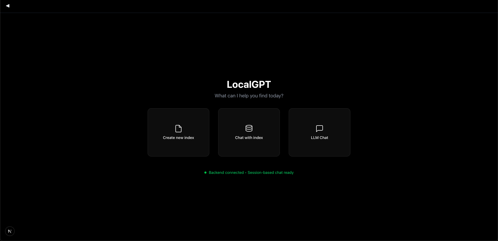
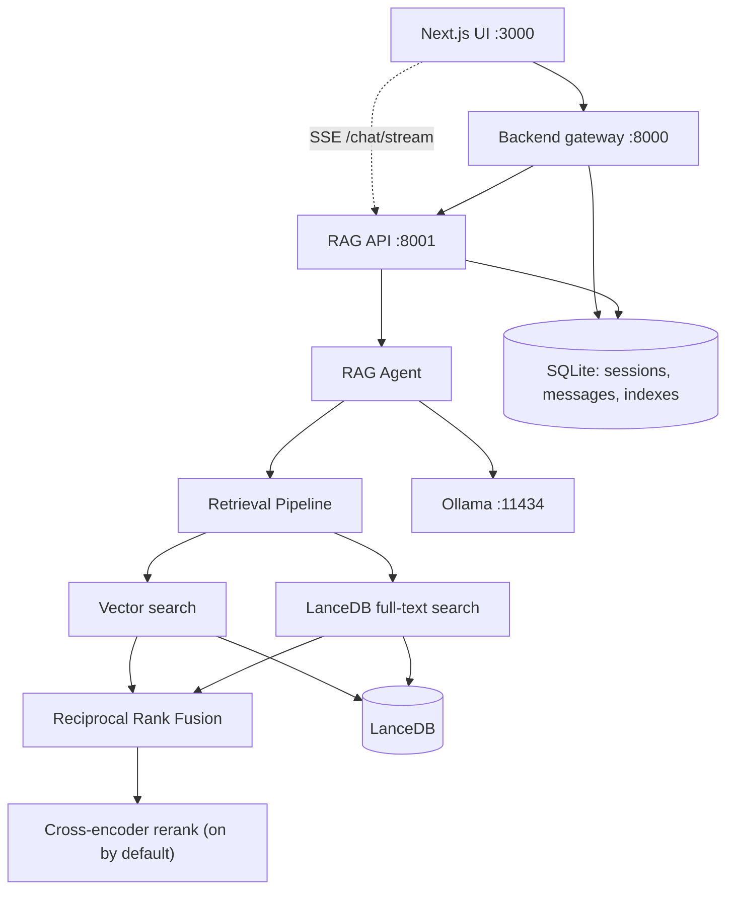
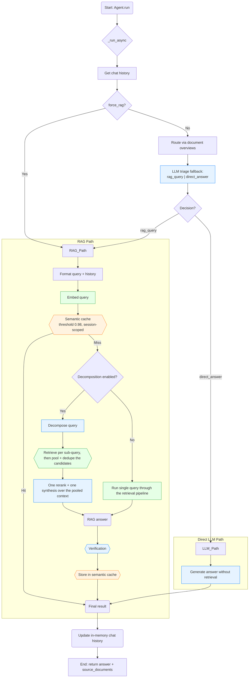

# LocalGPT - Private Document Intelligence Platform

<div align="center">

<p align="center">
<a href="https://trendshift.io/repositories/2947" target="_blank"></a>
</p>

[](https://github.com/PromtEngineer/localGPT/stargazers)
[](https://github.com/PromtEngineer/localGPT/network/members)
[](https://github.com/PromtEngineer/localGPT/issues)
[](https://github.com/PromtEngineer/localGPT/pulls)
[](https://www.python.org/downloads/)
[](LICENSE)
[](https://www.docker.com/)

<p align="center">
    <a href="https://x.com/engineerrprompt">
      
    </a>
    <a href="https://discord.gg/tUDWAFGc">
      
    </a>
  </p>
</div>

## 🚀 What is LocalGPT?

LocalGPT is a **fully private, on-premise Document Intelligence platform**. Ask questions, summarise, and uncover insights from your files with state-of-the-art AI—no data ever leaves your machine.

More than a traditional RAG (Retrieval-Augmented Generation) tool, LocalGPT features a **hybrid search engine** that fuses dense vector search with LanceDB's native full-text search, arbitrated by a **calibrated cross-encoder reranker**. A **smart router** picks between RAG and direct LLM answering for every query, while **contextual enrichment** and sentence-level [Context Pruning](https://huggingface.co/naver/provence-reranker-debertav3-v1) surface only the most relevant content. Optional passes — [Late Chunking](https://jina.ai/news/late-chunking-in-long-context-embedding-models/), an independent answer **verification** step, and experimental multi-vector (late-interaction) retrieval — can be switched on per config; the defaults ship with exactly the components that earned their place in measured evaluations (see [`eval/decisions/`](eval/decisions/)).

The architecture is **modular and lightweight**—enable only the components you need. The RAG core is plain Python built on the standard library's HTTP server, with no web framework and no agent framework in the way.

## ▶️ Video
Watch this [video](https://youtu.be/JTbtGH3secI) to get started with LocalGPT.

| Home | Create Index | Chat |
|------|--------------|------|
|  |  |  |

## ✨ Features

- **Utmost Privacy**: Your data remains on your computer, ensuring 100% security.
- **Versatile Model Support**: Swap generation models freely via Ollama.
- **Diverse Embeddings**: HuggingFace embedding models (harrier-oss-v1, the Qwen3-Embedding family) or any Ollama embedding tag.
- **Reuse Your LLM**: Once downloaded, reuse your LLM without the need for repeated downloads.
- **API**: A REST gateway on port 8000 and the RAG API on port 8001 for building your own applications.
- **CUDA, MPS & CPU**: Embedding and reranking pick CUDA, then Apple MPS, then CPU automatically.

### 📖 Document Processing
- **Formats**: PDF, DOCX, HTML/HTM, Markdown, and TXT, parsed by [Docling](https://github.com/docling-project/docling)
- **OCR fallback**: PDFs with no text layer are re-run through Docling's OCR pipeline; the engine is chosen from whatever is installed (OcrMac on macOS, then EasyOCR, RapidOCR, tesserocr, or the `tesseract` CLI)
- **Contextual Enrichment**: Chunk-level context generated by a small LLM, inspired by [Contextual Retrieval](https://www.anthropic.com/news/contextual-retrieval)
- **Late Chunking** (off by default): A second, document-level embedding pass stored in a companion `<table>_lc` table. The 2026-08-18 component ablation measured its removal at the noise floor on single-turn quality while it doubles the vectors written per index, so it now ships disabled; one flag (`retrieval.latechunk.enabled`) re-enables both the index-time build and the query-time leg — multi-turn conversations with drifting phrasing are where it earns its cost
- **Document Overviews**: A short per-document summary written to `index_store/overviews/<id>.jsonl` and used by the router

### 🤖 AI-Powered Chat
- **Natural Language Queries**: Ask questions in plain English
- **Source Attribution**: Answers come back with the chunks they were grounded in
- **Smart Routing**: Chooses between RAG and a direct LLM answer per query
- **Query Decomposition**: Splits complex questions into sub-questions, retrieves per sub-question, then pools the candidates for one rerank and one synthesis pass (per-sub-answer composition is available as an option)
- **Reciprocal Rank Fusion**: Vector and full-text hits are fused with RRF — no weights to tune
- **Reranking**: A cross-encoder pass over the fused candidate set, on by default with calibrated score-based selection ([`eval/DECISIONS.md`](eval/DECISIONS.md))
- **Sentence Pruning**: Optional Provence pruning drops irrelevant sentences from each chunk
- **Semantic Caching**: TTL cache with a 0.98 similarity threshold, scoped to the session
- **Answer Verification** (off by default): A second pass that appends `[Confidence: N%]` to the answer. Ablation measured zero verdict flips from disabling it — it annotates rather than changes answers — so it ships disabled; re-enable with `verification.enabled`

### 🛠️ Developer-Friendly
- **RESTful APIs**: Every UI action is a documented HTTP call
- **Streaming phases**: Server-Sent Events expose each pipeline stage as it runs
- **Flexible Configuration**: Models, chunk size, retrieval mode and toggles per request
- **One master config**: `rag_system/main.py` holds every default, overridable by environment variable

### 🎨 Modern Interface
- **Intuitive Web UI**: Clean, responsive design
- **Session Management**: Organize conversations by topic
- **Index Management**: Easy document collection management
- **Live Progress**: Retrieval, reranking and synthesis stages stream into the chat as they happen

---

## 🚀 Quick Start

### Prerequisites
- Python 3.10+ (3.11 recommended — the Docker images use `python:3.11-slim`)
- Node.js 20+ and npm
- Docker (optional, for containerized deployment)
- 8GB+ RAM (16GB+ recommended)
- Ollama (required for both deployment approaches)

### Option 1: Docker Deployment

```bash
# Clone the repository
git clone https://github.com/PromtEngineer/localGPT.git
cd localGPT

# Install Ollama locally (recommended even for Docker)
curl -fsSL https://ollama.ai/install.sh | sh
ollama pull qwen3.5:9b
ollama pull qwen3.5:4b

# Start Ollama
ollama serve

# Start with Docker (in a new terminal)
./start-docker.sh

# Access the application
open http://localhost:3000
```

If you would rather not install Ollama on the host, run it as a container instead:

```bash
./start-docker.sh container
# then pull the models inside the container
docker compose --profile with-ollama exec ollama ollama pull qwen3.5:9b
docker compose --profile with-ollama exec ollama ollama pull qwen3.5:4b
```

`./start-docker.sh` (with no argument) uses local Ollama. If nothing is listening on
port 11434 it offers to switch to the containerized Ollama; add `-y` (or set
`NONINTERACTIVE=1`) to take that fallback without a prompt in scripts and CI.

**Docker Management Commands:**
```bash
# Check container status
docker compose ps

# View logs
docker compose logs -f

# Stop containers
./start-docker.sh stop
```

### Option 2: Direct Development (Recommended for Development)

```bash
# Clone the repository
git clone https://github.com/PromtEngineer/localGPT.git
cd localGPT

# Install Python dependencies
pip install -r requirements.txt

# Key dependencies installed:
# - torch==2.4.1, transformers==4.51.0 (embedding + reranker models)
# - lancedb (vector store and full-text search)
# - rerankers (cross-encoder reranking)
# - docling (document parsing)

# Install Node.js dependencies
npm install

# Install and start Ollama
curl -fsSL https://ollama.ai/install.sh | sh
ollama pull qwen3.5:9b
ollama pull qwen3.5:4b
ollama serve

# Start the system (in a new terminal)
python run_system.py

# Access the application
open http://localhost:3000
```

**System Management:**
```bash
# Check system health (loads the models and runs a sample query)
python system_health_check.py

# Real HTTP health checks against each service; exits non-zero if one is unhealthy
python run_system.py --health

# Start in production mode (runs `npm run build` before `next start`)
python run_system.py --mode prod

# Skip frontend (Ollama + RAG API + backend only)
python run_system.py --no-frontend

# Tail logs/*.log from another shell
python run_system.py --logs-only

# Stop everything recorded in logs/run_system.pid
python run_system.py --stop
# Or press Ctrl+C in the terminal running python run_system.py
```

**Service Architecture:**
The `run_system.py` launcher manages four services and writes their PIDs to `logs/run_system.pid`:
- **Ollama Server** (port 11434): model serving — reused if already running
- **RAG API Server** (port 8001): indexing, retrieval and the agent loop
- **Backend Server** (port 8000): sessions, indexes, uploads, chat history
- **Frontend Server** (port 3000): Next.js web interface (optional — skipped if `npm` is missing)

On startup the launcher checks that `qwen3.5:9b` and `qwen3.5:4b` are present and
runs `ollama pull` for anything missing.

### Option 3: Manual Component Startup

```bash
# Terminal 1: Start Ollama
ollama serve

# Terminal 2: Start RAG API
python -m rag_system.api_server
# equivalently: python -m rag_system.main api --port 8001

# Terminal 3: Start Backend
python backend/server.py

# Terminal 4: Start Frontend
npm run dev

# Access at http://localhost:3000
```

> Run every command from the repository root. Relative paths (`backend/chat_data.db`,
> `lancedb/`, `index_store/`, `shared_uploads/`) resolve against the current working
> directory, so `cd backend && python server.py` would create a second database at
> `backend/backend/chat_data.db`.

---

### Detailed Installation

#### 1. Install System Dependencies

**Ubuntu/Debian:**
```bash
sudo apt update
sudo apt install python3.11 python3-pip nodejs npm docker.io docker-compose-plugin
```

**macOS:**
```bash
brew install python@3.11 node docker
```

**Windows:**
```bash
# Install Python 3.10+, Node.js 20+, and Docker Desktop
# Then use PowerShell or WSL2
```

#### 2. Install AI Models

Only the two Ollama models need an explicit pull. The embedding model
(`microsoft/harrier-oss-v1-0.6b`, 1.2 GB) is downloaded from HuggingFace the
first time it is used; the reranker (~7.5 GB) is loaded lazily — downloaded
on the first reranked query.

```bash
# Install Ollama
curl -fsSL https://ollama.ai/install.sh | sh

# Pull the default models
ollama pull qwen3.5:9b          # answer generation
ollama pull qwen3.5:4b          # routing, triage, enrichment, verification
```

#### 3. Configure Environment (optional)

Every setting has a working default, so LocalGPT runs with no `.env` at all.
To override one, create a `.env` in the repository root (`rag_system/main.py`
calls `load_dotenv()` at import, before its config constants are evaluated; the
factory calls it again defensively). `.env.example` lists the same variables
with their code defaults.

| Variable | Default | Read by |
|----------|---------|---------|
| `OLLAMA_HOST` | `http://localhost:11434` | `rag_system/main.py`, `backend/ollama_client.py` |
| `RAG_API_URL` | `http://localhost:8001` | `backend/server.py` (builds `/chat` and `/index`) |
| `NEXT_PUBLIC_API_URL` | `http://localhost:8000` | `src/lib/api.ts` — inlined at `npm run build` |
| `NEXT_PUBLIC_RAG_API_URL` | `http://localhost:8001` | `src/lib/api.ts` — inlined at `npm run build` |
| `DB_PATH` | `backend/chat_data.db` | `backend/database.py` |
| `LANCEDB_PATH` | `storage.lancedb_uri` (`./lancedb`) | `rag_system/main.py` (pipeline profiles), `backend/database.py`, `system_health_check.py` |
| `GENERATION_MODEL` | `qwen3.5:9b` | `rag_system/main.py`, `backend/server.py`, `run_system.py` |
| `ENRICHMENT_MODEL` | `qwen3.5:4b` | `rag_system/main.py`, `backend/server.py`, `run_system.py` |
| `EMBEDDING_MODEL` | `microsoft/harrier-oss-v1-0.6b` | `rag_system/main.py` |
| `RERANKER_MODEL` | `Qwen/Qwen3-Reranker-4B` (loaded lazily on the first reranked query) | `rag_system/main.py` |
| `RAG_CONFIG_MODE` | `default` | `rag_system/api_server.py` (`default` or `fast`) |
| `RAG_API_TIMEOUT` | `600` | `backend/server.py` (seconds to wait for a chat answer) |
| `RAG_API_INDEX_TIMEOUT` | `3600` | `backend/server.py` (seconds to wait for an indexing run) |
| `LLM_BACKEND` | `ollama` | `rag_system/main.py` (`ollama` or `watsonx`) |
| `HF_TOKEN` | unset | HuggingFace, for gated model downloads |

`NEXT_PUBLIC_*` values are baked into the frontend bundle by `next build`.
Changing them requires a rebuild (`npm run build`, or `docker compose build frontend`).

> **Changing `EMBEDDING_MODEL` invalidates existing indexes.** Vector width is read
> from the loaded model, and appending vectors of a different width to an existing
> LanceDB table raises an error telling you to rebuild. Re-create your indexes after
> switching embedding models.

#### 4. Initialize the System

```bash
# Run system health check
python system_health_check.py

# Initialize the SQLite database
python -c "from backend.database import ChatDatabase; ChatDatabase().init_database()"

# Test the RAG imports
python -c "from rag_system.factory import get_agent; print('✅ Installation successful!')"

# Validate the running services
python run_system.py --health
```

---

## 🎯 Getting Started

### 1. Create Your First Index

An **index** is a collection of processed documents that you can chat with.

#### Using the Web Interface:
1. Open http://localhost:3000
2. Click "Create New Index"
3. Upload your documents (PDF, DOCX, TXT, MD, HTML)
4. Configure processing options
5. Click "Build Index"

#### Using the CLI:
```bash
# Index a single file or a whole directory with the 'default' profile
python -m rag_system.main index ./my_documents

# Use the speed-optimised profile instead
python -m rag_system.main index ./my_documents --mode fast

# Ask one question and print the JSON result
python -m rag_system.main chat "What are the key findings?"
```

`index` walks a directory for `.pdf`, `.docx`, `.html`, `.htm`, `.md` and `.txt`
files. It writes into the profile's `storage.text_table_name` (`text_pages_v4`),
which is *not* the per-index table the web UI creates.

#### Using the interactive script (creates a UI-visible index):
```bash
# Guided prompts: name, documents, chunk size, models
python create_index_script.py

# Non-interactive, from a JSON file
python create_index_script.py --create-sample    # writes index_config.sample.json
python create_index_script.py --batch index_config.sample.json
```

#### Using the HTTP API:
```bash
# Create index
curl -X POST http://localhost:8000/indexes \
  -H "Content-Type: application/json" \
  -d '{"name": "My Index", "description": "My documents"}'

# Upload documents (form field name must be "files")
curl -X POST http://localhost:8000/indexes/INDEX_ID/upload \
  -F "files=@document.pdf"

# Build index
curl -X POST http://localhost:8000/indexes/INDEX_ID/build \
  -H "Content-Type: application/json" \
  -d '{"chunk_size": 512, "enable_enrich": true, "enable_latechunk": true}'
```

### 2. Start Chatting

Once your index is built:

1. **Create a Chat Session**: Click "New Chat" or use an existing session
2. **Select Your Index**: Choose which document collection to query
3. **Ask Questions**: Type natural language questions about your documents
4. **Get Answers**: Receive AI-generated responses with source citations

### 3. Advanced Features

#### Per-session and per-request model choice
```bash
# The session's default generation model
curl -X POST http://localhost:8000/sessions \
  -H "Content-Type: application/json" \
  -d '{"title": "High Quality Session", "model": "qwen3.6:27b"}'

# Override it for one message
curl -X POST http://localhost:8000/sessions/SESSION_ID/messages \
  -H "Content-Type: application/json" \
  -d '{"message": "Summarise section 3", "model": "qwen3.5:4b"}'
```

The embedding model is a property of the index, not the session — choose it when
you build the index.

#### API Integration
```python
import requests

# Talk to the RAG API directly
response = requests.post('http://localhost:8001/chat', json={
    'query': 'What are the key findings in the research papers?',
    'session_id': 'your-session-id',
    'retrieval_mode': 'hybrid',
    'retrieval_k': 20,
})

print(response.json()['answer'])
```

---

## 🔧 Configuration

All defaults live in `rag_system/main.py`. Every model name there can be
overridden with the environment variables listed above.

### Model Configuration

| Role | Default | Documented options |
|------|---------|--------------------|
| Generation (answers) | `qwen3.5:9b` | `qwen3.6:27b` (high-end, ~17GB), `qwen3.5:4b` (light) |
| Enrichment / utility (routing, triage, decomposition, verification) | `qwen3.5:4b` | `qwen3.5:2b` (light) |
| Embedding | `microsoft/harrier-oss-v1-0.6b` (MIT, 1024 dims) | `Qwen/Qwen3-Embedding-4B` (2560 dims, 32K context, for multilingual / long-context corpora), `Qwen/Qwen3-Embedding-0.6B` (1024 dims) |
| Reranker (on by default) | `Qwen/Qwen3-Reranker-4B` | `BAAI/bge-reranker-v2-m3` (low latency), `answerdotai/answerai-colbert-small-v1`, `Qwen/Qwen3-Reranker-0.6B` |

```python
# rag_system/main.py
OLLAMA_CONFIG = {
    "host": os.getenv("OLLAMA_HOST", "http://localhost:11434"),
    "generation_model": os.getenv("GENERATION_MODEL", "qwen3.5:9b"),
    "enrichment_model": os.getenv("ENRICHMENT_MODEL", "qwen3.5:4b"),
}

EXTERNAL_MODELS = {
    "embedding_model": os.getenv("EMBEDDING_MODEL", "microsoft/harrier-oss-v1-0.6b"),
    "reranker_model": os.getenv("RERANKER_MODEL", "Qwen/Qwen3-Reranker-4B"),
}
```

Embedding dimensions are never hardcoded — they are measured from the vectors the
loaded model produces. If the reranker fails to load, the pipeline logs a warning
and continues **without** reranking rather than falling back to another model.

Vision / multimodal models are not part of the pipeline. PDF parsing and OCR are
handled by Docling. Models such as GLM-OCR or Qwen3-VL could be added as a
pre-processing step, but **they are not integrated today**.

### Pipeline Configuration

`PIPELINE_CONFIGS` has exactly two profiles. Select one with `RAG_CONFIG_MODE`
(RAG API) or `--mode` (CLI).

#### Default Pipeline (Production-Ready)
```python
"default": {
    "description": "Production-ready pipeline with hybrid search, query decomposition, and verification",
    "storage": {
        "lancedb_uri": "./lancedb",
        "text_table_name": "text_pages_v4"
    },
    "retrieval": {
        "search_type": "hybrid",
        # Off since the 2026-08-18 component ablation; one flag covers the
        # index-time build and the query-time leg.
        "latechunk": {"enabled": False},
        "dense": {"enabled": True},
        "retry": {"enabled": True, "min_top_score": 0.12, "max_attempts": 1},
        # Phase-4 features, all off until benchmarked:
        "document_escalation": {"enabled": False, "max_documents": 1, "token_budget": 6000},
        "crossref_hop": {"enabled": False, "max_hops": 1, "chunks_per_hop": 3},
        "overview_prefilter": {"enabled": False, "top_documents": 5, "mode": "boost"}
    },
    "embedding_model_name": EXTERNAL_MODELS["embedding_model"],
    # On since arm G (2026-08-14): min_score keeps only candidates the
    # calibrated Qwen scorer marks relevant (min_keep is the floor).
    "reranker": {
        "enabled": True,
        "model_type": "cross-encoder",
        "strategy": "rerankers-lib",
        "model_name": EXTERNAL_MODELS["reranker_model"],
        "top_k": 10,
        "min_score": 0.5,
        "min_keep": 3
    },
    # Arm H (2026-08-15): per-sub-query retrieval, pooled + deduped
    # candidates, ONE rerank + ONE synthesis over the union context. The
    # compose path (answer each sub-question, then compose) remains
    # available via compose_from_sub_answers / the UI toggle.
    # Two-variant decomposer: single-turn questions use a frozen prompt;
    # multi-turn requests get a history-aware variant that resolves
    # references to earlier turns. resolve_only skips splitting and uses
    # only the resolved query (measured neutral; kept as an option).
    "query_decomposition": {
        "enabled": True,
        "compose_from_sub_answers": False,
        "pooled_first_stage": True,
        "resolve_only": False
    },
    # Off by default: measured annotate-only (zero verdict flips in ablation).
    "verification": {"enabled": False},
    "retrieval_k": 20,
    "context_window_size": 0,
    "semantic_cache_threshold": 0.98,
    "cache_scope": "session",
    "contextual_enricher": {"enabled": True, "window_size": 1},
    "indexing": {
        "embedding_batch_size": 50,
        "enrichment_batch_size": 10,
        "extract_crossrefs": True
    }
}
```

#### Fast Pipeline (Speed-Optimized)
```python
"fast": {
    "description": "Speed-optimized pipeline with minimal overhead",
    "retrieval": {
        "search_type": "vector_only",
        "latechunk": {"enabled": False},
        "dense": {"enabled": True}
    },
    "reranker": {"enabled": False},
    "query_decomposition": {"enabled": False},
    "verification": {"enabled": False},
    "retrieval_k": 10,
    "contextual_enricher": {"enabled": False},
    "indexing": {
        "embedding_batch_size": 100,
        "enrichment_batch_size": 50
    }
}
```

### Retrieval Modes

`retrieval_mode` (wire name; `search_type` inside the pipeline config) accepts:

| Value | Behaviour |
|-------|-----------|
| `hybrid` *(default)* | Vector and LanceDB full-text legs run in parallel and are fused with Reciprocal Rank Fusion |
| `vector_only` | Dense vector search only |
| `fts_only` | LanceDB full-text search only |

Anything else is rejected with HTTP 400 by the RAG API. There is no
`dense_weight` / `denseWeight` knob — RRF needs no weights.

### Experimental: multi-vector (late-interaction) retrieval

The repo carries env-gated hooks for ColBERT-style multi-vector retrieval,
served by an out-of-process sidecar (SentenceTransformers v6 needs a newer
torch/transformers stack than the pinned in-repo one). All measured, none
default — the full study is in `eval/decisions/multivector-retrieval-2026-08-19.md`,
`paraphrase-robustness-2026-08-20.md` and `union-fusion-2026-08-20.md`:

| Env | Behaviour | Measured verdict |
|-----|-----------|------------------|
| `MV_RETRIEVAL_ENDPOINT` | Multi-vector MaxSim replaces the dense leg | Loses on both document-phrased and paraphrased queries |
| + `MV_RRF_LEG=1` | Multi-vector runs as a third RRF leg | Break-even; small gain only on paraphrased queries |
| + `MV_UNION=1` | All three legs' candidates are unioned (no RRF cut) and the reranker arbitrates | Best config for paraphrase-heavy / conversational queries (+4/120 real); costs −3/120 on document-phrased queries |

Rule of thumb: if your users quote the documents' own vocabulary, keep the
default 2-leg hybrid; if they ask in their own words, `MV_UNION=1` is the
measured winner (at ~30–40% extra query latency plus the sidecar process).

## 🔬 Evaluation

Every retrieval component in the default profile earned its place in a measured
A/B — and several plausible features are off because they measurably didn't
(late chunking, verification, cross-ref hops, document escalation, multi-vector
retrieval). The harness lives in `eval/`:

- `eval/goldset/` — five 24-question corpora (technical RFCs, M&A documents,
  a service manual, HR policy, this project's docs), a 12-conversation
  multi-turn set (`multiturn.jsonl`), and `paraphrases.jsonl` — verified
  same-meaning rewrites of all 120 questions with ~0.21 content-word overlap,
  for measuring robustness to users who don't phrase queries like the documents.
- `eval/judge.py` — the groundedness judge (deterministic local model or a
  stronger LLM via `JUDGE_MODEL`); judged comparisons use blind multi-voter
  panels on every changed row.
- `eval/decisions/` — one dated record per experiment: setup, numbers,
  flip-level panel verdicts, and the decision. If you want to know why a
  default is what it is, the answer is in there.

---

## 🛠️ Troubleshooting

### Common Issues

#### Installation Problems
```bash
# Check Python version
python --version  # 3.10+ required, 3.11 recommended

# Check dependencies
pip list | grep -E "(torch|transformers|lancedb|docling|rerankers)"

# Reinstall dependencies
pip install -r requirements.txt --force-reinstall
```

#### Model Loading Issues
```bash
# Check Ollama status
ollama list
curl http://localhost:11434/api/tags

# Pull missing models
ollama pull qwen3.5:9b
ollama pull qwen3.5:4b
```

#### Database Issues
```bash
# Check database connectivity
python -c "from backend.database import ChatDatabase; db = ChatDatabase(); print('✅ Database OK')"

# Reset database (WARNING: This deletes all sessions, messages and index metadata)
rm backend/chat_data.db
python -c "from backend.database import ChatDatabase; ChatDatabase().init_database()"
```

#### Dimension mismatch after changing the embedding model
```
ValueError: ... changing the embedding model requires rebuilding the index
```
Delete the affected index in the UI (or `DELETE /indexes/{id}`) and rebuild it.

#### Performance Issues
```bash
# Check system resources
python system_health_check.py

# Monitor memory usage
htop  # or Task Manager on Windows

# Use lighter models (the default embedder is already the small one at 1.2GB)
export GENERATION_MODEL=qwen3.5:4b
```

### Getting Help

1. **Check Logs**: `run_system.py` writes structured logs to `logs/`:
   - `logs/system.log`: launcher events
   - `logs/ollama.log`, `logs/rag-api.log`, `logs/backend.log`, `logs/frontend.log`: per-service output
   - `logs/run_system.pid`: PIDs used by `--stop`

2. **System Health**: Run diagnostics:
   ```bash
   python system_health_check.py  # loads models, runs a sample query
   python run_system.py --health  # HTTP checks, non-zero exit on failure
   ```

3. **Health Endpoints**:
   - Backend: `http://localhost:8000/health`
   - RAG API: `http://localhost:8001/health`
   - Ollama: `http://localhost:11434/api/tags`

4. **Documentation**: See [Documentation/system_overview.md](Documentation/system_overview.md), and [Documentation/design_rationale.md](Documentation/design_rationale.md) for why each component is built the way it is — with the evidence and the eval numbers behind every default, plus a "deliberately not implemented" list
5. **GitHub Issues**: Report bugs and request features
6. **Community**: Join our Discord

---

## 🔗 API Reference

Two HTTP services. The backend gateway on **:8000** owns sessions, indexes,
uploads and chat history; the RAG API on **:8001** owns retrieval and indexing.
Both accept `snake_case` and `camelCase` spellings of every option and normalise
them to one canonical key.

### Backend gateway — http://localhost:8000

```http
GET    /health                              # {status, ollama_running, available_models, database_stats}
GET    /models                              # {generation_models, embedding_models}

GET    /sessions                            # {sessions, total}
POST   /sessions                            # {title?, model?} -> 201 {session, session_id}
GET    /sessions/{id}                       # {session, messages}
DELETE /sessions/{id}                       # {deleted: true}
GET    /sessions/cleanup                    # removes empty sessions
POST   /sessions/{id}/rename                # {title} -> {message, session}
GET    /sessions/{id}/documents             # {session, files, file_count}
GET    /sessions/{id}/indexes               # {indexes, total}
POST   /sessions/{id}/indexes/{index_id}    # link an index to a session
POST   /sessions/{id}/upload                # multipart/form-data, field "files"
POST   /sessions/{id}/index                 # index this session's uploads
POST   /sessions/{id}/messages              # chat (see below)

GET    /indexes                             # {indexes, total}
POST   /indexes                             # {name, description?, metadata?} -> 201 {index_id}
GET    /indexes/{id}
DELETE /indexes/{id}                        # also drops the LanceDB table
POST   /indexes/{id}/upload                 # multipart/form-data, field "files"
POST   /indexes/{id}/build                  # build/rebuild from uploaded documents

POST   /chat                                # session-less Ollama chat, no retrieval
```

#### Session chat

```http
POST /sessions/{session_id}/messages
Content-Type: application/json

{
  "message": "What are the main topics discussed?",
  "model": "qwen3.5:9b",
  "retrieval_mode": "hybrid",
  "retrieval_k": 20,
  "reranker_top_k": 10,
  "context_window_size": 1,
  "ai_rerank": true,
  "context_expand": true,
  "query_decompose": true,
  "compose_sub_answers": true,
  "verify": true,
  "provence_prune": false,
  "provence_threshold": 0.1,
  "force_rag": false
}
```

Response:
```json
{
  "response": "…",
  "session": { "...": "updated session row" },
  "source_documents": [],
  "used_rag": true
}
```

The backend decides per message whether to answer directly with Ollama or to
forward to the RAG API. `force_rag: true` skips that decision and always calls the
RAG API. Both the user message and the answer are written to SQLite on this path.

### RAG API — http://localhost:8001

```http
GET  /health          # {"status": "ok"}
GET  /models          # {generation_models, embedding_models}
POST /chat            # {answer, source_documents}
POST /chat/stream     # Server-Sent Events, terminated by a "complete" event
POST /index           # run the indexing pipeline over file_paths
```

#### `POST /chat` and `POST /chat/stream`

```json
{
  "query": "Explain the methodology",
  "session_id": "uuid",
  "table_name": "text_pages_<index_id>",
  "model": "qwen3.5:9b",
  "retrieval_mode": "hybrid",
  "retrieval_k": 20,
  "context_window_size": 1,
  "reranker_top_k": 10,
  "ai_rerank": true,
  "context_expand": true,
  "query_decompose": true,
  "compose_sub_answers": true,
  "verify": true,
  "force_rag": false,
  "provence_prune": false,
  "provence_threshold": 0.1
}
```

`/chat` returns `{"answer": "...", "source_documents": [...]}`. There is no
top-level `confidence` field — when verification runs it appends
`[Confidence: N%]` (and a low-confidence warning) to the answer text itself.

`/chat/stream` emits `data: {"type": "<phase>", "data": {...}}` lines and ends
with a `complete` event carrying the same object `/chat` would return.

`force_rag: true` skips the agent's triage step so the query always goes through
retrieval; `verify`, `ai_rerank`, `query_decompose` and `compose_sub_answers`
still apply. An unsupported `retrieval_mode` is rejected with HTTP 400.

#### `POST /index`

```json
{
  "file_paths": ["/abs/path/doc1.pdf", "/abs/path/doc2.pdf"],
  "session_id": "uuid",
  "table_name": "text_pages_<index_id>",
  "chunk_size": 512,
  "window_size": 2,
  "retrieval_mode": "hybrid",
  "enable_enrich": true,
  "enable_latechunk": false,
  "enable_docling_chunk": true,
  "embedding_model": "microsoft/harrier-oss-v1-0.6b",
  "enrich_model": "qwen3.5:4b",
  "overview_model_name": "qwen3.5:4b",
  "batch_size_embed": 50,
  "batch_size_enrich": 25
}
```

`file_paths` is required; the values above are the defaults applied when a field
is omitted. Response:

```json
{
  "message": "Indexing process for 2 file(s) completed successfully.",
  "table_name": "text_pages_<index_id>",
  "latechunk": false,
  "docling_chunk": true,
  "indexing_config": {
    "chunk_size": 512,
    "retrieval_mode": "hybrid",
    "window_size": 2,
    "enable_enrich": true,
    "embedding_model": "microsoft/harrier-oss-v1-0.6b",
    "enrich_model": "qwen3.5:4b",
    "overview_model_name": "qwen3.5:4b",
    "batch_size_embed": 50,
    "batch_size_enrich": 25
  }
}
```

`retrieval_mode` at index time is validated and recorded with the index config;
it takes effect at query time. `enable_docling_chunk` defaults to `true`
(Docling structure-aware chunking); sending `false` selects the legacy chunker.
Indexing is synchronous — the call returns when
the pipeline finishes, which is why the backend allows up to
`RAG_API_INDEX_TIMEOUT` (default 3600s) for it.

For the full route table see [Documentation/api_reference.md](Documentation/api_reference.md).

### Known limitations

- **The RAG API is single-threaded.** Requests are serialised: one chat or
  indexing run at a time. The backend gateway is threaded, so it stays responsive,
  but a long RAG call blocks the next one.
- **Streamed turns are persisted after the fact.** The chat UI streams from
  `:8001/chat/stream` directly and, when the stream completes, saves the finished
  turn through the gateway (`POST /sessions/{id}/messages/save`). If the browser is
  closed mid-stream, that turn is not saved.
- **Index metadata is per index, not per session.** Choosing a different embedding
  model requires rebuilding the index.

---

## 🏗️ Architecture


```mermaid
graph TB
    UI[Next.js UI :3000] --> API[Backend gateway :8000]
    UI -. "SSE /chat/stream" .-> RAGAPI
    API --> RAGAPI[RAG API :8001]
    RAGAPI --> Agent[RAG Agent]
    Agent --> Retrieval[Retrieval Pipeline]
    Agent --> Ollama[Ollama :11434]

    Retrieval --> Vector[Vector search]
    Retrieval --> FTS[LanceDB full-text search]
    Vector --> RRF[Reciprocal Rank Fusion]
    FTS --> RRF
    RRF --> Rerank["Cross-encoder rerank (on by default)"]

    Vector --> LanceDB[(LanceDB)]
    FTS --> LanceDB

    API --> SQLite[(SQLite: sessions, messages, indexes)]
    RAGAPI --> SQLite
```

Overview of the Retrieval Agent


```mermaid
graph TD
    classDef llmcall fill:#e6f3ff,stroke:#007bff;
    classDef pipeline fill:#e6ffe6,stroke:#28a745;
    classDef cache fill:#fff3e0,stroke:#fd7e14;

    A(Start: Agent.run) --> C{_run_async};

    C --> C1[Get chat history];
    C1 --> T0{force_rag?};
    T0 -- Yes --> RAG_Path;
    T0 -- No --> T1[Route via document overviews];
    T1 --> T2["LLM triage fallback:<br/>rag_query | direct_answer"]; class T2 llmcall;
    T2 --> T3{Decision?};

    T3 -- rag_query --> RAG_Path;
    T3 -- direct_answer --> LLM_Path;

    subgraph RAG Path
        RAG_Path --> R1[Format query + history];
        R1 --> R2[Embed query]; class R2 pipeline;
        R2 --> R3{{Semantic cache<br/>threshold 0.98, session-scoped}}; class R3 cache;
        R3 -- Hit --> FinalResult;
        R3 -- Miss --> R4{Decomposition enabled?};

        R4 -- Yes --> R5[Decompose query]; class R5 llmcall;
        R5 --> R6{{Retrieve per sub-query, then pool + dedupe the candidates}}; class R6 pipeline;
        R6 --> R8[One rerank + one synthesis over the pooled context]; class R8 llmcall;
        R8 --> V1(RAG answer);

        R4 -- No --> R9[Run single query through the retrieval pipeline]; class R9 pipeline;
        R9 --> V1;

        V1 --> V2{{Verification}}; class V2 llmcall;
        V2 --> R_Cache_Store{{Store in semantic cache}}; class R_Cache_Store cache;
        R_Cache_Store --> FinalResult;
    end

    subgraph Direct LLM Path
        LLM_Path --> L2[Generate answer without retrieval]; class L2 llmcall;
        L2 --> FinalResult(Final result);
    end

    FinalResult --> R_Hist_Update(Update in-memory chat history);
    R_Hist_Update --> ZZZ["End: return answer + source_documents"];
```

Inside the retrieval pipeline a query runs: embed → hybrid retrieve (vector +
FTS, fused with RRF) → optional late-chunk leg → cross-encoder rerank (on by
default) → context window expansion → optional Provence sentence
pruning → synthesis.

---

## 🤝 Contributing

We welcome contributions from developers of all skill levels! LocalGPT is an open-source project that benefits from community involvement.

### 🚀 Quick Start for Contributors

```bash
# Fork and clone the repository
git clone https://github.com/PromtEngineer/localGPT.git
cd localGPT

# Set up development environment
pip install -r requirements.txt
npm install

# Install Ollama and models
curl -fsSL https://ollama.ai/install.sh | sh
ollama pull qwen3.5:9b
ollama pull qwen3.5:4b

# Verify setup
python system_health_check.py
python run_system.py --mode dev
```

### 📋 How to Contribute

1. **🐛 Report Bugs**: Use our [bug report template](.github/ISSUE_TEMPLATE/bug_report.md)
2. **💡 Request Features**: Use our [feature request template](.github/ISSUE_TEMPLATE/feature_request.md)
3. **🔧 Submit Code**: Follow our [development workflow](CONTRIBUTING.md#development-workflow)
4. **📚 Improve Docs**: Help make our documentation better

### 📖 Detailed Guidelines

For comprehensive contributing guidelines, including:
- Development setup and workflow
- Coding standards and best practices
- Testing requirements
- Documentation standards
- Release process

**👉 See our [CONTRIBUTING.md](CONTRIBUTING.md) guide**

---

## 📄 License

This project is licensed under the MIT License - see the [LICENSE](LICENSE) file for details. For models, please check their respective licenses.

---

## 📞 Support

- **Documentation**: [Documentation/system_overview.md](Documentation/system_overview.md)
- **Issues**: [GitHub Issues](https://github.com/PromtEngineer/localGPT/issues)
- **Discussions**: [GitHub Discussions](https://github.com/PromtEngineer/localGPT/discussions)
- **Business Deployment and Customization**: [Contact Us](https://tally.so/r/wv6R2d)
---

<div align="center">

## Star History

[](https://star-history.com/#PromtEngineer/localGPT&Date)

</div>
